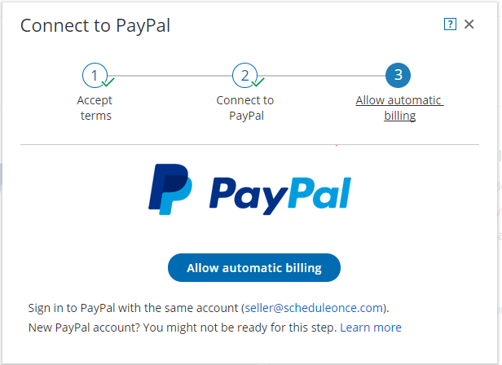
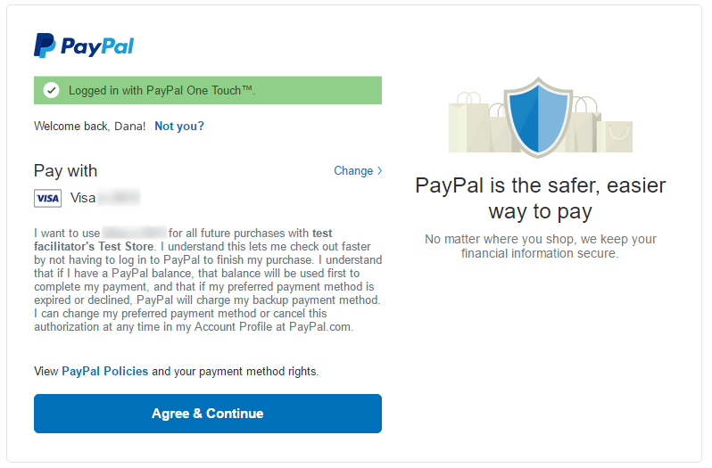

import { Aside } from '@astrojs/starlight/components';

**Note**

This article only applies if you use our [PayPal integration to collect payments from your Customers](/payment-integration-throughout-the-booking-lifecycle/ "Payment integration throughout the booking lifecycle (collecting payments from Customers)"). If you have any questions on how we bill you as a OnceHub Customer, go to the [Account billing article](/introduction-to-billing/ "Introduction to Billing").

To connect your OnceHub account to your PayPal account, you must allow automatic billing. When allowed, OnceHub will be able to charge a [1% transaction fee](/scheduleonce-transaction-fee/ "ScheduleOnce transaction fee") for each payment made via OnceHub, in addition to the fees charged by PayPal. [Learn more about the OnceHub Master Services Agreement](https://www.oncehub.com/trustcenter/legal/msa/)

# Requirements

To allow automatic billing, you need:

*   A PayPal Administrator
*   A OnceHub Administrator

# Allowing automatic billing

1.  ```
    &lt;style type="text/css">
    p.p1 &#123;margin: 0.0px 0.0px 0.0px 0.0px; font: 13.0px 'Helvetica Neue'&#125;
    &lt;/style>
    ```
    
    Hover over the lefthand menu and go to the Booking pages icon → open the lefthand sidebar → **Integrations →** **Payment**.
2.  Click the **Get started** button. The **Connect to PayPal** wizard pop-up appears (Figure 1). Figure 1: Accept terms
3.  Read the terms of use and click **Accept and continue**. OnceHub charges a [1% transaction fee](/scheduleonce-transaction-fee/ "ScheduleOnce transaction fee") for payments made via OnceHub, in addition to the fees charged by PayPal.
4.  In the **Connect to PayPal** step, click the **Connect to PayPal** button (Figure 2). This will allow OnceHub to access your PayPal account via the PayPal API. [Learn more about granting permissions to OnceHub](/granting-permissions-to-scheduleonce/ "Granting permissions to ScheduleOnce") Figure 2: Grant permissions
5.  After connecting to your PayPal account and granting permissions to OnceHub, you are automatically redirected to your OnceHub account to allow automatic billing. In the **Allow automatic billing** step, click the **Allow automatic billing** button. You are redirected to PayPal (Figure 3).  
    When you allow automatic billing, you authorize OnceHub to charge a [1% transaction fee](/scheduleonce-transaction-fee/ "ScheduleOnce transaction fee") for each payment made via OnceHub, in addition to the fees charged by PayPal. [Learn more about OnceHub Master Services Agreement](https://www.oncehub.com/trustcenter/legal/msa/). Figure 3: Allow automatic billing
6.  Log in to your PayPal account using your PayPal credentials. Once logged in, you will be prompt to allow automatic billing with OnceHub (Figure 4). Figure 4: PayPal automatic billing
7.  Click **Agree & Continue** to allow automatic billing. Once approved, OnceHub will be able to automatically charge your PayPal account a 1% transaction fee for each payment made via OnceHub.

**Important** Automatic billing authorization remains valid unless you [cancel it directly from your PayPal account](https://www.paypal.com/selfhelp/article/how-do-i-cancel-an-automatic-payment-i-have-with-a-merchant-faq2058) or [disconnect your PayPal account in your OnceHub account](/disconnecting-from-paypal/ "Disconnecting from PayPal").

Congratulations! You have allowed automatic billing. You'll now be automatically redirected to the OnceHub application where you can [customize the Payment settings](/customizing-payment-settings/ "Customizing payment settings").