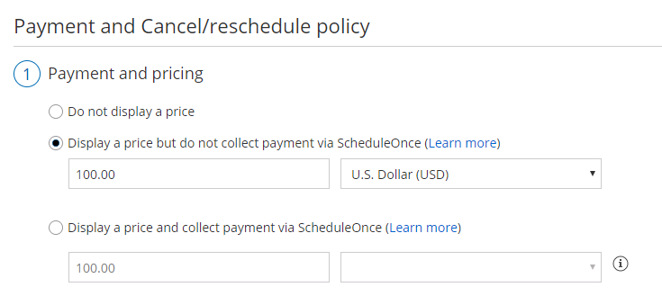
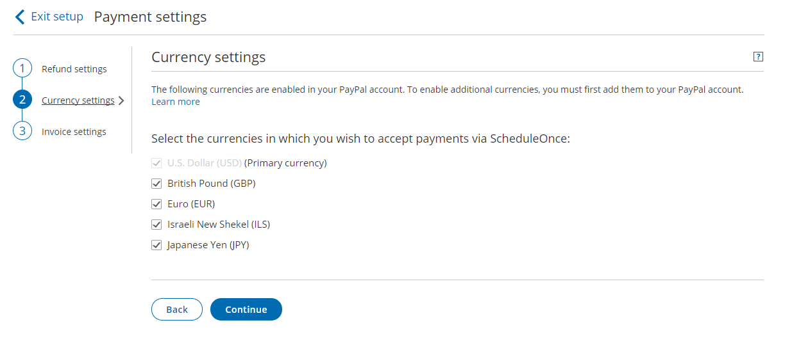

import { Aside } from '@astrojs/starlight/components';

**Note**

This article only applies if you use our [PayPal integration to collect payments from your Customers](/payment-integration-throughout-the-booking-lifecycle/ "Payment integration throughout the booking lifecycle (collecting payments from Customers)"). If you have any questions on how we bill you as a OnceHub Customer, go to the [Account billing article](/introduction-to-billing/ "Introduction to Billing").

[The OnceHub connector for PayPal](/the-scheduleonce-connector-for-paypal/ "The ScheduleOnce connector for PayPal") allows you to work with any currency enabled in your PayPal account. In the Currency settings, you can choose the currencies that will be used in your account when collecting payments and processing refunds.

**Note**When your PayPal account is connected to OnceHub, Customers can pay with their **credit/debit card** or with their **PayPal account,** a PayPal account on the Customer end is **not** required.

The ability to offer two payment methods - **Traditional cards & PayPal** - increases sales and improves customer satisfaction

# Managing multiple PayPal currencies

OnceHub allows you to use multiple currencies from your PayPal account. This allows you to use different currencies with different Event types, optimizing the payment experience for your global customers.

When you connect your OnceHub account to your PayPal account, OnceHub retrieves the Currencies that are enabled in PayPal (See Figure 1). [Learn more about PayPal currencies](https://www.paypal.com/is/cgi-bin/webscr?cmd=p/sell/mc/mc_receive-outside)

Figure 1: Payment settings in Event types

You can select the Currencies you want to make available in your OnceHub User app (See Figure 2). When checked, the currencies will appear in the relevant Event type **-> Payment and cancel/reschedule policy section** (See Figure 1). [Learn more about Cancel/reschedule policy when payment is collected via OnceHub](/payment-and-cancelreschedule-policy-when-payment-is-collected-via-scheduleonce/ "Event type: Payment and cancel/reschedule policy when payment is collected via ScheduleOnce")

Figure 2: Currency tab

## Frequently Asked Questions

### **What is the default currency for my Event types?**

By default, the PayPal Primary currency is used as the default currency for your Event types. When you add a new Event type, the default currency will always be the PayPal Primary currency.

### **Can I change the default currency set for my Event types?**

The PayPal primary currency cannot be changed from your OnceHub account. To change the default currency, you must change the PayPal primary currency directly from your PayPal account. Then simply refresh your Currency settings to reflect your changes. [Learn more about changing the PayPal primary currency](https://www.paypal.com/selfhelp/article/FAQ1030/1)

### **What happens if I add a new currency in my PayPal account?**

When you add a currency in your PayPal account, you will need to update the Currency settings in your OnceHub account to reflect the change. Once checked, the new currency will be available in your Event types.

### **What happens if I remove a currency in my PayPal account?**

When you remove a currency in your PayPal account, you need to update the Currency settings in your OnceHub account to reflect your changes and ensure that your Event types are not set to that currency. Otherwise, your Event types will be set automatically to the PayPal Primary currency and you will not be able to accept payments or process refunds in that currency via OnceHub.

### **What happens if I remove a currency in my OnceHub account?**

When you remove a currency in your OnceHub account, you need to ensure that your Event types are not set to that currency. Otherwise, your Event types will be set automatically to the PayPal Primary currency. Note that you will still accept payments or process refunds for scheduled bookings if your PayPal account can still accept payments in the removed currency.