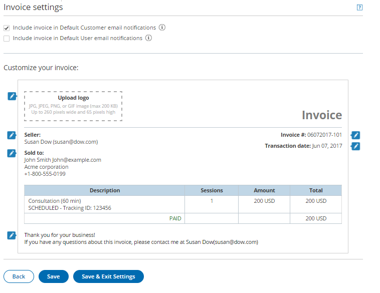
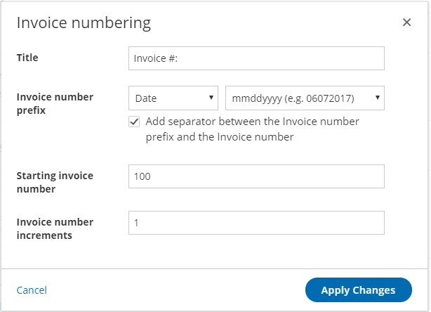

import { Aside } from '@astrojs/starlight/components';

**Note**

This article only applies if you use our [PayPal integration to collect payments from your Customers](/payment-integration-throughout-the-booking-lifecycle/ "Payment integration throughout the booking lifecycle (collecting payments from Customers)"). If you have any questions on how we bill you as a OnceHub Customer, go to the [Account billing article](/introduction-to-billing/ "Introduction to Billing").

[Payment integration](/payment-integration-throughout-the-booking-lifecycle/ "Payment integration throughout the booking lifecycle") allows you to automate booking-related financial processes. OnceHub automatically sends an invoice to your Customers when a payment is made or a refund is processed via OnceHub.

In the Invoice settings, you are able to:

*   **Turn on automatic invoicing for payments and refunds**: OnceHub allows you to automatically generate an invoice for all payments and refunds made via OnceHub and add it to default scheduling and rescheduling confirmation emails sent to the Customer.
*   **Customize your invoice to fit your messaging and brand**: You can easily customize the invoice template with your own text messages and company logo.
*   **Customize the invoice number to work in tandem with your financial environment**: You can customize the Invoice number by adding an Invoice number prefix, a Starting invoice number, and an Invoice number increment.

In this article, you will learn how to customize the Invoice settings.

```
&lt;script id="snippet-prepend">
$(function()&#123;
  
  /*disable in widget*/
  if($('.w-documentation-article').length === 0)&#123;

     var ToC =
  "&lt;nav role='navigation' class='table-of-contents toc-top'><h4>In this article:" + "<ul>";
     var el,     title, link, header;
      //Define the heading levels you want to use in ascending order. Can add extra or remove unneeded.
     $(".hg-article-body h1, .hg-article-body h2, .hg-article-body h3, .hg-article-body h4").each(function() &#123;
              el = $(this);
              title = el.text();
                 if(title != '')&#123;
                anchorTitle = el.text().replace(/([~!@#$%^&*()_+=`&#123;&#125;\[\]\|\\:;'&lt;>,.\/\? ])+/g, '-').toLowerCase();
                link = "#" + anchorTitle;
                //Set all headers to a 0-nesting level.
                header = 'header-nesting-0';
                //Adjust header-nesting layers so that they point to the correct html tag. header-nesting-1 should match the second .hg-article-body h# listed above; header-nesting-2 should match the third, etc.
                if($(this).is('h2'))&#123;
                    header = 'header-nesting-1';
                &#125;else if($(this).is('h3'))&#123;
                    header = 'header-nesting-2'
                &#125;
                el.html('<a id="'+anchorTitle+'" class="toc-anchor">' + el.html());
                newLine =
      "<li class='"+header+"'>" +
        "<a class='article-anchor' href='" + link + "'>" +
          title +
        "" +
      "";


                ToC += newLine;
              &#125;
              &#125;);
     ToC +=
   "" +
  "";
    $("#snippet-prepend").before(ToC);
  &#125;
&#125;);

&lt;/script>
```

```
&lt;style>
/* CSS to style the TOC as it displays and the auto-created anchors
.toc-top styles the box for the TOC; adjust styles here to tweak look and feel */
  
.toc-top &#123;
  background-color: #FAFAFA; /* set to #fff or delete entirely for no background */
  border: 1px solid #C8C8C8; /* adjust the color hex here to change border color */
  box-shadow: 0 1px 1px rgba(0, 0, 0, 0.05) inset;
  margin-top: 24px;
  margin-bottom: 36px;
  min-height: 20px;
  padding: 13px 20px;
  max-width: 75%;
&#125;
.toc-top h4 &#123;
  font-size: 18px;
  line-height: 26px;
  margin: 0 0 8px;
  font-weight: 400;
&#125;
.toc-top ul &#123;
  padding: 0 0 0 15px !important;
  margin-bottom: 0;	
&#125;
.toc-top > ul &#123;
  margin-bottom: 13px!important;
&#125;
.toc-anchor &#123;
  display: block;
  height: 90px; 
  margin-top: -90px; 
  visibility: hidden;
&#125;

/* Set the indentation for the nesting levels. May need to be edited to match changes above. Increase or decrease the margin-left to get your desired level of indentation. */
.header-nesting-1 &#123;
    margin-left: 14px;
&#125;
.header-nesting-1:before &#123;
	background-image: url(https://dyzz9obi78pm5.cloudfront.net/app/image/id/5d31bcc88e121c9b25ba22c4/n/bulletv2.svg)!important;
&#125;
.header-nesting-2 &#123;
    margin-left: 28px;
&#125;
.header-nesting-2:before &#123;
	background-image: url(https://dyzz9obi78pm5.cloudfront.net/app/image/id/5d31be536e121cf22b0cc6ae/n/bulletv3.svg)!important;
&#125;
&lt;/style>
```

# Requirements

To customize the Invoice settings, you must be a OnceHub Administrator.

# Customizing the Invoice settings

1.  Hover over the lefthand menu and go to the Booking pages icon → open the lefthand sidebar → **Integrations →** **Payment**.
2.  Click the **Customize payment settings** button.
3.  In the **Payment settings** page, click the **Invoice settings** tab (Figure 1). Figure 1: Invoice settings
4.  In the **Invoice settings** area, check the relevant options:
    *   **Include invoice in Default Customer email notifications**: By default, invoices for payment transactions will be automatically added to default scheduling and rescheduling confirmation emails sent to the Customer. Credit invoices for refund transactions will be automatically added to default cancellation emails sent to the Customer. When you uncheck this option, the invoice will be automatically removed from default email notifications. [Learn more about notification scenarios](/notification-scenarios/ "Notification scenarios")
    *   **Include invoice in Default User email notifications**: You can choose to add the invoice to User notifications. When checked, invoices for payment transactions will be automatically added to default scheduling and rescheduling confirmation emails sent to the User. Credit invoices for refund transactions will be automatically added to default cancellation emails sent to the User. [Learn more about notification scenarios](/notification-scenarios/ "Notification scenarios")
5.  In the **Customize your invoice** area, you can customize the look and feel of the invoice sent to Customers. Below is the list of fields that can be edited:
    *   **Upload logo:** The image should be JPG, JPEG, PNG, or GIF image (max 200 KB) and up to 360 pixels wide and 60 pixels high.
    *   **Seller** (max 100 characters): You can customize the Seller title and detailed information.
    *   **Sold to** (max 50 characters): You can customize the title for the Customer information appearing on the invoice. The Customer information is dynamically added at the time of the booking and can include the Customer full name, email, company, and phone number.
    *   **Thank you…** (max 150 characters): You can customize the footer displayed at the bottom of the invoice.
    *   **Transaction date** (max 50 characters): You can customize the title of the transaction date that will appear on the invoice.
6.  To update the Invoice number, click the edit icon next to the Invoice number. The **Invoice numbering** pop-up appears (Figure 2).
    *   **Invoice prefix:** The Invoice prefix can be a date or a custom text. Custom text can be a maximum of ten characters: 0 to 9 and can only contain alphanumeric characters: 0-9 a-z A-Z. It does not in include special characters such as _space,\\,’,”,/,&,&lt;.>,=,\[,\]._
    *   **Separator**: You can add a separator between the Invoice number prefix and the Invoice number. The separator is by default a dash "-".
    *   **Starting invoice number**: The starting invoice number determines from which number you want OnceHub to start. It can be between 1 to 100,000.
    *   **Invoice increments**: You can set the increment in which invoice numbers will be generated. The invoice increment can be set between 1 and 10.
    *   Figure 2: Invoice numbering