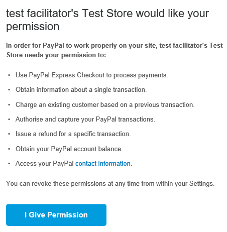

import { Aside } from '@astrojs/starlight/components';

**Note**

This article only applies if you use our [PayPal integration to collect payments from your Customers](/payment-integration-throughout-the-booking-lifecycle/ "Payment integration throughout the booking lifecycle (collecting payments from Customers)"). If you have any questions on how we bill you as a OnceHub Customer, go to the [Account billing article](/introduction-to-billing/ "Introduction to Billing").

To connect the OnceHub User app to your PayPal account, you must connect to PayPal and grant permissions to OnceHub to run specific transactions via the PayPal API. OnceHub communicates with the PayPal API to charge Customers for bookings, [issue refunds via OnceHub](/customizing-refund-settings/ "Customizing refund settings"), and capture transactions in OnceHub invoicing and [Revenue reports](/revenue-reports/ "Revenue Reports").

**Note** You can reduce administrative overheads and align invoices with your branding requirements by customizing the invoice sent to Customers when payment is collected or refunds are processed via OnceHub. [Learn more about customizing the Invoice settings](/customizing-invoice-settings/ "Customizing invoice settings")

In this article, you will learn about granting permissions to OnceHub in your PayPal account.

# Requirements

To grant permissions to OnceHub, you will need:

*   A PayPal Administrator
*   A OnceHub Administrator

# Granting permissions to OnceHub

1.  ```
    &lt;style type="text/css">
    p.p1 &#123;margin: 0.0px 0.0px 0.0px 0.0px; font: 13.0px 'Helvetica Neue'&#125;
    &lt;/style>
    ```
    
    Hover over the lefthand menu and go to the Booking pages icon → open the lefthand sidebar → **Integrations → Payment**.
2.  Click the **Get started** button. The **Connect to PayPal** wizard pop-up appears (Figure 1).  
    Figure 1: Accept Terms
3.  Once you accept the OnceHub terms, click **Connect to PayPal** button on the **Connect to PayPal** step (Figure 2).  
    You will be redirected to the PayPal sign-in page where you'll be required to enter your credentials.
    
    **Note** If you do not have a PayPal account, you will be prompted to create one. If you have a PayPal Personal account or a Premier account, PayPal will automatically upgrade your account to a free PayPal Business account as part of the connection process.
    
    Figure 2: Connect to PayPal
    
4.  Sign in to your PayPal account using your PayPal credentials or create a new account. Once signed in, PayPal will automatically display a pop-up window including the list of permissions OnceHub needs to be granted (Figure 3). Figure 3: Granting permissions
5.  In your PayPal account, click the **Grant permissions** button.  
    Once permissions are granted, OnceHub will receive a token from PayPal Permissions Service to run **Express Checkout API** calls on your behalf.
6.  Next, PayPal will automatically take you through the **In-Context Sign-Up** flow. This allows OnceHub to use the **In-Context API** to determine whether your PayPal account can receive payments.  
    OnceHub will only charge Customers for bookings if your PayPal account can accept payments. Otherwise, Customers won't be able to make bookings when Payment integration is used. [Learn more about troubleshooting Payment integration issues](/troubleshooting-payment-integration-issues/ "Troubleshooting Payment integration issues")
7.  At the end of the **In-Context sign up** flow in PayPal, click the **PayPal return** button to return to OnceHub.