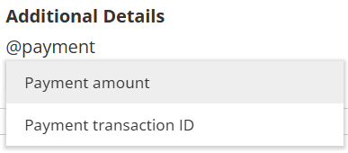

import { Aside } from '@astrojs/starlight/components';

When a paid meeting is scheduled, guests can receive the payment transaction details in two ways:

1.  Via an invoice sent by Stripe.
2.  Via transaction details added to the guest notification.

* * *

## Invoice Sent by Stripe

When a paid meeting is scheduled, an invoice is automatically emailed to your guests through Stripe.

* * *

## Adding the Transaction Details to Guest Notifications

To ensure that guests receive a complete record of the meeting and the transaction in one place, we recommend adding the transaction details to the guest notifications sent by OnceHub using the following steps:

### Navigating to the Guest Notification Template

1.  Click the gear icon in the top-right corner.
2.  Select **Guest Notifications** from the dropdown.
3.  Select the template that you are using on your Booking Calendar.

### Adding the Transaction Details to the Guest Notification Template

1.  Click **Customize email** to expand the email editor.
2.  Left click where you want to add the transaction details.
3.  Type **@** to bring up the list of variables you can add.
4.  Add the **Payment amount** and **Payment transaction ID** variables as shown in the image below.  
      
      
    
5.  Click **Save** to confirm the changes.

For more detailed guide on guest notifications, please read [**Booking Calendar Guest Notifications**](/booking-calendar-guest-notifications/).