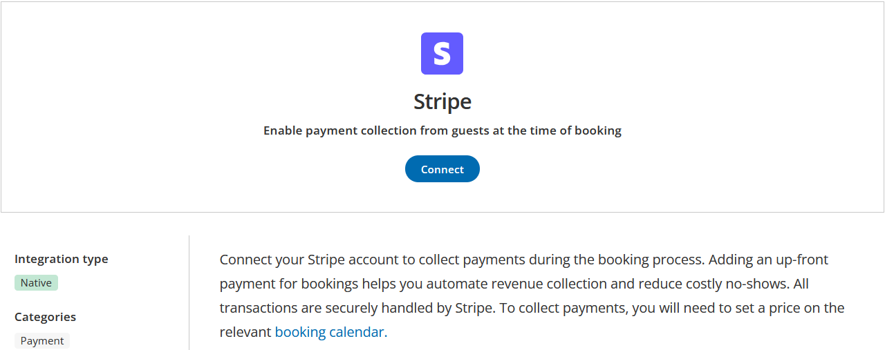

import { Aside } from '@astrojs/starlight/components';

This article describes how to connect your OnceHub account to Stripe to enable payment collection for your **Booking Calendars**.

### Navigating to Stripe in OnceHub

1.  Click the gear icon in the top-right corner.
2.  Select **Account Integrations** from the dropdown.
3.  Click the **Payment** Category. 
4.  Click the **Stripe** tile.

### Connecting OnceHub with Stripe

1.  Click **Connect**.  
      
      
    
2.  Follow the instructions in the Stripe portal.
    *   **For an Existing Stripe Account**: Log in with your existing Stripe credentials and complete the integration process. 
    *   **For a New Stripe Account**: Connecting to a new Stripe account requires extensive business verification information which may take some time to verify. Once your Stripe account is fully verified, please re-initiate the integration using OnceHub, or it will lead to a failed connection status.  
        display the email ID of the Stripe account in the integration window.

* * *

Once the integration is complete, you will be automatically redirected to your OnceHub account. It will display the email ID of the Stripe account in the integration window.

After integrating OnceHub with Stripe, the next step is to configure your Booking Calendars to collect payments from your guests. 

For more details, please read [**How to Configure Payment Collection on your Booking Calendar**](/how-to-configure-payment-collection-on-your-booking-calendar/).