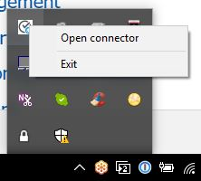
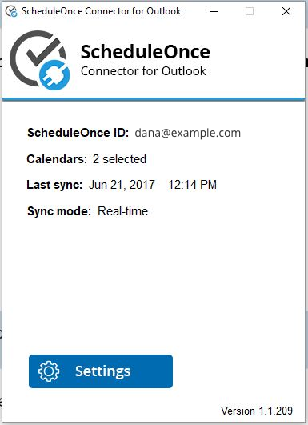
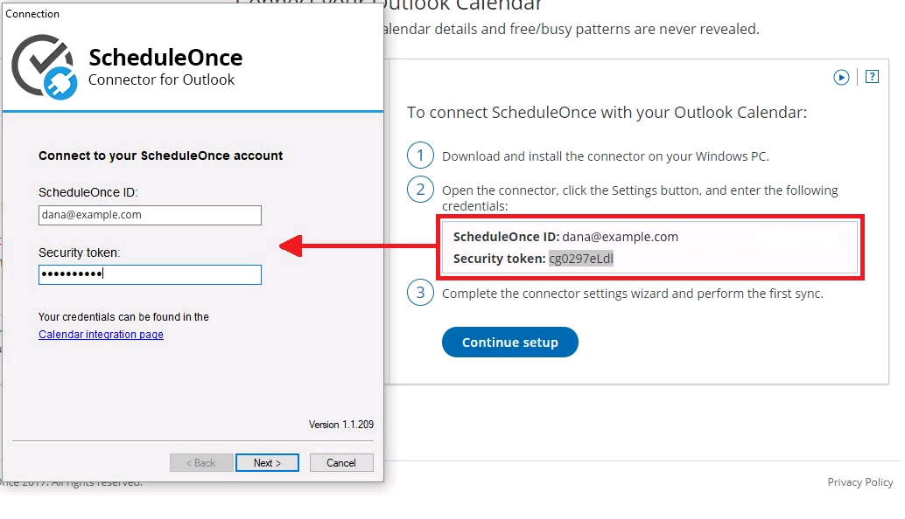
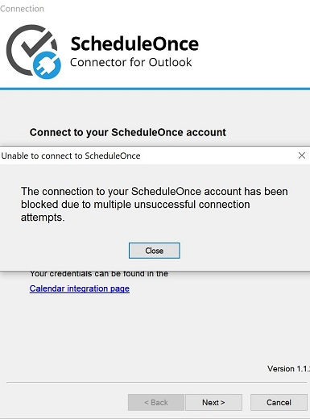
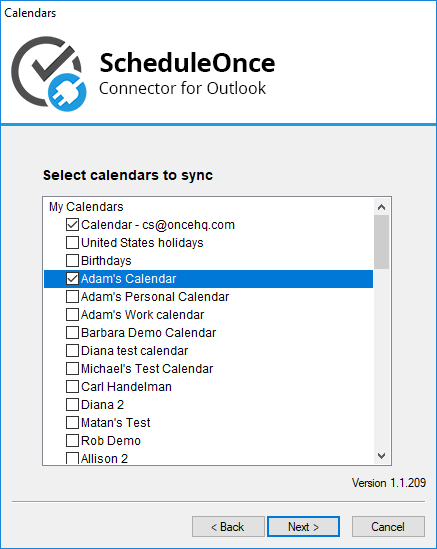
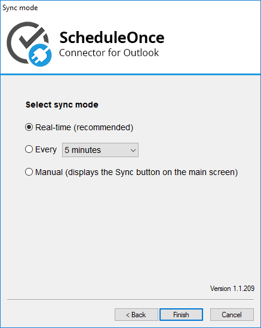
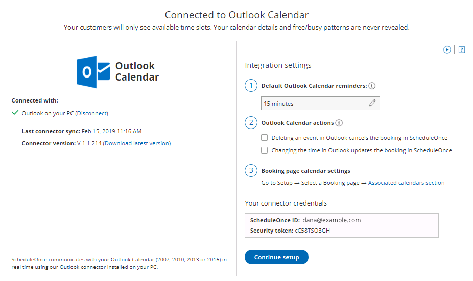
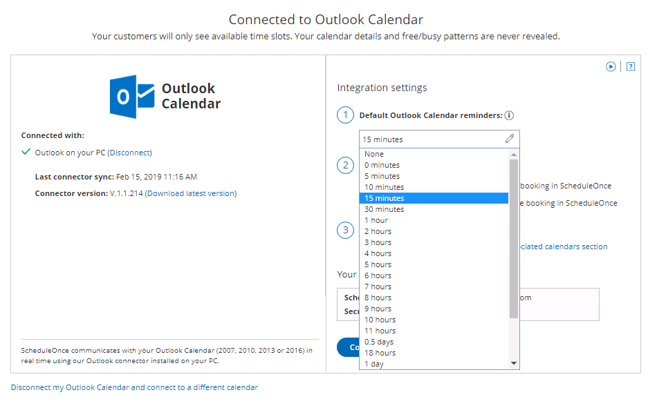
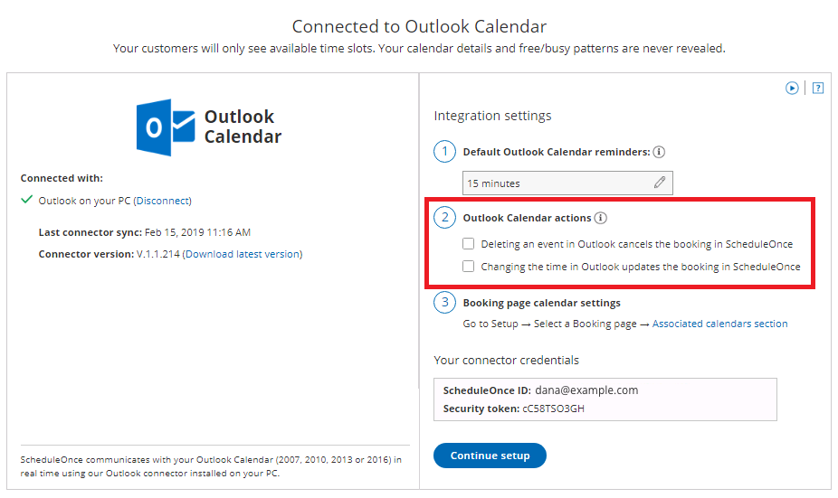

import { Aside } from "@astrojs/starlight/components";

In this article, you will learn how to connect and configure the Outlook connector on your Windows PC (Mac is not supported). This article assumes that you already installed the connector. [Learn more about installing the PC connector for Outlook](/installing-the-pc-connector-for-outlook "Installing the PC Connector for Outlook")

<Aside type="caution">

Once you download the PC connector for Outlook, you will not be able to accept bookings until you install the connector and perform the first sync.

</Aside>

1. From the system tray icons in your Windows PC, click the PC connector icon and select **Open connector** (see Figure 1).

   Figure 1: Open connector

   <Aside type="note">

   **Note**Alternatively, you can double-click the PC connector icon from your desktop.

   </Aside>

2. This will bring the connector to the front of the screen (see Figure 2). Click the **Settings** button.Figure 2: PC Connector for Outlook

3. After clicking the **Settings** button, you'll be prompted to connect to your OnceHub account. In your OnceHub account, select your profile picture or initials in the top right-hand corner → **Profile settings** → **Calendar connection**.

4. Copy the **OnceHub** **ID** and **Security token** from the **Connect your Outlook Calendar** page into the **PC Connector for Outlook** (see Figure 3). Figure 3: Connect to your OnceHub account Once you've entered the credentials, click **Next**. If you enter your credentials incorrectly six times within a 10-minute period, your connection will be blocked for 30 minutes (see Figure 4).Figure 4: Multiple unsuccessful connection attempts

5. The **Calendar** step appears and displays all calendars in your Outlook calendar (see Figure 5). These can be local calendars, Exchange Calendars, resource calendars, or any other calendars that are shared with you.

   Figure 5: Calendar step

   <Aside type="note">

   **Note**Calendars that cannot be selected are calendars for which you do not have full read/write permissions. These calendars cannot be synced with OnceHub. If you do want to connect to one of these calendars, you can ask the calendar owner to grant you full read/write permissions.

   </Aside>

6. Select the calendars you want to sync and click **Next**. The selected calendars will be synced with OnceHub and will appear in your OnceHub account under **Setup → Booking pages →&#x20;**&#x20;[**Associated calendars** section](/scheduleonce/event-types-booking-pages/booking-pages/booking-pages-associated-calendars "Booking page: Associated calendars section") in your Booking pages. Calendars that are not selected will never be synced with OnceHub.

7. After you click **Next**, the **Select sync mode** step displays the various options for syncing between your Outlook Calendar and OnceHub: real-time (recommended), auto-sync every X minutes/hours, and manual (see Figure 6). [Learn more about Outlook sync modes](/outlook-connector-sync-modes "Outlook connector sync modes")

   Figure 6: Sync mode

8. Select a sync mode and click **Finish**. The connector will perform an initial sync that may take a few minutes, depending on the number of calendars you have and how busy they are. Now simply refresh the browser in your OnceHub account (see Figure 7).Figure 7: Connected to Outlook Calendar

9. Your OnceHub account and Outlook Calendar are now connected. You can receive reminders in your connected Outlook Calendar when events are created via OnceHub. By default, the reminders are set to _15 minutes_.

   To configure default Outlook Calendar alerts, simply select an option from the **Default Outlook Calendar reminders** drop-down list (see Figure 8).

   Figure 8: Default Outlook Calendar reminders

10. The following settings allow you to determine whether changes made in your connected calendar are reflected in OnceHub or not (see Figure 9). [Learn more about Outlook Calendar actions](/user-action-cancel-or-reschedule-in-outlook-calendar "User action: Cancel or Reschedule in Outlook Calendar") Figure 9: Outlook Calendar actions

Congratulations! Your connector is configured and you can now [configure the Associated calendar settings on your Booking pages](/scheduleonce/event-types-booking-pages/booking-pages/booking-pages-associated-calendars "Booking page: Associated calendars section").
