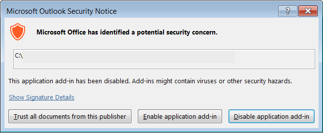

import { Aside } from '@astrojs/starlight/components';

If the OnceHub team has prompted you to use an alternate method for sending meeting invites, this might cause an Outlook security alert to pop up, which will cause Outlook to ignore the connector. This happens because you are essentially using the connector to send an email (the calendar invite), so it raises a red flag for Outlook's basic security system.

You can change this by disabling the security alert. When there is no real-time protection in effect against viruses and spyware, Outlook provides a basic level of protection against add-ins by displaying the security alert popup.

You might receive security notices like these:

Figure 1: Outlook security notice

When you see this message, it is vital that you take action, because Outlook will block the sync between OnceHub and Outlook if you do not. 

You can disable this security alert in the Outlook Trust Center. In Outlook 2007, this is found in the Tools menu. If you are using Outlook 2010 and 2013, you can access the Outlook Trust Center in the File -> Options area. For more information, please see Microsoft's documentation for [Outlook 2010 and 2013](http://www.addintools.com/documents/outlook/where-trust-center.html). You will need to open Outlook as an administrator, which you can usually do by right-clicking the file name and selecting to open as an administrator.