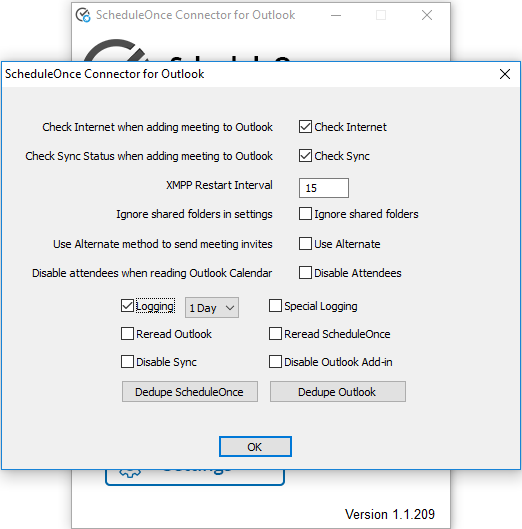

import { Aside } from "@astrojs/starlight/components";

If you encounter issues with the [Outlook connector](/non-visible-articles/pc-connector-for-outlook/non-visible-articles/pc-connector-for-outlook/non-visible-articles/pc-connector-for-outlook/introduction-to-the-pc-connector-for-outlook// "Introduction to the PC connector for Outlook"), OnceHub may ask you to generate a log file that will help us troubleshoot the problem. The log will register the detailed steps about the problems you encountered and will help our Support team resolve the issue.

<Aside type="note">

If you would like us to assist you in generating and sending logs, please [contact us](/contact-us/).

</Aside>

In this article, you'll learn how to generate an Outlook connector log file.

## Generating an Outlook connector log file

1. In the taskbar on your desktop, click the PC connector icon and select **Open connector** (Figure 1). Alternatively, you can double-click the PC connector icon from your desktop. Figure 1: PC Connector icon

2. Press CTRL + SHIFT + L on your keyboard to automatically start the troubleshooting log. This will log all communication between OnceHub and the connector.

3. Once logging is enabled, reproduce the steps that generated the error.

4. If you are not able to reproduce the error when you attempt this, press CTRL + Shift + U to open the connector's options menu.

5. Check the **Logging** checkbox.

6. From the drop down-menu, select **1 Day** (Figure 2). The logs will generate in the background as you use Outlook and OnceHub. If the issue occurs during these 24 hours, the logs will capture it and give us the information needed. Figure 2: OnceHub Connector for Outlook menu pop-up

7. If the issue does not occur in this time, press CTRL + Shift + U to open the options menu. From the drop-down menu, select **Logging: 5 Days**.

8. Once the issue has been reproduced, click the PC connector icon in the taskbar on your desktop. Then, press CTRL + Shift + L to disable logging. The connector may run slower if logging is not disabled after a log is captured.

9. Press CTRL + Shift + D to access the folder where the log file was created. There are four essential files needed:

   - Scheduleoncec4o.log
   - Recordchanges.log
   - ClxDate-out-.dat
   - ClxDate-in-.dat (not always present)

10. Select these files and zip them to a compressed file. If you are not sure which files should be highlighted, it's okay to highlight all files in the folder and zip them all.

11. Please [send the zipped file to us](/contact-us/) with the following data:

    - A description of the issues you experienced.
    - Your Outlook version.
    - Your mail server: Exchange, Office 365, Outlook.com, or other.
    - Your operating system.
