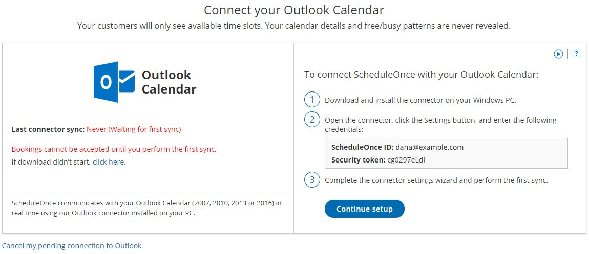

import { Aside } from "@astrojs/starlight/components";

OnceHub uses a proprietary connector to establish a secure connection with your Outlook Calendar. Once connected, all communication with your Outlook Calendar is encrypted, keeping your calendar data safe and secure.

In this article, you will learn how to generate OnceHub authentication credentials and how to install the PC connector for Outlook on your Windows PC (Mac is not supported).

<Aside type="caution">

In addition to connecting with your Outlook Calendar on your PC, OnceHub can also connect directly to the [Office 365](/introduction-to-office-365-calendar-connection "Introduction to Office 365 Calendar Connection") API. This may be a more stable option than connecting to your local computer's Outlook software through a downloaded connector. If you use Office 365, OnceHub recommends that you connect through our API integration with the Office 365 cloud rather than through the Outlook client integration.

However, if you need to use the PC connector, please [contact us](/contact-us). We can confirm whether this option works best for your environment and, if relevant, enable it in your account.

</Aside>

## Requirements:

- A Windows PC
- Microsoft Outlook 2007 or newer

## Downloading the connector:

1. [**Contact us**](/contact-us) to enable the PC connector as an option.

2. In OnceHub, select your profile picture or initials in the top right-hand corner → **User Integrations**.

3. Click **Connect additional calendars in OnceHub**.

4. Select the **PC connector for Outlook** option.

5. On the **Connect your Outlook Calendar** page, you can download the connector to your Windows PC.

6. After you download the PC connector for Outlook, you are in a pending connection state with your Outlook Calendar and you will not be able to accept bookings until you install the connector and perform the first sync. On the page, you will see your credentials and the step-by-step instructions to [connect and configure the Outlook connector](/connecting-and-configuring-the-scheduleonce-connector-for-outlook "Connecting and configuring the ScheduleOnce connector for Outlook") (see Figure 5). You will need these credentials to sign in to the connector. Figure 5: Outlook Calendar integration page - Setup

   **Note**The connector is compatible with Outlook 2007, 2010, 2013, and 2016. The connector installation file size is about 16mb. The connector is not compatible with Macs.

In order to start syncing the connector, you will need to:

1. [Connect and configure the connector’s settings](/connecting-and-configuring-the-scheduleonce-connector-for-outlook "Connecting and configuring the ScheduleOnce connector for Outlook")
2. [Configure calendar settings for your Booking pages](/scheduleonce/event-types-booking-pages/booking-pages/booking-pages-associated-calendars "Booking page: Associated calendars section")
