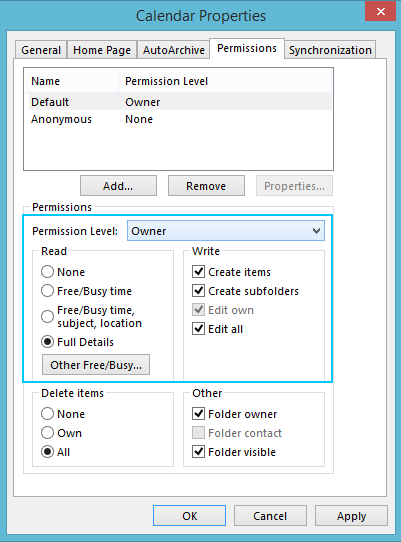

import { Aside } from '@astrojs/starlight/components';

The calendar selection step allows you to choose which calendars you’d like to sync with OnceHub. 

If it appears blank, there are a few steps you can follow to determine what might be causing the issue.

## **Quit and reboot connector**

The first recommendation is to quit the connector and reboot it. You can do this by right-clicking on the square, blue and white SO icon in your taskbar icons. Select Exit. You can re-open the OnceHub connector for Outlook through the shortcut created on your Windows Desktop. 

## **Check permission settings**

If you are trying to sync Microsoft Exchange shared calendars, check the permissions of the calendar(s) you are syncing with OnceHub. In Outlook, right-click on the relevant calendar. Go to Properties -> Permissions -> Permission level.

Ensure that you still have read/write capabilities as the Owner or Publishing Editor of the calendar.

## **Try repairing Outlook**

Outlook files can sometimes become corrupted, preventing the connector from reading the calendars correctly and displaying a blank screen. Performing a quick Outlook repair will usually take no more than 5-10 minutes and can help with connector issues as well as general Outlook performance issues. [Learn more about repairing Outlook](https://support.office.com/en-NZ/Article/Repair-an-Office-application-7821d4b6-7c1d-4205-aa0e-a6b40c5bb88b)