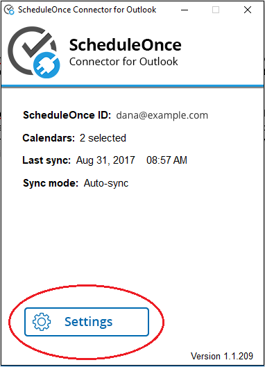
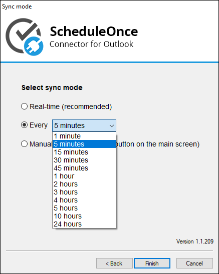

import { Aside } from "@astrojs/starlight/components";

If you have noticed that Outlook runs slowly or crashes after installing the connector, please follow these guidelines to determine what might be causing the issue.

## **Number of calendars**

You should first check how many calendars you are attempting to sync with OnceHub (see Figure 1). Please note that the connector was designed to sync a single User’s calendar(s) with his/her Booking page. Syncing more than three or four calendars, particularly shared calendars, on behalf of non-OnceHub Users is not advised, as it may interfere with the connector’s performance and can sometimes affect Outlook performance as well.

Figure 1: Calendars

## **Other add-ins**

The connector is generally compatible with other add-ins and running the connector in parallel with other add-ins should not affect performance. However, compatibility issues can occur, as is usual when combining multiple software add-ins together that were created by different developers.

The easiest way to check if the connector is conflicting with another add-in is by disabling the OnceHub connector for Outlook add-in. Please be advised that disabling the add-in will also disable real-time sync. To use the connector without an active add-in, please [change your syncing mode](/outlook-connector-sync-modes "Outlook connector sync modes") to auto-sync.

To disable the connector add-in, follow these steps:

- Open the connector and click on **Settings** (see Figure 2). Figure 2: Connector settings
- Go through the setup wizard, select Every 5 minutes on the final step, and click Finish (see Figure 3). Figure 3: Sync mode settings
- Press CTRL+Shift+U and select the option: Disable Outlook Add-in
- Make a few test bookings in OnceHub and create some calendar events in Outlook to verify all is performing as intended.

## **Conflicting user permission levels for open Windows applications**

Every Windows application can be opened as either an administrator or as a standard user. Ensure that you are opening both Outlook and the OnceHub connector for Outlook at the same level, or the two might conflict and result in crashing Outlook. If you have one open as an administrator and the other as a standard user, this will cause a conflict.

To open an application as an administrator, you can right-click on that application's icon and select Run as administrator.

## **Contact us**

If you are still experiencing performance drops in Outlook, please [generate logs](/generating-an-outlook-connector-log-file "Outlook troubleshooting: Generating an Outlook connector log file") and email them to us. Once you have the logs, please put them in a zipped file and [send them to us](/contact-us) along with the following information:

- Windows version
- Outlook version
- Screenshot of active add-ins in Outlook (File -> Options -> Add-Ins)
- Are you using Exchange?
- How many calendars are you syncing, and how many of these are shared with you?
- When was the last time you archived your calendar(s)?
