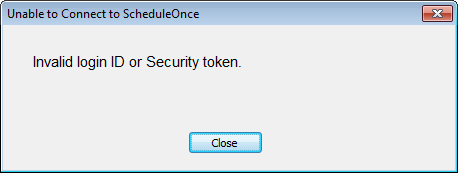

import { Aside } from "@astrojs/starlight/components";

If you are experiencing connection issues between your Connector and OnceHub, you might receive an alert on your PC informing you what the issue is.

<Aside type="note">

If you are not receiving an alert message, but the connector is still not syncing, there are other reasons your sync might be affected. [Learn more about how to fix an Outlook connector that is not syncing as expected](/outlook-troubleshooting-the-connector-is-not-syncing-as-expected "Outlook troubleshooting: The connector is not syncing as expected")

If the alert is from Outlook rather than the connector, you might have encountered [the Outlook security alert, which should be disabled](/outlook-troubleshooting-disabling-the-outlook-security-alert "Outlook troubleshooting: Disabling the Outlook security alert").

</Aside>

The connector will not be able to connect to OnceHub in the following cases.

## You have changed your sign-in ID

If you have [changed your sign-in ID](/how-do-i-change-my-sign-in-id "How do I change my email ID?"), the connector will display a pop-up (Figure 1).

Figure 1: Unable to Connect to OnceHub pop-up

To resolve this, click the **Settings** button on the connector and update the OnceHub Once sign-in ID to the new ID.

## The connection to Outlook Calendar has been disabled in OnceHub

If the connection to Outlook Calendar has been disabled in OnceHub, the connector will display a pop-up (Figure 2).

Figure 2: Unable to Connect to OnceHub pop-up

To resolve this:

1. Log into OnceHub and select your profile picture or initials in the top right-hand corner → **Profile settings** → **Calendar connection**.
2. In the Outlook calendar integration page, click the **Connect** button.
3. Copy the new security token.
4. In the connector, click the **Settings** button and paste the new security token.

## OnceHub is unable to process your payment

If OnceHub is unable to process your payment, the connector will display the following pop up (Figure 3):

Figure 3: Unable to Connect to OnceHub pop-up

When your organization is using OnceHub, your OnceHub account is charged a recurring fee, based on your subscription payment cycle. If a recurring payment cannot be processed, your account will be suspended and placed on hold. You must renew your subscription if you want to continue using OnceHub with your Outlook calendar.

[Learn how to renew your OnceHub subscription](/scheduleonce/insights-operations/billing-subscription-management/payment-and-billing "Payment hold")
