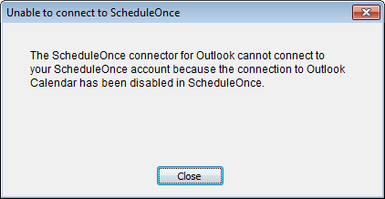
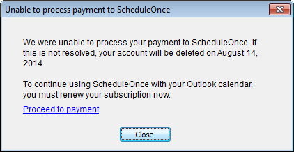

import { Aside } from '@astrojs/starlight/components';

If you are experiencing connection issues between your Connector and OnceHub, you might receive an alert on your PC informing you what the issue is.

**Note**If you are not receiving an alert message, but the connector is still not syncing, there are other reasons your sync might be affected. [Learn more about how to fix an Outlook connector that is not syncing as expected](/outlook-troubleshooting-the-connector-is-not-syncing-as-expected/ "Outlook troubleshooting: The connector is not syncing as expected")

If the alert is from Outlook rather than the connector, you might have encountered [the Outlook security alert, which should be disabled](/outlook-troubleshooting-disabling-the-outlook-security-alert/ "Outlook troubleshooting: Disabling the Outlook security alert").

The connector will not be able to connect to OnceHub in the following cases.

```
&lt;script id="snippet-prepend">
$(function()&#123;
  
  /*disable in widget*/
  if($('.w-documentation-article').length === 0)&#123;

     var ToC =
  "&lt;nav role='navigation' class='table-of-contents toc-top'><h4>In this article:" + "<ul>";
     var el,     title, link, header;
      //Define the heading levels you want to use in ascending order. Can add extra or remove unneeded.
     $(".hg-article-body h1, .hg-article-body h2, .hg-article-body h3, .hg-article-body h4").each(function() &#123;
              el = $(this);
              title = el.text();
                 if(title != '')&#123;
                anchorTitle = el.text().replace(/([~!@#$%^&*()_+=`&#123;&#125;\[\]\|\\:;'&lt;>,.\/\? ])+/g, '-').toLowerCase();
                link = "#" + anchorTitle;
                //Set all headers to a 0-nesting level.
                header = 'header-nesting-0';
                //Adjust header-nesting layers so that they point to the correct html tag. header-nesting-1 should match the second .hg-article-body h# listed above; header-nesting-2 should match the third, etc.
                if($(this).is('h2'))&#123;
                    header = 'header-nesting-1';
                &#125;else if($(this).is('h3'))&#123;
                    header = 'header-nesting-2'
                &#125;
                el.html('<a id="'+anchorTitle+'" class="toc-anchor">' + el.html());
                newLine =
      "<li class='"+header+"'>" +
        "<a class='article-anchor' href='" + link + "'>" +
          title +
        "" +
      "";


                ToC += newLine;
              &#125;
              &#125;);
     ToC +=
   "" +
  "";
    $("#snippet-prepend").before(ToC);
  &#125;
&#125;);

&lt;/script>
```

```
&lt;style>
/* CSS to style the TOC as it displays and the auto-created anchors
.toc-top styles the box for the TOC; adjust styles here to tweak look and feel */
  
.toc-top &#123;
  background-color: #FAFAFA; /* set to #fff or delete entirely for no background */
  border: 1px solid #C8C8C8; /* adjust the color hex here to change border color */
  box-shadow: 0 1px 1px rgba(0, 0, 0, 0.05) inset;
  margin-top: 24px;
  margin-bottom: 36px;
  min-height: 20px;
  padding: 13px 20px;
  max-width: 75%;
&#125;
.toc-top h4 &#123;
  font-size: 18px;
  line-height: 26px;
  margin: 0 0 8px;
  font-weight: 400;
&#125;
.toc-top ul &#123;
  padding: 0 0 0 15px !important;
  margin-bottom: 0;	
&#125;
.toc-top > ul &#123;
  margin-bottom: 13px!important;
&#125;
.toc-anchor &#123;
  display: block;
  height: 90px; 
  margin-top: -90px; 
  visibility: hidden;
&#125;

/* Set the indentation for the nesting levels. May need to be edited to match changes above. Increase or decrease the margin-left to get your desired level of indentation. */
.header-nesting-1 &#123;
    margin-left: 14px;
&#125;
.header-nesting-1:before &#123;
	background-image: url(https://dyzz9obi78pm5.cloudfront.net/app/image/id/5d31bcc88e121c9b25ba22c4/n/bulletv2.svg)!important;
&#125;
.header-nesting-2 &#123;
    margin-left: 28px;
&#125;
.header-nesting-2:before &#123;
	background-image: url(https://dyzz9obi78pm5.cloudfront.net/app/image/id/5d31be536e121cf22b0cc6ae/n/bulletv3.svg)!important;
&#125;
&lt;/style>
```

# You have changed your sign-in ID

If you have [changed your sign-in ID](/how-do-i-change-my-sign-in-id/ "How do I change my email ID?"), the connector will display a pop-up (Figure 1).

Figure 1: Unable to Connect to OnceHub pop-up

To resolve this, click the **Settings** button on the connector and update the OnceHub Once sign-in ID to the new ID.

# The connection to Outlook Calendar has been disabled in OnceHub 

If the connection to Outlook Calendar has been disabled in OnceHub, the connector will display a pop-up (Figure 2).

Figure 2: Unable to Connect to OnceHub pop-up 

To resolve this:

1.  Log into OnceHub and select your profile picture or initials in the top right-hand corner → **Profile settings** → **Calendar connection**. 
2.  In the Outlook calendar integration page, click the **Connect** button. 
3.  Copy the new security token. 
4.  In the connector, click the **Settings** button and paste the new security token.

# OnceHub is unable to process your payment

If OnceHub is unable to process your payment, the connector will display the following pop up (Figure 3):

[](http://help.scheduleonce.com/customer/portal/articles/1509778-payment-failure)Figure 3: Unable to Connect to OnceHub pop-up 

When your organization is using OnceHub, your OnceHub account is charged a recurring fee, based on your subscription payment cycle. If a recurring payment cannot be processed, your account will be suspended and placed on hold. You must renew your subscription if you want to continue using OnceHub with your Outlook calendar. 

[Learn how to renew your OnceHub subscription](/payment-hold/ "Payment hold")