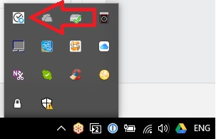
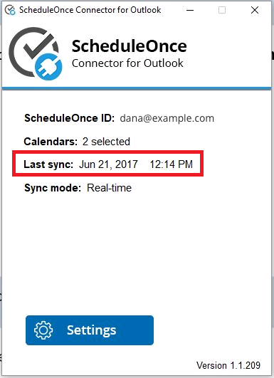
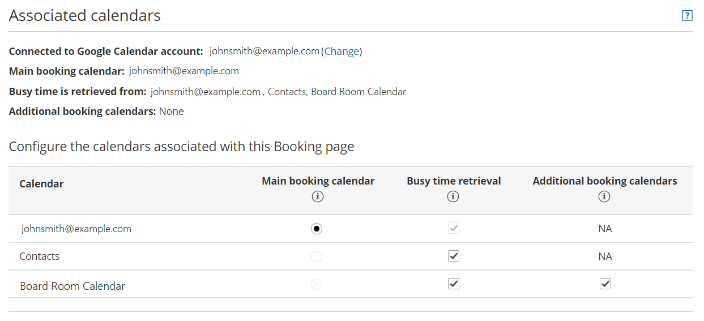
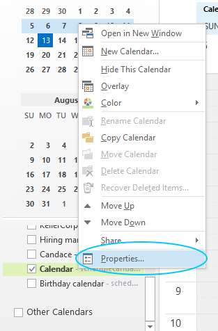

import { Aside } from '@astrojs/starlight/components';

There can be a number of reasons why your bookings are not showing up in Outlook, you are seeing double bookings in Outlook, or your availability is not reflected correctly in OnceHub. 

This article describes how these issues can be fixed. If you’re still having problems, please [contact us](/contact-us/) and we will be happy to assist you.

```
&lt;script id="snippet-prepend">
$(function()&#123;
  
  /*disable in widget*/
  if($('.w-documentation-article').length === 0)&#123;

     var ToC =
  "&lt;nav role='navigation' class='table-of-contents toc-top'><h4>In this article:" + "<ul>";
     var el,     title, link, header;
      //Define the heading levels you want to use in ascending order. Can add extra or remove unneeded.
     $(".hg-article-body h1, .hg-article-body h2, .hg-article-body h3, .hg-article-body h4").each(function() &#123;
              el = $(this);
              title = el.text();
                 if(title != '')&#123;
                anchorTitle = el.text().replace(/([~!@#$%^&*()_+=`&#123;&#125;\[\]\|\\:;'&lt;>,.\/\? ])+/g, '-').toLowerCase();
                link = "#" + anchorTitle;
                //Set all headers to a 0-nesting level.
                header = 'header-nesting-0';
                //Adjust header-nesting layers so that they point to the correct html tag. header-nesting-1 should match the second .hg-article-body h# listed above; header-nesting-2 should match the third, etc.
                if($(this).is('h2'))&#123;
                    header = 'header-nesting-1';
                &#125;else if($(this).is('h3'))&#123;
                    header = 'header-nesting-2'
                &#125;
                el.html('<a id="'+anchorTitle+'" class="toc-anchor">' + el.html());
                newLine =
      "<li class='"+header+"'>" +
        "<a class='article-anchor' href='" + link + "'>" +
          title +
        "" +
      "";


                ToC += newLine;
              &#125;
              &#125;);
     ToC +=
   "" +
  "";
    $("#snippet-prepend").before(ToC);
  &#125;
&#125;);

&lt;/script>
```

```
&lt;style>
/* CSS to style the TOC as it displays and the auto-created anchors
.toc-top styles the box for the TOC; adjust styles here to tweak look and feel */
  
.toc-top &#123;
  background-color: #FAFAFA; /* set to #fff or delete entirely for no background */
  border: 1px solid #C8C8C8; /* adjust the color hex here to change border color */
  box-shadow: 0 1px 1px rgba(0, 0, 0, 0.05) inset;
  margin-top: 24px;
  margin-bottom: 36px;
  min-height: 20px;
  padding: 13px 20px;
  max-width: 75%;
&#125;
.toc-top h4 &#123;
  font-size: 18px;
  line-height: 26px;
  margin: 0 0 8px;
  font-weight: 400;
&#125;
.toc-top ul &#123;
  padding: 0 0 0 15px !important;
  margin-bottom: 0;	
&#125;
.toc-top > ul &#123;
  margin-bottom: 13px!important;
&#125;
.toc-anchor &#123;
  display: block;
  height: 90px; 
  margin-top: -90px; 
  visibility: hidden;
&#125;

/* Set the indentation for the nesting levels. May need to be edited to match changes above. Increase or decrease the margin-left to get your desired level of indentation. */
.header-nesting-1 &#123;
    margin-left: 14px;
&#125;
.header-nesting-1:before &#123;
	background-image: url(https://dyzz9obi78pm5.cloudfront.net/app/image/id/5d31bcc88e121c9b25ba22c4/n/bulletv2.svg)!important;
&#125;
.header-nesting-2 &#123;
    margin-left: 28px;
&#125;
.header-nesting-2:before &#123;
	background-image: url(https://dyzz9obi78pm5.cloudfront.net/app/image/id/5d31be536e121cf22b0cc6ae/n/bulletv3.svg)!important;
&#125;
&lt;/style>
```

# Is the connector running? 

Check to ensure that the OnceHub connector for Outlook is running in the taskbar (Figure 1). 

Figure 1: OnceHub Connector for Outlook 

The connector must be running and connected to the internet in order to sync between Outlook and OnceHub. If it is not running, new bookings from OnceHub will not be synced to Outlook and new events in your Outlook Calendar will not block availability in OnceHub, which can cause double bookings.

[Learn more about connecting and configuring the connector for Outlook](/connecting-and-configuring-the-scheduleonce-connector-for-outlook/ "Connecting and configuring the ScheduleOnce connector for Outlook")

# Is the connector displaying an alert?

The connector is programmed to alert you when specific issues arise, so you will be aware of any issues that arise. 

[Learn more about alerts notifying you of issues that affect syncing](/outlook-troubleshooting-the-outlook-connector-is-not-syncing-and-displays-an-alert/ "Outlook Troubleshooting: The Outlook connector is not syncing and displays an alert")

# When did the Connector last sync?

Open the OnceHub connector for Outlook to see when the **Last sync** took place (Figure 2). This will be shown above the Settings button.Figure 2: Last sync

The latest time the connector synced is affected by the sync mode you are using. If you are using real-time mode, the latest sync should be the last time you received a OnceHub booking or changed something in a syncing Outlook Calendar. If you are using auto-sync every X minutes/hours, the latest time will correspond to the duration of auto-sync you have configured. 

[Learn more about sync modes](/non-visible-articles/pc-connector-for-outlook/outlook-connector-sync-modes/ "Outlook connector sync modes")

If it has not synced recently, you can prompt a sync by clicking **Settings** and going through all the steps. 

[Learn more about connecting and configuring the OnceHub connector for Outlook](/connecting-and-configuring-the-scheduleonce-connector-for-outlook/ "Connecting and configuring the ScheduleOnce connector for Outlook")

# Is the calendar event set to show as Free?

In order to block events in OnceHub, the calendar event in Outlook must be set to show as Busy or another setting besides Free. Events showing as Free will not be blocked in OnceHub. 

[Learn more about when calendar events are treated as busy](/the-basics-of-calendar-connection-ed13279-how-can-i-use-my-calendars-busy-time-in-scheduleonce/ "How can I use my calendar's busy time in OnceHub?")

# Is your OnceHub account configured to block availability for busy events?

The default Booking page configuration is a [one-on-one session](/one-on-one-or-group-session/ "One-on-one or Group session"), with busy time blocking availability as soon as you have one event in any calendar for which OnceHub is reading busy time. However, if busy time is not being blocked when it should be, it's possible you have changed this configuration. For example, you may have enabled [group sessions](/one-on-one-or-group-session/ "One-on-one or Group session"). 

[Learn more about what to do when busy time is not blocking availability](/why-does-my-booking-page-say-im-available-when-im-busy/ "Booking page troubleshooting: Why does my Booking page say I’m available when I’m busy?")

# Is the correct calendar selected in OnceHub?

To check that OnceHub is retrieving busy time from the correct calendars, select the relevant Booking page **-> Associated calendars** (Figure 3). Ensure that your connected Outlook Calendar is selected as the **Main booking calendar** or **Additional booking calendar**. You should also ensure that busy time is being retrieved from your connected Outlook Calendar. 

Figure 3: Associated calendars section

[Learn more about customizing calendar settings](/booking-page-associated-calendars-section/ "Booking page: Associated calendars section")

# Do you still have permissions for the calendar you are syncing?

If you are trying to sync Microsoft Exchange shared calendars, check the permissions of the calendar(s) you are syncing with OnceHub. In Outlook, right-click on the relevant calendar (Figure 4).

Figure 4: Calendar properties

Go to **Properties -> Permissions -> Permission level** (Figure 5). Ensure that you still have read/write capabilities for the calendar. 

Figure 5: Permissions

# Are you using an alternate method to send meeting invites through the connector?

If OnceHub has prompted you to use an alternate method for sending meeting invites, this might cause an Outlook security alert to pop up, which will cause Outlook to ignore the connector. This happens because you are using the connector to send an email (the calendar invite), so it raises a red flag for Outlook's basic security system. You can change this by [disabling the security alert](/outlook-troubleshooting-disabling-the-outlook-security-alert/ "Outlook Troubleshooting: Disabling the Outlook security alert").

# Are you running antivirus software or a firewall?

Your antivirus software or firewall might be blocking the sync. To fix this, you or your IT team can create a whitelisted exception for the program Scheduleoncec4o.exe. In the case of a firewall, you can open specific ports required for syncing in real time. Ask your IT department to open XMPP ports 5222 and 5223. 

Alternatively, you can [switch sync mode](/non-visible-articles/pc-connector-for-outlook/outlook-connector-sync-modes/ "Outlook connector sync modes") from real-time sync to auto-sync every 5 minutes (or another amount), and the XMPP ports will not be required.