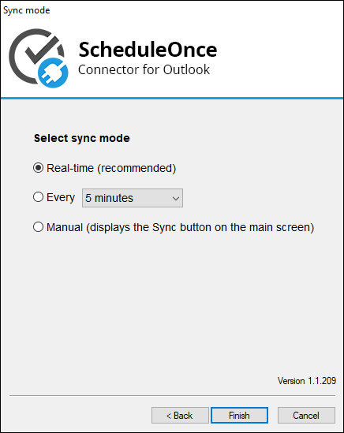

import { Aside } from "@astrojs/starlight/components";

[When you configure the Outlook connector on your PC](/non-visible-articles/pc-connector-for-outlook/connecting-and-configuring-the-pc-connector-for-outlook/ "Connecting and configuring the PC connector for Outlook"), you can select different sync options between your Outlook Calendar and OnceHub.

In this article, you will learn about the different sync options.

There are three options to sync your connector with Outlook:

Figure 1: Sync mode options

- **Real-time**: The connector will automatically push to OnceHub any change made to calendar appointments in the calendars that you have selected to sync with OnceHub. When a booking is made in OnceHub, it will automatically sync and populate your relevant Outlook Calendar. The real-time option is the default selection and is recommended unless there are specific environmental factors affecting its functionality.

<Aside type="note">

The connector uses the **XMPP messaging protocol that uses ports 5222 and 5223** to sync in real time. If the protocol or the ports it uses are blocked by your company's firewall, communications between OnceHub and Outlook will not be allowed. In this case, you should contact your IT administrator to enable the protocol or choose the auto-sync mode.

</Aside>

- **Auto-sync every X minutes/hours**: The connector will sync every time interval that you choose. You can select from the following values: 1 min, 5 min, 15 min, 30 min, 45 min, 1 hr, 2 hrs, 3 hrs 4 hrs, 5 hrs, 10 hrs, 24 hrs.
- **Manual sync**: When you choose to sync manually, a **Sync** button will be added to the connector. Manual sync mode is useful for testing and is not a recommended sync mode.
