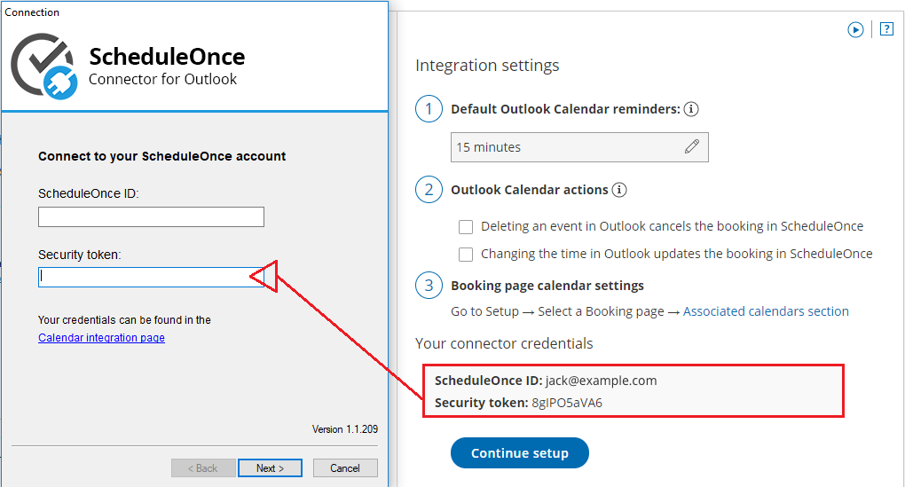
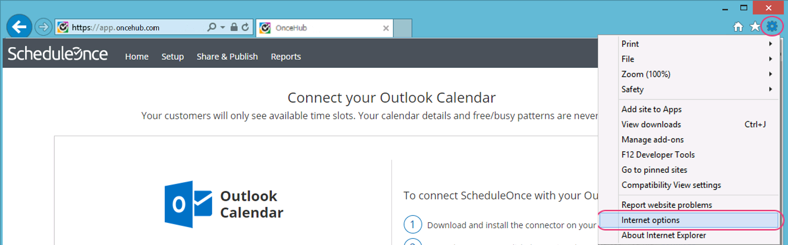
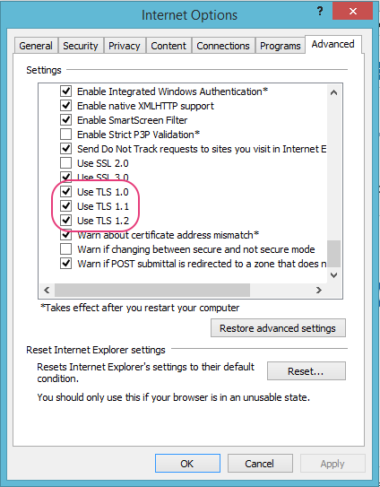

import { Aside } from "@astrojs/starlight/components";

If your security token is invalid, please first ensure that you have copied it accurately from the Calendar integration page (see Figure 1). Select your profile picture or initials in the top right-hand corner → Profile settings → **Calendar connection** and check that you copied it with no blank spaces. If you have tried this multiple times and it has not worked, try by manually typing the token instead.

Figure 1: Connector credentials

## **TLS enabled?**

If neither of these work, you should check settings in Internet Explorer to ensure that TLS protocol is enabled. This is a security protocol that allows the security token to work. Windows takes multiple internet settings directly from Internet Explorer options. Even if you never or seldom use Internet Explorer, these options affect your internet connection, so they need to be checked within the Internet Explorer browser.

This is an easy thing to check. Open Internet Explorer and select the Tools gear icon on the top right. Select Internet options (see Figure 2).

Figure 2: Internet options

In the Advanced menu, please scroll down to the Security section and ensure that the boxes for Use TLS 1.0, TLS 1.1, and TLS 1.2 are all enabled.

Once this is done, open the connector again and see if the security token now works.

<Aside type="note">

Windows XP is no longer supported by Microsoft. As a result, it does not support updated TLS protocols. Because of this, the Outlook connector will not work on machines running Windows XP. .

</Aside>
