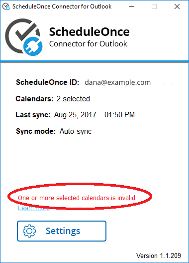
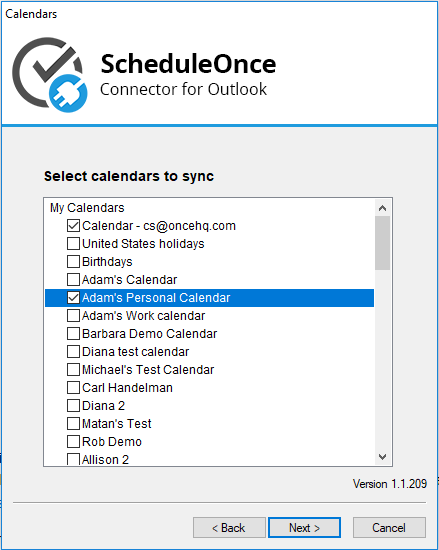

import { Aside } from '@astrojs/starlight/components';

If you receive the message "One or more selected calendars is invalid" from the [PC connector for Outlook](/non-visible-articles/pc-connector-for-outlook/introduction-to-the-pc-connector-for-outlook/ "Introduction to the PC connector for Outlook"), it is due to the calendar ID being changed since the connector was set up (see Figure 1).

Connector with the error message:Figure 1: Invalid calendar

This can happen for the following reasons:

*   The calendar was deleted.
*   The calendar ID was changed.
*   Sharing permissions on the calendar were changed and the calendar you are trying to sync with is no longer accessible to you.

To resolve the issue, open the connector, click the Settings button, click Next to see your calendars, and re-select the calendars you want to sync with (see Figure 2). The connector will list all of the calendars which you have read/write permissions.

Figure 2: Select calendars  

If you want to use a different calendar for your appointments, you can create a new calendar in Outlook and repeat the above steps. If you want to sync with a calendar that is owned by someone else, please ask the owner to share their calendar with you and then repeat the above steps. [Learn more about sharing Outlook calendars](/sharing-outlook-calendars/ "Sharing Outlook Calendars")