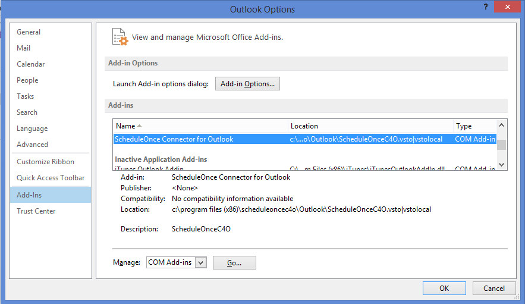
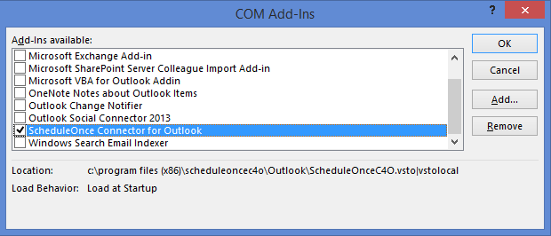

import { Aside } from "@astrojs/starlight/components";

If the connector for Outlook is not functioning as it should, you may need to upgrade it to the latest version. This can be done by going hovering over your profile picture or initials in the top right-hand corner → **Profile settings** → **Calendar connection**, and upgrading the connector by downloading and installing the latest connector version.

If that fixes the issue, there is no need to read further. If the problem still persists, you might need to perform a clean reinstall:

1. Close the connector and Outlook. If your connector or Outlook are not responding, press Ctrl+Alt+Delete to access the Task Manager. From the Task Manager on your PC, you should end the Outlook and the OnceHub connector for Outlook tasks.

2. The next step is to uninstall the connector from your PC. From your Control Panel, select Programs and Features and uninstall the connector.

3. Now you will remove the connector add-in in Outlook:

   Open Outlook, go to File -> Options > Add-Ins, and select OnceHub connector for Outlook. Click Go.

   

   \- The COM Add-ins window appears and lists the add-ins in Outlook.

   

   \- In the COM Add-in window, check the OnceHub connector for Outlook, click Remove, and finally OK.

4. Restart your computer.

5. When your computer is back up, sign in to your OnceHub account and [re-install the Outlook connector](/non-visible-articles/pc-connector-for-outlook/non-visible-articles/pc-connector-for-outlook/non-visible-articles/pc-connector-for-outlook/installing-the-pc-connector-for-outlook// "Installing the PC Connector for Outlook")

6. If you still experience issues, you should [generate a connector log](/non-visible-articles/pc-connector-for-outlook/generating-an-outlook-connector-log-file/ "Generating an Outlook connector log file") and [send it to us](/contact-us).
