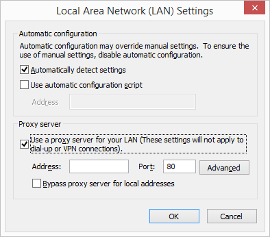

import { Aside } from "@astrojs/starlight/components";

If your organization is using a proxy server to access the internet, you will need to take additional configuration steps for the connector to work in your environment:

1. In your Internet Explorer browser, go to **Tools** in the top right corner of the screen -> **Internet options** -> **Connections** tab -> click the **LAN settings** button and enter the details of your proxy server:

   

   You _must_ do this in Internet Explorer because Internet Explorer updates the Windows operating system with this data, which also makes it available to the connector.

2. Restart the connector and check if it can sync successfully. If it still displays the message that it cannot connect to the internet, ask your IT department to do the following:

   - Make sure that the following ports are open on the proxy and/or the firewall: HTTP and HTTPS ports (80 and 443). When real-time sync is used, the connector also uses the XMPP protocol that uses ports 5222 and 5223.
   - Make sure that the firewall is set to permit the connector process name: scheduleoncec4o.exe
