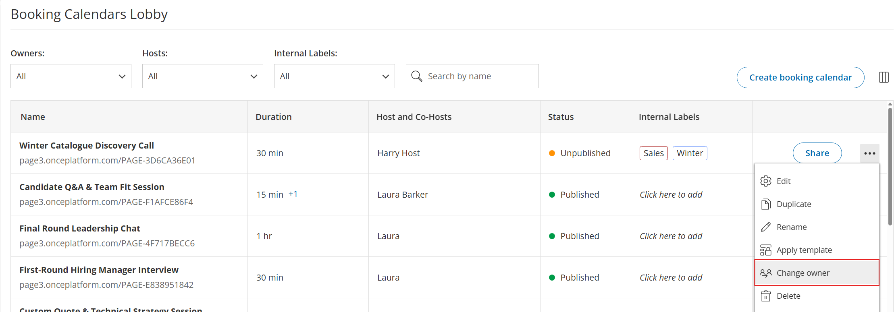

import { Aside } from "@astrojs/starlight/components";

The **Booking Calendar Owner** is the primary user authorized to manage and edit a [**Booking Calendar's**](https://help.oncehub.com/product/booking-calendars/introduction-to-booking-calendars/introduction-to-booking-calendars/) configuration settings. By default, the user who creates a Booking Calendar is automatically designated as its Owner.

---

## What Can the Booking Calendar Owner Do?

The Booking Calendar Owner's ability to edit an owned booking calendar depends on the Owner's assigned [**user role**](https://help.oncehub.com/account-administration/user-management/user-roles-overview/):

- **Member:** Can edit all settings except for changing the Host.
- **Team Manager:** Can edit all settings including changing the Host for their [**managed teams**](https://help.oncehub.com/product/booking-calendars/booking-settings/booking-calendar-meeting-distribution-options/#creating-teams).
- **Administrator / Account Owner:** These roles are stronger than individual object permissions. They can edit all settings across all Booking Calendars on the account regardless if they are an owner or not.

---

## Changing the Booking Calendar Owner

Permission to update ownership depends on your user role:

- **Member:** Cannot assign or change Booking Calendar Owners.
- **Team Manager:** Can set any member of their specific team as the Owner.
- **Administrator/Account Owner:** Can set any user on the account as the Owner.

### How to Change the Booking Calendar Owner

Follow these steps to update ownership for an existing Booking Calendar:

1. Navigate to **Booking Calendars** in the left-hand menu.
2. Click the three-dot menu to the right of the Booking Calendar.
3. Select **Change owner**.
4. Select the new **Owner** from the dropdown.
5. Click **Save** to apply the change.

<Aside type="note">

You can also assign an Owner during the initial creation of a Booking Calendar.

</Aside>

---

## Booking Calendar Owner Vs. Host

The Owner and Host serve distinct roles and do not need to be the same user.

- The **Owner** manages and configures the Booking Calendar settings.
- The **Host** conducts the meetings booked through the Booking Calendar.

The ability to change the Host depends on the Owner's user role:

- **Member:** Cannot change the Host.
- **Team Manager:** Can change the Host to themselves or to a member of their team.
- **Administrator/Account Owner:** Can change the Host to any user on the account.

<Aside type="note">

Hosts can view meetings booked through their assigned Booking Calendar. Being an Owner **does not grant access to view scheduled meetings** unless that user is also assigned as a Host or Co-Host on the Booking Calendar.

</Aside>

---

### A Special Note When a Booking Calendar Uses a Team of Hosts With Custom Availability

When a Booking Calendar is set to use [**customize availability and locations for some hosts**](https://help.oncehub.com/product/booking-calendars/booking-settings/configuring-availability-for-specific-booking-calendars/), the following rules apply:

- Any user who is part of the Host or Co-Host team of the Booking Calendar can **update their own availability on the Booking Calendar**.
- Team Managers can update availability for any Host or Co-Host on their team.
