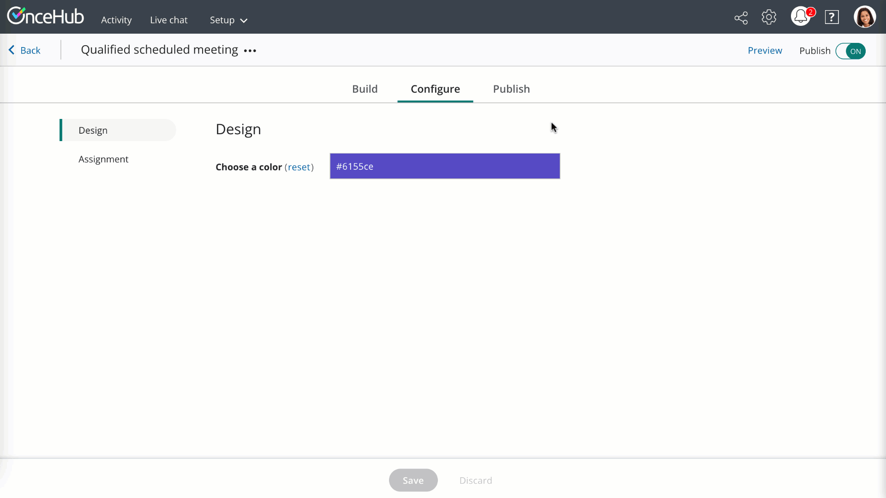

import { Aside } from '@astrojs/starlight/components';

Adding a routing form to your Weebly website is quick and easy. 

**Note**

Adding custom javascript requires a **Weebly** Professional or Performance plan.

# Add a routing form to your website

## Create the routing form

1.  Go to **Routing forms** on the left.
2.  Click on the **Create routing form** button OR duplicate another form by clicking the three dots menu for that form and selecting **Duplicate**.  
    

[**Create the form**](/routing-forms/getting-started-with-routing-forms/creating-a-routing-form/) as you prefer, either duplicated from another, from scratch, or using a template.

When you've added the interactions you want, routed them, and designed the form as you like, navigate to the **Embed on website** tab.

## Install the code

### In OnceHub

You'll grab the code you need for Weebly.

1.  On the  **Embed on website** tab, pick the color you'd like for your routing form, then select **Get the code**.
2.  Copy the code.

Figure 1: Copy the embed code

### In Weebly

You'll add an [**Embed Code element**](https://www.weebly.com/app/help/us/en/topics/create-widgets-embed-code-and-add-external-content) to your website, on each individual page where you want a form.

1.  Edit your website.
2.  Add an **Embed code** element to the site. 
3.  Click on the element and **Edit Custom HTML**.
4.  Paste the code from OnceHub and adjust as needed.
5.  Publish your website. 

That's it! Your website can now display your routing form in the place you added it.