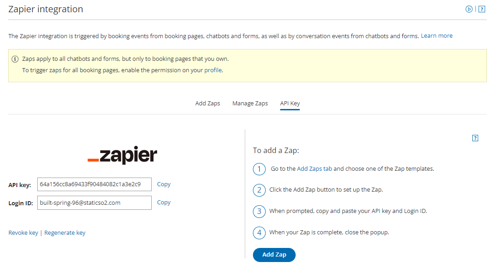

import { Aside } from "@astrojs/starlight/components";
import YouTubeEmbed from "~/components/YouTubeEmbed.astro";

<YouTubeEmbed id="dy4-muw5FGk" title="Connect Zapier to OnceHub" />

Zapier is an iPaaS (Integration Platform as a Service) that enables quick and simple data movement between applications.

The platform is connected to more than 1000 applications in many categories, including CRM, invoicing, productivity, email marketing, and more. OnceHub is part of the Zapier app community, allowing you to easily push Customer and Booking data to your favorite apps.

## The OnceHub connector for Zapier

Once you register with Zapier, you can create Zaps.

Zaps are workflow automations linking two or more apps, through Triggers and Actions. Each Zap is triggered by an event in one app, and automatically completes an Action in a second app using the data collected from the Trigger. For example, you can set up a Zap that creates or updates a contact in your CRM every time a new booking is made via OnceHub.

OnceHub provides **ten Zapier triggers** for OnceHub activity. They are divided into two groups: specific and composite. [Learn more about the OnceHub triggers on Zapier](/scheduleonce/account-integrations/automation/zapier/oncehub-fields-and-triggers-available-in-zapier "OnceHub fields available in Zapier")

To get started with Zapier, you will need to [create a Zapier account](https://zapier.com/sign-up/) and then generate a Zapier API key in OnceHub.

## Generate your Zapier API key

To trigger Zaps from your OnceHub account, you must first generate a Zapier API key in OnceHub. Once you generate your key, you can [create Zaps using OnceHub as a Trigger.](/scheduleonce/account-integrations/automation/zapier/create-and-manage-zaps-from-oncehub "Create and manage Zaps from OnceHub")

To generate your Zapier API key in OnceHub:

1. Click the gear icon located in the top-right corner of the page.
2. Select **Account Integrations** from the dropdown menu.
3. Filter for **Automation**.
4. Click on the **Zapier** tile.
5. Select the **API key** tab and click the **Generate API Key** button. OnceHub will create your unique API key (see _Figure 1_).
6. When you [create your first Zap](/scheduleonce/account-integrations/automation/zapier/create-and-manage-zaps-from-oncehub "Create and manage Zaps from OnceHub"), simply copy your API key and OnceHub Login ID from OnceHub (see _Figure 1_).Figure 1: API key generated
7. Next, paste the copied credentials into the Zapier authentication page

Congratulations! Your Zapier API key is ready and you can start creating Zaps with OnceHub as a Trigger.

<Aside type="caution">

If you revoke or regenerate your Zapier API key, or change your OnceHub Login ID, you will need to reconnect OnceHub to Zapier. To reconnect, log into Zapier, go to Connected Accounts and reconnect OnceHub using the new credentials.

</Aside>

Once you generate your Zapier API key, you are ready to [create Zaps](/scheduleonce/account-integrations/automation/zapier/create-and-manage-zaps-from-oncehub "Create and manage Zaps from OnceHub") for integrating OnceHub with your chosen applications.

### Creating Zaps

<Aside type="note">

By default, your Zaps can only be triggered from Booking pages you own. OnceHub administrators can trigger Zaps from pages not under their ownership by enabling a permission in their User profile. [Learn more about triggering Zaps from pages not under your ownership](/scheduleonce/account-integrations/automation/zapier/create-and-manage-zaps-from-oncehub "Create and manage Zaps from OnceHub")

</Aside>

OnceHub offers many Zap templates with more than 35+ applications, giving you access to pre-defined workflows for recommended use-cases. Our templates provide you with a guided setup experience with pre-filled options and fields, so you don't have to [create Zaps from scratch](/scheduleonce/account-integrations/automation/zapier/create-and-manage-zaps-from-oncehub "Create and manage Zaps from OnceHub") in the Zap Editor.

You can find all the OnceHub Zap templates in your OnceHub account. In OnceHub, simply search the specific apps with which we have templates, and click to add the Zap you require. [Learn more about adding Zaps from within OnceHub](/scheduleonce/account-integrations/automation/zapier/create-and-manage-zaps-from-oncehub "Create and manage Zaps from OnceHub")

If you do not find a Zap template that suits your exact scenario, you can also [create your Zaps from scratch in Zapier](/scheduleonce/account-integrations/automation/zapier/create-and-manage-zaps-from-oncehub "Create and manage Zaps from OnceHub") with any of the 1000+ apps connected.
