import { Aside } from "@astrojs/starlight/components";

The [OnceHub connector for Zapier](/scheduleonce/account-integrations/automation/zapier/connect-zapier-to-oncehub "Connect Zapier to OnceHub") allows you to add Zaps directly from within your OnceHub account. This can be done using ready-made Zap templates, or by creating Zaps from scratch.

<Aside type="note">

If you joined OnceHub on or after May 2024, your experience will be slightly different to that described below.

The key differences will be:

- Only account administrators will be able to create and configure Zaps. Member users will not be able to set up and configure Zaps.
- Zaps will apply to all scheduling tools; i.e., a Zap set up for a booking calendar will apply to all active booking calendars on the account. The same is true for booking pages, chatbots, and routing forms.
- Instead of having a Login ID, users will now use an Account ID generated by OnceHub when linking OnceHub and Zapier accounts.

Whether you are a new user or an existing user, Zapier integration settings can now be found in **Account settings** as opposed to profile settings.

</Aside>

## Adding a Zap from within OnceHub

1. Log into your OnceHub account.

2. Click the gear icon located in the top-right corner of the page.

3. Select **Account Integrations** from the dropdown menu.

4. Filter for **Automation**.

5. Click on the **Zapier** tile.

6. Select the **Add Zaps** tab. Here, you can search for apps with Zap templates to connect with OnceHub. By default, the **Popular Zaps** category is selected, showing you the most popular Zaps used by OnceHub Users (Figure 1). 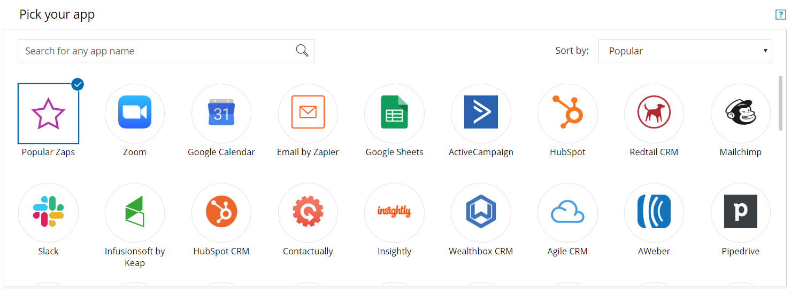_Figure 1: The Add Zaps tab with the Popular Zaps category selected_

7. Filter the Zaps shown by selecting one or more apps in the Search area. The Zap templates are displayed below the Search area, listed by popularity by each selected app (see Figure 2).

   <Aside type="note">

   **Note**To find a specific app, you can type the app name in the Search bar. You can also sort the list of apps by popularity or alphabetically (see Figure 2).

   </Aside>

   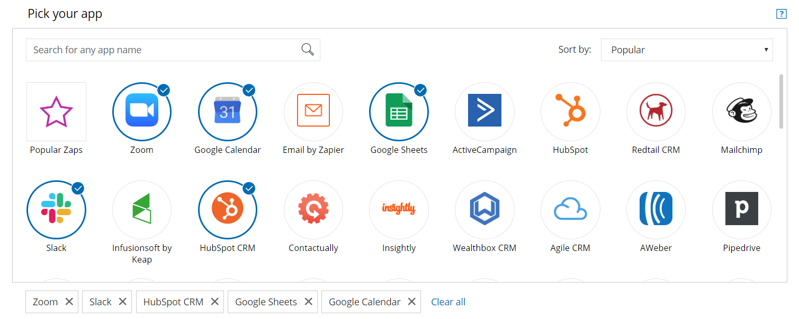_Figure 2: Selecting specific apps_

8. Click the **Add Zap** (Figure 3) button to add a Zap or to see a detailed description of the template. The Zap Editor will open in OnceHub, allowing you to customize the Zap (see Figure 4).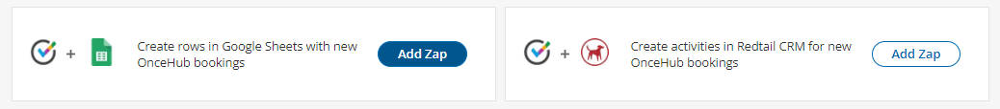_Figure 3: The Add Zap button_

9. To add the template to your account click **Create this Zap** (see Figure 4). If you are not already logged in to Zapier or have not yet signed up for a Zapier account, you will be asked to log in or sign up at this stage.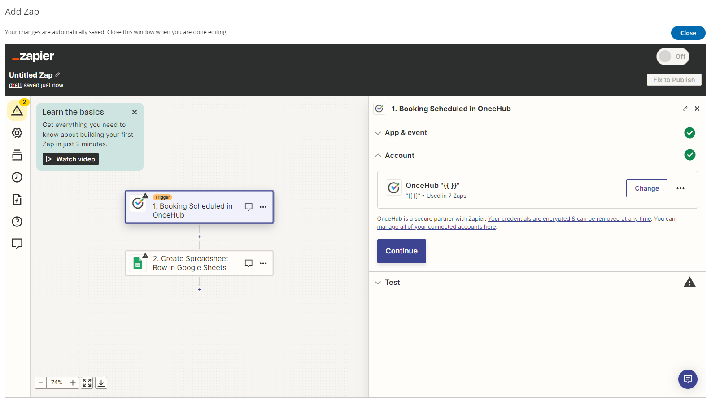_Figure 4: The Zap editor_

10. Select a OnceHub account. If you have already connected OnceHub with Zapier, simply select the account (see Figure 5). Make sure to test the connection by clicking the **Test** button (bottom of Figure 5).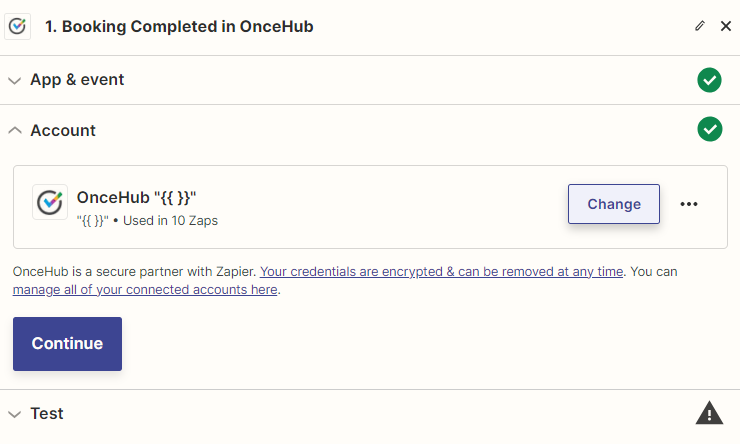 _Figure 5: Selecting your OnceHub account_

11. If you have not connected an account, or want to connect a different account, click on the **Connect an Account** button to establish a new connection. You will be asked to provide your Zapier **API Key** and **OnceHub Login ID** in the Zapier authentication page.

12. Click the link to open your OnceHub account in a new browser tab. Copy your **API key** and **Login ID** from the **API Key** tab in the OnceHub Zapier integration page (see Figure 6).

    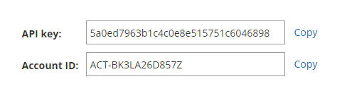Figure 6: Your Zapier API key and Account ID

13. Once connected, click **Save + Continue** in the Zap Editor (see Figure 8).

14. Test the OnceHub trigger. First, make sure you have an existing booking in your connected OnceHub account. If not, you can make a test booking by opening your Booking page in a new browser tab. Once you have at least one booking, click **Fetch & Continue** to test the trigger.

15. Once the test is successful, click **Continue**.

    <Aside type="note">

    **Note**You can add a Filter step to more accurately define when to trigger this Zap. For example, you can define a filter that states only specific booking events (e.g. “Scheduled” and “Rescheduled”) or specific Bookings pages will trigger the Zap. [Learn more about adding a Filter step in Zapier](/scheduleonce/account-integrations/automation/zapier/create-and-manage-zaps-from-oncehub "How to add a Filter step to a Zap in Zapier")

    </Aside>

16. Select an account for your Action app (see Figure 7). If you have already connected your account with Zapier, simply select the account. Make sure to test the connection by clicking the **Test** button. If you have not connected an account or want to connect a different account, click the **Connect an Account** button to establish a new connection. Once connected, click **Save + Continue**.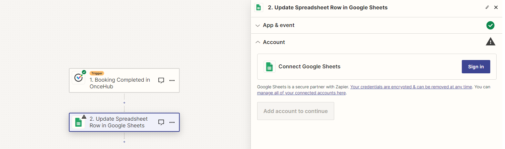_Figure 7: Selecting an account for the Action app_

17. Set up the Action by filling in the fields (see Figure 8). Some fields require you to select values from the Action app, while other fields require you to use your own text and/or values from OnceHub fields. Click on a field’s drop-down to see which options are available. Use the Search bar at the top of the dropdown to search for a specific field. Values from OnceHub fields will be dynamically updated with the relevant booking data and customer data each time the Zap is triggered. In the example below, you have to choose a Google Sheet for Zapier to populate.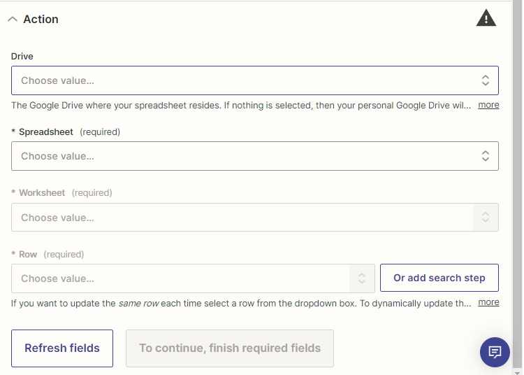 _Figure 8: Filling in the Action fields_

18. Test the Action step by following the instructions (see Figure 9). Once you are done testing, you can either add another step or click **Publish** to complete the Zap (see Figure 10). 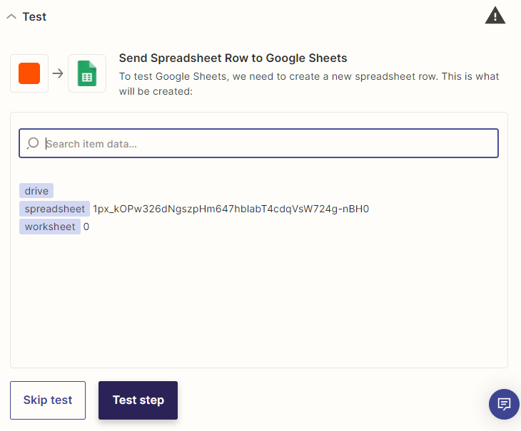 _Figure 9: Testing the Action step_

19. Publish your Zap (see Figure 10).

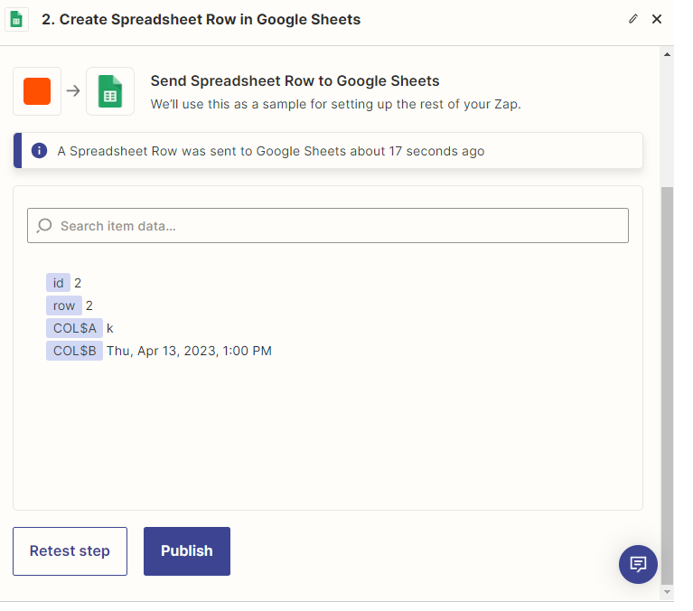

_Figure 10: Publishing your Zap_

Congratulations! You are done. Your Zap is active and your workflow is automated. You can now close the Add Zap popup and return to browsing Zap templates in OnceHub.

<Aside type="note">

By default, Zaps are only triggered from Booking pages you own. OnceHub administrators can be allowed to trigger Zaps from pages not under their ownership by enabling the **Trigger Zaps from all Booking pages** permission in the Administrator’s profile. [Learn more about triggering Zaps from pages not under your ownership](/scheduleonce/account-integrations/automation/zapier/create-and-manage-zaps-from-oncehub "Triggering Zaps from pages not under your ownership")

</Aside>

If none of the ready-made Zaps suits your exact scenario, you can also create your own Zaps from scratch in Zapier with any of the 1,000+ apps connected. Learn how to do this by reading on in this article.

### Managing Zaps from within OnceHub

The OnceHub connector for Zapier allows you to manage your OnceHub Zaps from within the comfort of your OnceHub account. OnceHub communicates with the Zapier API to retrieve a list of your OnceHub Zaps and their statuses.

#### Requirements:

To access your OnceHub Zaps from within OnceHub, you need a Zapier account.

<Aside type="note">

- From within OnceHub, you can only access your OnceHub Zaps. Your non-OnceHub Zaps are not accessible via the Zapier API.
- If you have a Zapier Team account, you will see Zaps from both your Zapier Personal account and team-shared Zaps in your OnceHub account.

</Aside>

#### Managing your OnceHub Zaps

To access your OnceHub Zaps:

1. Select your profile picture or initials in the top right-hand corner → **Profile settings** → **Zapier**.

2. Select the **Manage Zaps** tab and click **Connect** (_see Figure 1_). 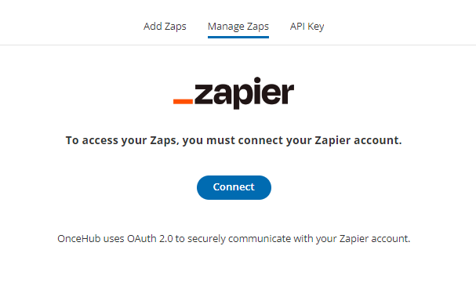

   Figure 1: The **Manage Zaps** tab

3. In the Zapier login page, enter your Zapier email and password, and click **Login**.

4. In the Zapier consent screen (_see Figure 2_), click **Authorize** to allow OnceHub to list your Zaps and their statuses. You will be redirected back to OnceHub.

   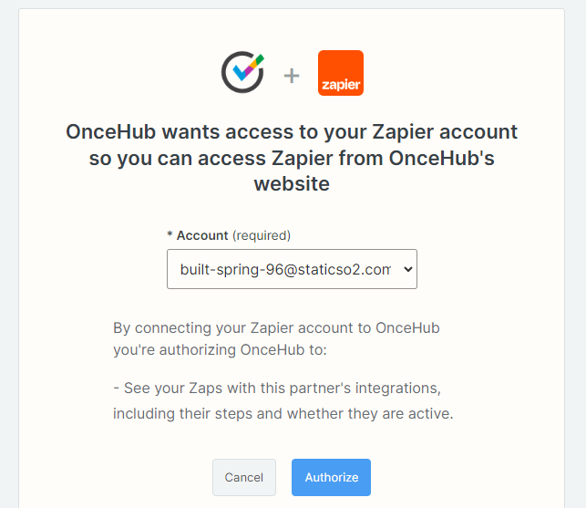

   _Figure 2: Zapier consent screen_

5. Once connected, you can view your OnceHub Zaps (_see Figure 3_).

   A Zap can be in one of the following states:

   **On**: The Zap is active and performing the action when triggered.

   **Off**: The Zap is complete but inactive. Turn on to use this Zap.

   **Draft**: The Zap is incomplete. Finish setup to activate this Zap.

   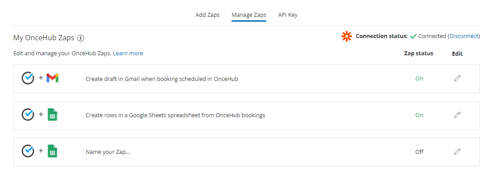_Figure 3: Your OnceHub Zaps_

6. To edit a Zap, click the pencil icon (****) to open the Zap Editor (_see Figure 4_).

In the Zap Editor, you can make any changes, including turning the Zap ON or OFF. Changes are automatically saved.

<Aside type="note">

&#x20;To delete a Zap, click on **Dashboard** within the Zap Editor (see _Figure 4_). Your Zapier account will open in a new browser tab. Locate the Zap and select **Trash** in the Zap's menu.

</Aside>

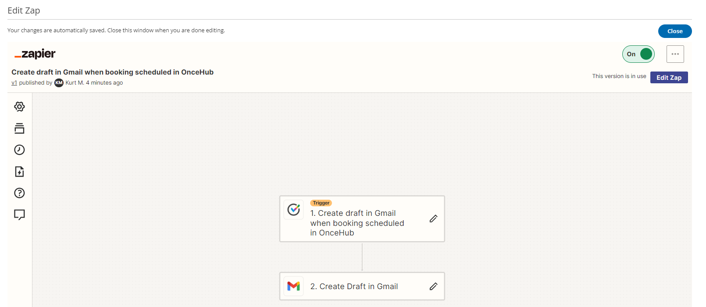_Figure 4: The Zap Editor from within OnceHub&#x20;_

7\. When finished, simply close the overlay popup.

Congratulations! You can now manage your OnceHub Zaps from within OnceHub.

### Triggering Zaps from pages not under your ownership

By default, you can only trigger Zaps from Booking pages you own. If you're a OnceHub Administrator, you can remove this restriction for yourself and for other Administrators in the account.

When Zap triggering from all Booking pages is enabled for an Administrator, the Administrator’s active Zaps will be triggered by booking events that occur on all Booking pages in the account effective immediately.

To limit your Zaps to specific Booking pages, add a Filter step to your Zaps before enabling the permission to trigger Zaps from all Booking pages.

<Aside type="caution">

Allowing an Administrator to trigger Zaps from pages owned by other Users means that you are giving this Administrator access to booking data and Customer data from all Booking pages in the account.

When Zap triggering from all pages is enabled, and other Users in the account are also connected to Zapier, there is a risk of duplicate or conflicting actions. For example, Customers may receive duplicate notifications. We recommend reviewing the Zaps of all connected Users before enabling this permission.

</Aside>

#### Requirements

To enable Zap triggering from all booking pages:

- You must be a OnceHub Administrator. This permission is User-based and can only be granted to Administrators.
- The Administrator for which the permission is enabled must have a [Zapier API key](/scheduleonce/account-integrations/automation/zapier/connect-zapier-to-oncehub "Connect Zapier to OnceHub").

#### Enabling Zap triggering from all pages

1. Sign in to OnceHub.
2. Select your profile picture or initials in the top right-hand corner → **Profile settings** → **Permissions.**
3. Check the box **Trigger Zaps for all booking pages** and click **Save.**
4. **In the Trigger Zaps from all booking pages pop-up, click **Yes**. Active Zaps will immediately apply to all booking pages in the account.**

### Creating Zaps using OnceHub as a Trigger

#### How to create a Zap using OnceHub as a Trigger

There are two ways to create a Zap using a OnceHub trigger:

1. **Use one of the Zap templates available to you within OnceHub**

   OnceHub offers many Zap templates with more than 35+ applications, giving you access to pre-defined workflows for recommended use-cases. Our templates provide a guided setup experience with pre-filled options and fields, so you don't have to create Zaps from scratch in the Zap Editor.

   You can set up Zap templates directly from within your OnceHub account (see _Figure 1_). Simply search the specific apps with which we have templates, and click to add the template you require.

   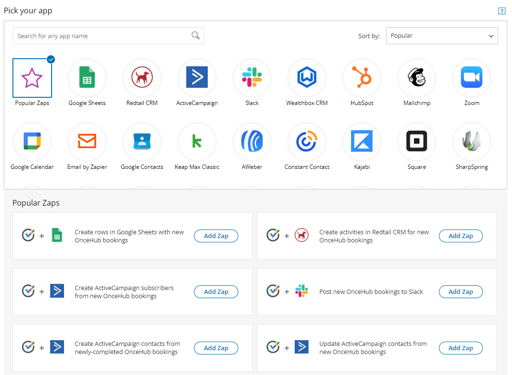

   _Figure 1: Add Zaps within OnceHub_

2. **Create a Zap from scratch in Zapier**

   If none of the Zap templates suit your exact scenario, you can create your own Zaps from scratch in Zapier (see _Figure 2_). This allows you to connect OnceHub with more than 1000 apps.

   

   _Figure 2: Click **Create Zap** to create a Zap from scratch_

### How to create a Zap from scratch in Zapier

<Aside type="note">

&#x20;You can add a Filter step to more accurately define when to trigger this Zap. For example, you can define a Filter that allows the Zap to continue only when specific Bookings pages are used or when specific booking events occur (e.g. **Scheduled** and **Rescheduled**).

</Aside>

1. Log in to Zapier, go to your **Dashboard** and click the **MAKE A ZAP!** button (see Figure 1).

   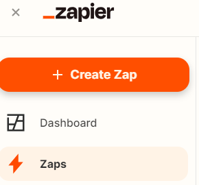

   _Figure 1: Click the Create Zap button_

2. Choose OnceHub as the trigger app. Type “oncehub” in the **Choose a Trigger app** field, and select **OnceHub** from the drop-down list.

3. Select a OnceHub trigger. [Learn more about the OnceHub triggers on Zapier](/scheduleonce/account-integrations/automation/zapier/oncehub-fields-and-triggers-available-in-zapier "OnceHub fields available in Zapier")

4. Select a OnceHub account. If you have already connected your OnceHub account with Zapier, simply select the account. Make sure to test the connection by clicking the **Test** button.

5. If you have not connected an account, or want to connect a different account, click on the **Connect an Account** button to establish a new connection. You will be asked to provide your Zapier API key and OnceHub login ID.

6. Click the link to open your OnceHub account in a new browser tab and copy your API key and Login ID shown in the API key tab in the Zapier integration page in OnceHub (see Figure 2).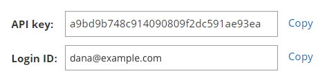

   _Figure 2: Copy your **API key** and **Login ID** from OnceHub_

7. Once connected, click **Continue**.

8. Test the OnceHub trigger. First, make sure you have an existing booking in your connected OnceHub account. If not, you can make a test booking by opening your Booking page in a new browser tab. Once you have at least one booking, click **Fetch & Continue** to test the trigger.

9. Once the test is successful, click **Continue**.

10. Choose an Action App with which to integrate OnceHub (see Figure 3).

    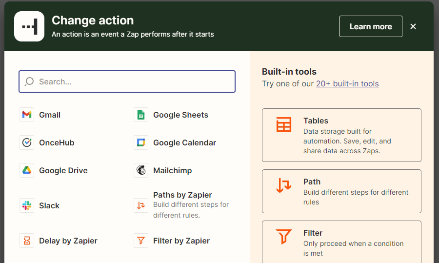

    _Figure 3: Choose an Action App_

11. Select the Action you want to occur when the Zap is triggered and click **Continue** (see Figure 4).

    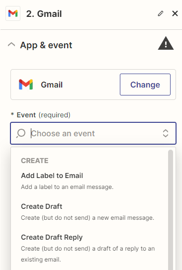

    _Figure 4: Select the Action_

12. Select an account for your Action app. If you have already connected your account with Zapier, simply select the account as shown below. Make sure to always test the connection by clicking the **Test** button. If you have not connected an account or want to connect a different account, click the **Connect an Account** button to establish a new connection. Once connected, click **Save + Continue**.

13. Set up the Action by filling in the fields. Some fields require you to select values from the Action app, while other fields require you to use your own text and/or values from OnceHub fields. Click on a field’s drop-down to see which options are available. Use the Search bar at the top of the dropdown to search for a specific field. Values from OnceHub fields will be dynamically updated with the relevant booking data and customer data each time the Zap is triggered. In the example below, OnceHub's **Customer – Email** field is used as the value for the **Subscriber Email** field in MailChimp, the Action app. [Learn more about the OnceHub fields available in Zapier](/scheduleonce/account-integrations/automation/zapier/oncehub-fields-and-triggers-available-in-zapier "OnceHub fields available in Zapier")

14. Test the Action step by following the instructions. Once you are done testing, you can either add another step or click **Finish** to complete the Zap.

15. Turn on your Zap. If you haven’t named your Zap yet, you can name it on this screen (see Figure 5).

    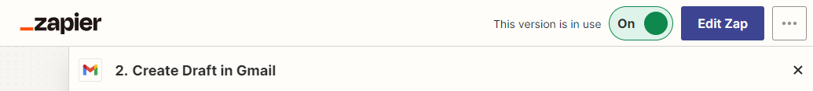

    Figure 5: Editing/publishing your Zap

16. Congratulations! You are done. Your Zap is active and your workflow is automated.

    <Aside type="note">

    **Note** By default, Zaps are only triggered from Booking pages you own. OnceHub Administrators can be allowed to trigger Zaps from pages not under their ownership by enabling a permission in the Administrator’s profile.

    </Aside>

### How to add a Filter step to a Zap in Zapier

A Filter is an optional step in a Zap that allows you to control when a Zap is triggered. You can define rules that state whether the Zap Action should be performed. For example, if you have multiple Booking pages, you can define a filter that states the Zap should only be triggered on specific Booking pages. Another option is to create filters that state the Zap should only be triggered upon specific booking events (e.g. **Scheduled** and **Rescheduled**).

In this article, we will review two examples in which a Filter can be useful: filtering by booking lifecycle phase and by [Booking page](/scheduleonce/event-types-booking-pages/booking-pages/introduction-to-booking-pages "Introduction to Booking pages"). Filtering by booking lifecycle phase is useful if you only want specific types of lifecycle events to trigger your Zap.

#### Filtering by booking lifecycle phase when using the Booking Lifecycle Event trigger

When using the **Booking Lifecycle Event trigger**, a Zap is triggered every time the status of one your bookings changes. The following statuses, or lifecycle events, can trigger a Zap: Scheduled, Rescheduled, Canceled, Completed, and No-show.

Without filtering, this trigger will create a new record every time a booking is canceled or completed. If you wish to prevent this, you should limit the trigger by filtering it. Below are the steps to set up this filter:

1. Log in to Zapier, go to **Zaps**, and click on the Zap you want to edit.

2. Add a Filter step by clicking on the **+** symbol on the left panel in the Zapier Editor (see Figure 1).

   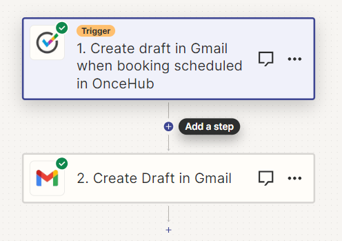

   _Figure 1: Add a Filter step_

3. Click on the **Filter** button to add the Filter (see Figure 2).

   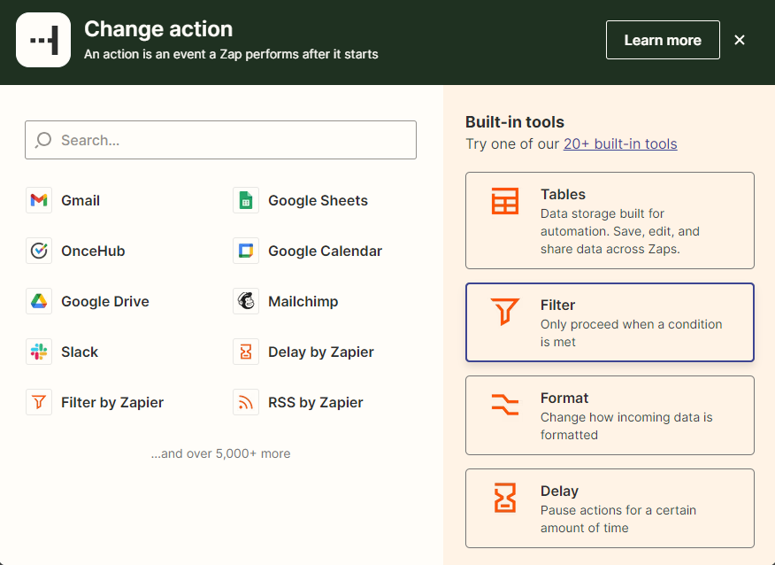

   Figure 2: Click on the **Filter** button

   Click **Continue** (see Figure 3). 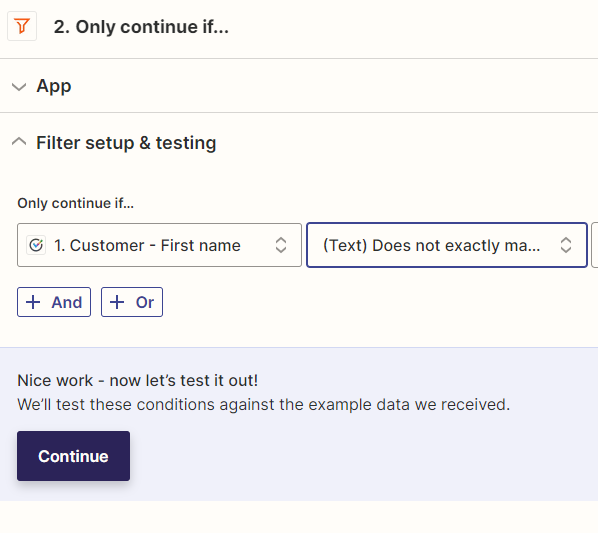\*Figure 3: Click **Save + Continue\***

4. Set up and test the Filter. A couple of examples are shown below.

   1. **Example 1: Allow only the “Scheduled” event to trigger the Zap.** Select the **Booking – Status** option in the 1st drop-down field. Select the **(Text) Exactly matches** option in the 2nd drop-down field and type “Scheduled” in the 3rd text field (see Figure 4). 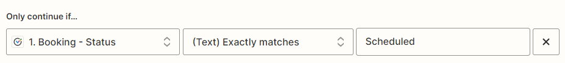Figure 4: Example

      <Aside type="note">

      **Note**The **(Text) Exactly matches** filter is case-sensitive. Make sure you use a capital S for "Scheduled".

      </Aside>

   2. **Example 2: Allow both the “Scheduled” and “Rescheduled” events to trigger the Zap**. Repeat the steps in Example #1. Next, click on the **+ OR** button. In the new added row, select the **Booking – Status** option in the 1st drop-down field. Select the **(Text) Exactly matches** option in the 2nd drop-down field and type “Rescheduled” in the 3rd text field (see Figure 5).

      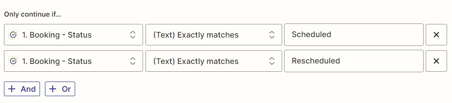

      Figure 5: Example 2: Allow both the **Scheduled** and **Rescheduled** events to trigger the Zap

### Filtering by Booking page

When you have multiple Booking pages and you wish to track a specific Booking page, you will need to set up a Filter. Setting up this Filter is done the same way described in the section above. The difference is in the Filter definition.

<Aside type="note">

By default, you can only trigger Zaps from Booking pages you own. OnceHub Administrators can be allowed to trigger Zaps from all Booking pages in the account by enabling a permission in the Administrator’s profile.

</Aside>

To define the Filter:

1. Select the **Booking page - Public link** option in the 1st drop-down field (see Figure 6).

   <Aside type="note">

   **Note**Always use the Booking page’s public link because it is unique. Do not use the Public name or Internal label because they are only unique to your account.

   </Aside>

2. Select the **(Text) Exactly matches** option in the 2nd drop-down field and type or paste the Booking page’s public link (see Figure 6). The Booking page’s public link can be copied from the [Overview section in the Booking page settings](/scheduleonce/event-types-booking-pages/booking-pages/booking-pages-overview "Booking page: Overview section") in your OnceHub account (see Figure 7).

   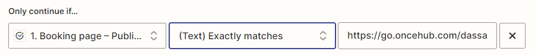

   Figure 6: Filter setup

   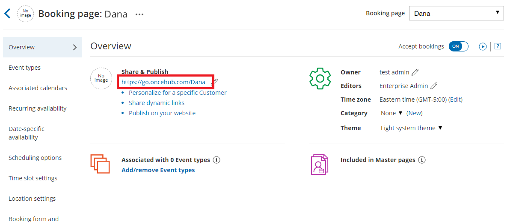

   Figure 7: Overview section in the Booking page settings
