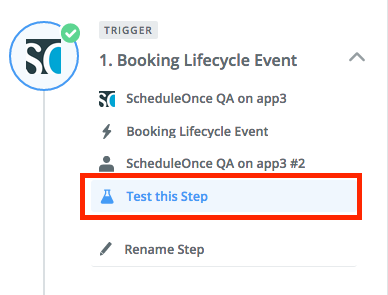
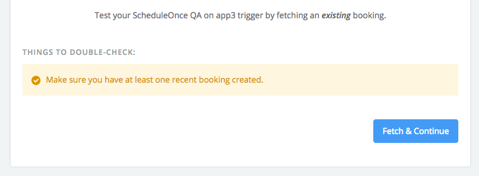
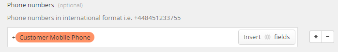
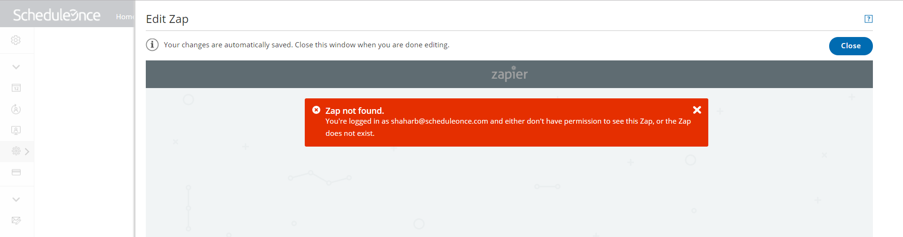

import { Aside } from "@astrojs/starlight/components";

This article describes potential issues while [integrating OnceHub with Zapier](/scheduleonce/account-integrations/automation/zapier/connect-zapier-to-oncehub "The ScheduleOnce connector for Zapier") and how these issues can be fixed. [Learn more about our Zapier support policy](/scheduleonce/account-integrations/automation/zapier/our-zapier-support-policy "Our Zapier support policy")

## The Zap is active but data is not transferred to the third-party app

1. Select your profile picture or initials in the top right-hand corner → **Profile settings** → **Zapier**.
2. In the **Manage Zaps** tab, find the specific Zap and click the pencil icon to open the Zap Editor.
3. Click **Test this Step** to test the OnceHub trigger (Figure 1). Figure 1: Test the OnceHub trigger
4. Zapier may ask you to create a new booking in OnceHub. If you have defined a [Filter step](/scheduleonce/account-integrations/automation/zapier/create-and-manage-zaps-from-oncehub "How to add a Filter step to a Zap in Zapier") in your Zap, make sure that the new booking can pass through the filter. Figure 2: Fetch data
5. If Zapier doesn’t receive any data from OnceHub, test the OnceHub/Zapier connection in Zapier.
6. If the connection fails, try to reconnect. Make sure you enter the correct API key and OnceHub login email.
7. If this does not resolve the issue, regenerate your API key in OnceHub. Open the left side bar and navigate to **Zapier → API key** tab, regenerate the key, and reconnect. Make sure you enter the new API Key in Zapier.

## Too many Zaps are triggered from the same Booking page.

By default, Zaps are triggered only from Booking pages owned by the connected User. A [OnceHub Administrator](/account-administration/user-management/user-roles-overview "Differences between Administrator and Member") can be granted [permission to trigger Zaps from pages not under their ownership](/scheduleonce/account-integrations/automation/zapier/create-and-manage-zaps-from-oncehub "Triggering Zaps from pages not under your ownership").

If an Administrator and another connected User have duplicate Zaps, and the Administrator is granted the permission to trigger Zaps from pages not under their ownership, both the Administrator’s Zap and the User’s Zap will be triggered from the same Booking page.

To fix this issue, you can:

- Restrict Zaps to specific Booking pages, by adding a Filter step in the Zap. [Learn more about adding a Filter step in Zapier](/scheduleonce/account-integrations/automation/zapier/create-and-manage-zaps-from-oncehub "How to add a Filter step to a Zap in Zapier")
- Remove any duplicate Zaps.

## Zapier creates too many records in the integrated app.

If Zapier is creating too many records in the integrated app (for example, if Zapier adds a new contact when a booking is canceled in OnceHub), you'll need to filter the data that Zapier sends to the integrated app.

For example, if the filter is **Booking – Status / Exactly matches / Scheduled**, the integration will only be triggered with new bookings. If the filter is **Booking – Status / Contains / Scheduled**, the integration will be triggered with both new and rescheduled bookings, but not with canceled bookings. [Learn more about adding a Filter in Zapier](/scheduleonce/account-integrations/automation/zapier/create-and-manage-zaps-from-oncehub "How to add a Filter step to a Zap in Zapier")

## Activity dates or hours in the connected app do not match the dates or hours of the related OnceHub booking.

If the meeting time in the integrated app is incorrect, it may be the case that your integrated app supports time zones and does its own conversion from UTC. In this case, you will need to map the **Meeting time in UTC** field to the Task starting time. Your integrated app will handle the conversion to the appropriate time zone.

## The new lead's mobile phone appears with a different international prefix.

When mapping this field to a lead or contact phone number, OnceHub does not send the + prefix (indicating an international number). If you want this prefix to be created, you can add it as static text before the field.

Figure 3: Mapping **Customer - Mobile phone** field in Zapier

## Zap is not found when trying to edit it from within OnceHub.

To [edit a Zap from within OnceHub](/scheduleonce/account-integrations/automation/zapier/create-and-manage-zaps-from-oncehub "Managing Zaps from within ScheduleOnce"), you must be logged into your Zapier account. If you receive a **Zap not found** error message when trying to edit a Zap (Figure 4), it means that the Zap belongs to a different Zapier account than the one you are logged in to.

To resolve the error, follow these steps:

1. Close the Zap Editor popup.
2. Sign in to the correct Zapier account in a different browser tab.
3. Go back to the **Manage Zaps** tab in OnceHub and edit the Zap.

Figure 4: Zap not found
