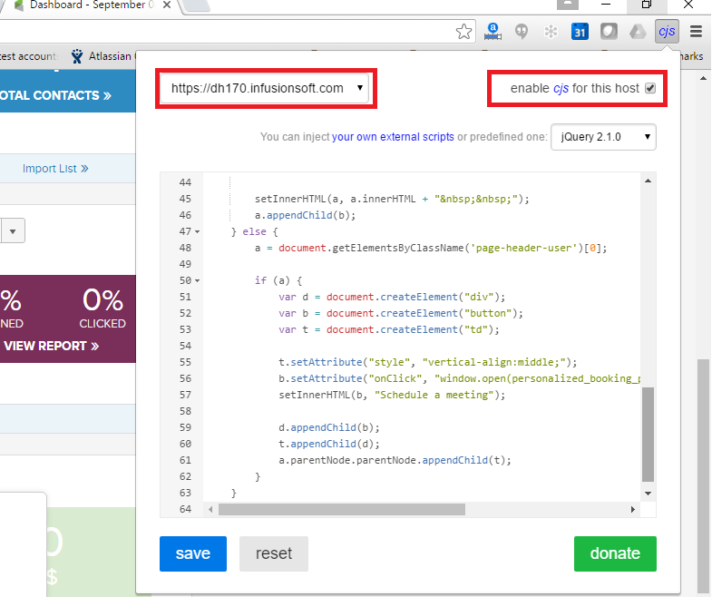

import { Aside } from "@astrojs/starlight/components";

Infusionsoft Scheduling buttons provide quick access to a record-specific booking page link. Bookings made via this link are automatically added to the Contact and the customer making the booking does not have to provide any information that already exists for this Contact. Infusionsoft scheduling buttons can be used in two ways:

- The Booking page link can be copied and sent to the customer
- The Infusionsoft user can schedule on behalf of the customer

Infusionsoft scheduling buttons can be configured to [prepopulate the booking form, or skip it altogether](/scheduleonce/account-integrations/crm/infusionsoft/prepopulateskip-booking-form-step-in-infusionsoft-integration "How to prepopulate or skip the Booking form step in Infusionsoft integration"). In this article, you will learn how to create an Infusionsoft scheduling button and add it to the Contact record in Infusionsoft.

## Requirements

To add the button to the Contact in Infusionsoft, you will need:

- To use a Google Chrome browser.
- The permission to add custom JavaScript code to Google Chrome.
- A completed Infusionsoft connector setup in OnceHub.
- A OnceHub User connected to Infusionsoft.

## How to add the Infusionsoft Scheduling button to Infusionsoft Contact records

1. [Download the custom JavaScript extension for Chrome.](https://chrome.google.com/webstore/detail/custom-javascript-for-web/ddbjnfjiigjmcpcpkmhogomapikjbjdk) This tool is used to inject JavaScript code to your website URLs. The script is kept in the local storage and is applied across the Infusionsoft domain URLs. When downloaded, the **_cjs_&#x20;**&#x65;xtension is added to your Chrome browser.

2. Log in to Infusionsoft.

3. In the right hand side of the Google Chrome browser toolbar, click the **\*cjs**&#x20;\*&#x65;xtension. The **_Custom JavaScript_** window appears.

4. Select the Infusionsoft domain in the **Domain&#x20;**&#x64;rop-down (Figure 1). Check the **enable _cjs_ for this host** checkbox.

   Figure 1: Custom JavaScript extension

5. In the code below, replace `<booking page link>` with your Booking page general link and Schedule a meeting with the label of your choice. For example: *https://go.oncehub.com/JohnSmith?soskip=1&soisContactID=*

   ```
   var personalized_booking_page_url = '<Booking page link>?soskip=1&soisContactID=';
   var getPathParameter = function getPathParameter(sParam) {
       var sPageURL = decodeURIComponent(window.location.pathname),
           sURLVariables = sPageURL.split('/'),
           i;
       for (i = 0; i < sURLVariables.length; i++) {
           if (sURLVariables[i] === sParam) {
               return sURLVariables[i] === undefined ? true : sURLVariables[i];
           }
       }
   };
   var getUrlParameter = function getUrlParameter(sParam) {
       var sPageURL = decodeURIComponent(window.location.search.substring(1)),
           sURLVariables = sPageURL.split('&'),
           sParameterName,
           i;
       for (i = 0; i < sURLVariables.length; i++) {
           sParameterName = sURLVariables[i].split('=');
           if (sParameterName[0] === sParam) {
               return sParameterName[1] === undefined ? true : sParameterName[1];
           }
       }
   };

   function setInnerHTML(element, content) {
       element.innerHTML = content;
       return element;
   } // -- Display the 'Schedule a meeting' button when a full record is displayed
   if (getPathParameter('Contact') == 'Contact') {
        var a = document.getElementsByClassName('ph_link')[0]; if (a) {
             var b = document.createElement("button");
                  b.setAttribute("onClick",
                 "window.open(personalized_booking_page_url + getUrlParameter('ID'), '_blank');");
                  setInnerHTML(b, "Schedule a meeting");
                  setInnerHTML(a, a.innerHTML + "  ");
                  a.appendChild(b);
   }
   else { a = document.getElementsByClassName('page-header-user')[0];
        if (a) {
             var d = document.createElement("div");
             var b = document.createElement("button");
             var t = document.createElement("td");
             t.setAttribute("style", "vertical-align:middle;");
             b.setAttribute("onClick", "window.open(personalized_booking_page_url + getUrlParameter('ID'), '_blank');");
             setInnerHTML(b, "Schedule a meeting");
             d.appendChild(b);
             t.appendChild(d);
             a.parentNode.parentNode.appendChild(t);
             }
        }
   }
   ```

   When your changes are made, copy and paste the code to the Code area of the _cjs_ extension.

6. Click **Save.** You are done. You can open any Contact record, click the button and make a test booking (Figure 2). 

   Figure 2: Infusionsoft Scheduling button
