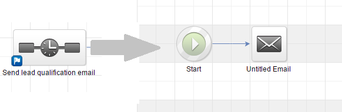
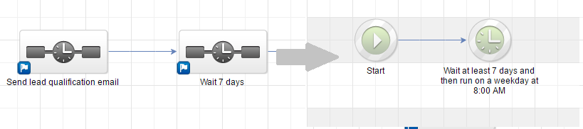
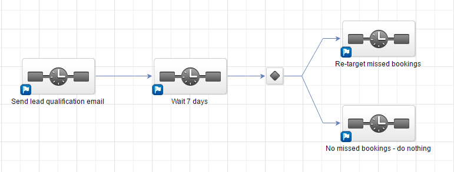
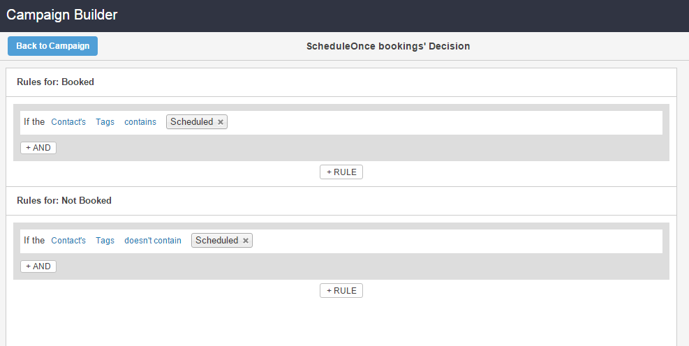

import { Aside } from "@astrojs/starlight/components";

When booking appointments is part of your email marketing campaigns, [optimizing your booking rates](/scheduleonce/sharing-publishing/personalized-links/configuring-your-booking-page-for-maximizing-booking-rates-in-marketing-campaigns "Maximizing booking rates in marketing campaigns") becomes critical. In this article, you will learn how to configure [Infusionsoft Campaign sequence](https://help.infusionsoft.com/help/connecting-objects-in-a-campaign-sequence), so that you track both bookings made, and more importantly, booking invitations that were missed or ignored. We call these, **missed bookings**. By tracking missed bookings, you are able to re-target them, and increase the overall booking rates for your campaign.

<Aside type="note">

For security and privacy reasons, using CRM record IDs to skip or pre-populate the Booking form is not compatible with [collecting data from an embedded Booking page](https://developers.oncehub.com/docs/client-side-api/collecting-data-from-embedded-booking-page/) or [redirecting booking confirmation data](https://developers.oncehub.com/docs/client-side-api/redirecting-booking-confirmation-data/).

</Aside>

## Requirements

To maximize booking rates in Infusionsoft campaigns, you will need:

- A OnceHub administrator.
- An Infusionsoft Administrator for your organization.
- [An active connection to the Infusionsoft connector](/scheduleonce/account-integrations/crm/infusionsoft/connecting-to-infusionsoft "Connecting to Infusionsoft")

Let’s assume that you have enabled [OnceHub lifecycle tags](/scheduleonce/account-integrations/crm/infusionsoft/tagging-infusionsoft-contact-records-with-lifecycle-tags "Tagging Infusionsoft Contact records with Lifecycle tags") in the Infusionsoft connector setup. When a booking is Scheduled, Rescheduled, Completed, Canceled or set to No-show, Lifecycle tags are automatically added to Contact records.

<Aside type="note">

&#x20;You can also use Infusionsoft tags that can be added to your Booking pages, Event types, and Master pages in the Infusionsoft connector setup wizard. These tags are automatically added to the Contact record for the selected booking lifecycle: Scheduled, Rescheduled, Completed, Canceled, or No-show. [Learn how to tag Infusionsoft Contact records with Infusionsoft tags](/scheduleonce/account-integrations/crm/infusionsoft/tagging-infusionsoft-contact-records-with-infusionsoft-tags "Tagging Infusionsoft Contact records with Infusionsoft tags")

</Aside>

## Setting up Infusionsoft Campaigns to re-target missed bookings

**Infusionsoft Campaigns** allow you to automatically trigger the missed bookings. For this example, let's look at a lead qualification use case, whereby you want to send an email broadcast to a List of unqualified leads, inviting them to book a discovery call.

1. Log in to Infusionsoft.

2. In the Campaign builder, click **Create a Campaign** named "Maximizing Booking rates" and click Save.

3. From the Campaign tools, Add a **Sequence**. Double-click the **Sequence** and add the Email communication tool. (See Figure 1) **Figure 1: Send qualification Email**

4. Now In the Campaign builder, add a **Timer sequence.** Double-click the **Sequence** and add the Delay Timer tool. (See Figure 2) During this time, Leads will submit the form. Figure 2: Delay Timer

5. Now you should connect the Timer Sequence to two Infusionsoft Campaign sequences (See Figure 3):

   - One sequence should target leads that DID make a Booking.

   - Another sequence should target leads that DID NOT make a Booking.

     <Aside type="note">

     **Note** If you are using the Email communication object to schedule with your existing Infusionsoft Contacts, you should either use [our Personalized links (Infusionsoft ID)](/scheduleonce/account-integrations/crm/infusionsoft/using-personalized-links-infusionsoft-id "Using Personalized links (Infusionsoft ID)") or use [URL variables to pass the Infusionsoft Contact ID](/scheduleonce/account-integrations/crm/infusionsoft/personalizing-scheduling-on-landing-pages-with-infusionsoft-contact-ids "Using InfusionSoft Contact ID to personalize scheduling in landing pages") to the Website [embed](/scheduleonce/sharing-publishing/publishing-on-websites/website-embed "Website embed") , or [button](/scheduleonce/sharing-publishing/publishing-on-websites/website-button "Website button") placed in a landing webpage.

     </Aside>

     Figure 3: Connection of two sequences

6. When you connect a campaign sequence to multiple sequences, a decision node is created automatically. [Learn more about Decision nodes](https://help.infusionsoft.com/help/decision-diamonds) Double-click the **Decision node** to configure it. You should create a rule for each Campaign sequence. In each rule, you simply need to use the lifecycle tags that are added to the Contact when a booking is made: (see figure 4)

   1. The first rule should tag leads that DID make a Booking when Tags contain "Scheduled"
   2. The second rule should re-target leads that DID NOT make a Booking Tags do not contain "Scheduled" **Figure 4: Rules\*\*

7. **Run the campaign** and make sure to monitor your **re-targeting missed bookings** campaign.

   <Aside type="note">

   **Note**You can run this campaign as many times as you need, in order to continuously maximize your booking rates.

   </Aside>
