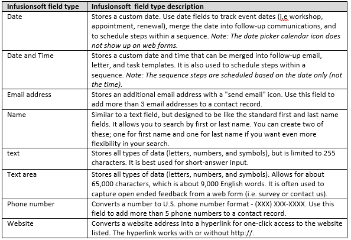
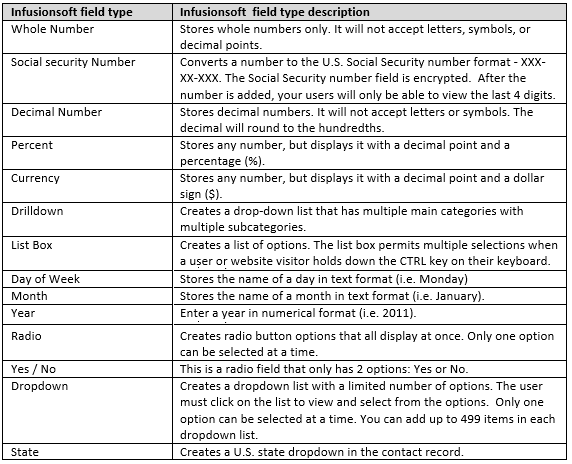

In the [Mapping step of the Infusionsoft setup wizard](/scheduleonce/account-integrations/crm/infusionsoft/mapping-oncehub-fields-to-infusionsoft-fields "Mapping ScheduleOnce fields to Infusionsoft fields"), you can map OnceHub fields to Infusionsoft fields. For each OnceHub field, the system will only show Infusionsoft fields that correspond to the selected OnceHub field type.

The system will only show fields that are supported by the integration. Non-supported fields will not be included in the Infusionsoft or OnceHub field lists.

## OnceHub fields

1. **Supported OnceHub field types** Our Infusionsoft integration supports all OnceHub field types, except for checkboxes. It means that almost all OnceHub System and Custom fields can be mapped to Infusionsoft fields in Mapping step of the Infusionsoft setup page.

2. **Non-supported OnceHub field types**

   The only non-supported OnceHub field type is checkbox. It means that the default Custom field - _Terms of Service_ and any additional checkbox Custom fields that you have created cannot be mapped to Infusionsoft fields.

   The checkbox field type will not appear in the [Mapping step of the Infusionsoft setup page](/scheduleonce/account-integrations/crm/infusionsoft/mapping-oncehub-fields-to-infusionsoft-fields "Mapping ScheduleOnce fields to Infusionsoft fields").

## Infusionsoft fields

1. **Supported Infusionsoft field types**

   The Infusionsoft integration supports most Infusionsoft field types. Below are the supported Infusionsoft field types that can accept data from OnceHub:

   

2. **Non-supported Infusionsoft field types**

   Non-supported Infusionsoft field types will not appear in the Mapping step of the Infusionsoft setup. You won’t be able to map OnceHub fields to Infusionsoft fields of the following types:

   
