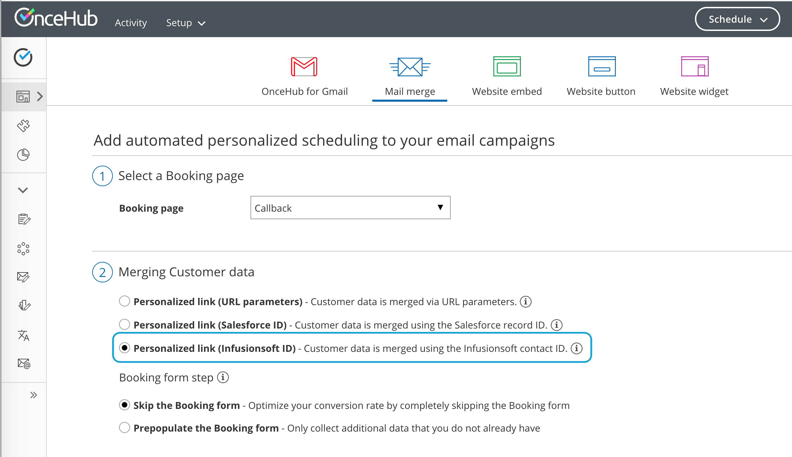

import { Aside } from "@astrojs/starlight/components";

When scheduling with your existing Infusionsoft Contact base, you can use our special **Personalized links (Infusionsoft ID)** in your [Infusionsoft email and broadcasts](https://help.infusionsoft.com/help/send-or-schedule-an-email-broadcast) to automatically recognize the Contact based on their Infusionsoft record ID.

## Recognizing the Customer by the Infusionsoft Contact ID provides two key benefits:

- On the User side, it allows you to update the correct record, eliminating any chances of updating the wrong record and keeping your CRM data clean.
- On the Customer side, it allows you to [prepopulate the Booking form step with Infusionsoft record data or completely skip the Booking form step](/scheduleonce/account-integrations/crm/infusionsoft/prepopulateskip-booking-form-step-in-infusionsoft-integration "How to prepopulate or skip the Booking form step in Infusionsoft integration"). This eliminates the need to ask Customers for information you already have, improving conversion rates and moving leads through the funnel with speed and efficiency.

### **Personalized links (Infusionsoft ID)** are available for Booking pages and Master pages:

- When working with Booking pages, **Personalized links (Infusionsoft ID)** will be available only for Booking pages owned by [Users connected to Infusionsoft](/scheduleonce/account-integrations/crm/infusionsoft/prepopulateskip-booking-form-step-in-infusionsoft-integration "How to prepopulate or skip the Booking form step in Infusionsoft integration").
- When working with Master pages, **Personalized links (Infusionsoft ID)** will always be available to you. However, Booking pages owned by Users not connected to Infusionsoft will work as [General links](/scheduleonce/sharing-publishing/general-one-time-links/using-general-links "Using General links").

<Aside type="note">

For security and privacy reasons, using CRM record IDs to skip or prepopulate the Booking form is not compatible with [collecting data from an embedded Booking page](/scheduleonce/developers/client-side-api/collecting-data-from-embedded-booking-page/) or [redirecting booking confirmation data](/scheduleonce/developers/client-side-api/redirecting-booking-confirmation-data/).

</Aside>

## Where do I find the integrated Personalized links (Infusionsoft ID)?

You can find **Personalized links (Infusionsoft ID)** in the **Share & Publish** section by following the steps below:

<Aside type="note">

To use data from Infusionsoft in a prepopulated Booking form, you first have to [connect to Infusionsoft](/scheduleonce/account-integrations/crm/infusionsoft/infusionsoft-integration "The ScheduleOnce connector for Infusionsoft").

</Aside>

1. Log into OnceHub.

2. Select your profile picture or initials in the top right-hand corner → from the lefthand sidebar, select **Share & Publish → Mail merge** tab.

3. Select the relevant Booking page or Master page.

4. Under **Merging customer data**, select the **Personalized links (Infusionsoft ID)** (Figure 1). 

   Figure 1: Selecting the Infusionsoft ID personalized link option

5. In the **Booking form** step, you can select one of the two options below:

   - **Skip the Booking form:** Skipping the OnceHub Booking form helps you maximize your booking conversions and provides your Customers with a seamless and quick booking process.
   - **Prepopulate the Booking form:** The Booking form works in private mode, in which the prepopulated data used in the Booking is indicated as a checklist and the Customer can provide additional information if required. [Learn more about prepopulated Booking forms](/scheduleonce/account-integrations/crm/infusionsoft/prepopulateskip-booking-form-step-in-infusionsoft-integration "How to prepopulate or skip the Booking form step in Infusionsoft integration")

6. Copy and paste the link into your [Infusionsoft emails](https://help.infusionsoft.com/help/send-or-schedule-an-email-broadcast) (see Figure 1).
