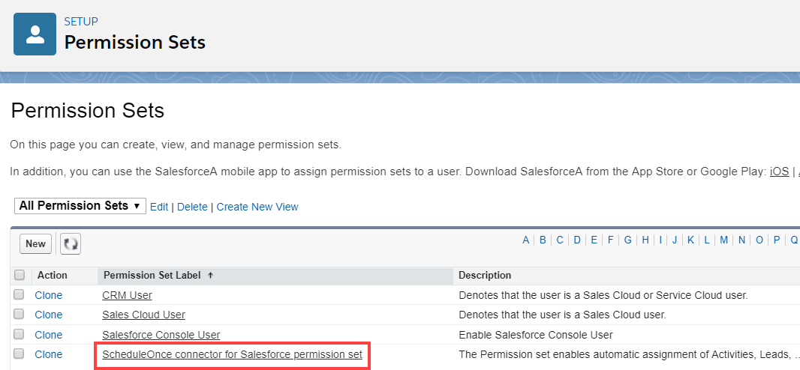
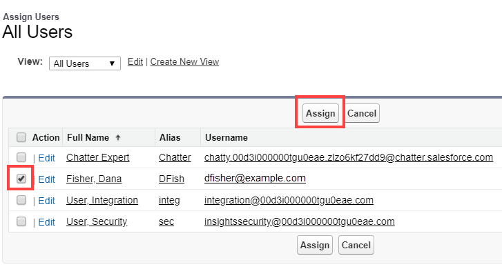

import { Aside } from "@astrojs/starlight/components";

The Salesforce setup process includes 5 phases: [API connection](/scheduleonce/account-integrations/crm/salesforce/connecting-salesforce-api-user "How to connect a Salesforce API User"), [Installation](/scheduleonce/account-integrations/crm/salesforce/installing-oncehub-connector-for-salesforce "How to install the ScheduleOnce connector for Salesforce"), [Field validation](/scheduleonce/account-integrations/crm/salesforce/handling-required-salesforce-fields-in-field-validation-step "Handling required Salesforce fields in the Field validation step"), [Field mapping](/scheduleonce/account-integrations/crm/salesforce/mapping-oncehub-fields-to-non-mandatory-salesforce-fields "Mapping ScheduleOnce fields to non-mandatory Salesforce fields"), and [Creation rules](/scheduleonce/account-integrations/crm/salesforce/salesforce-record-creation-update-and-assignment-rules "Salesforce record creation, update, and assignment rules").

In this article, you'll learn how to assign the OnceHub Permission Set to the [API User](/scheduleonce/account-integrations/crm/salesforce/connecting-salesforce-api-user "How to connect a Salesforce API User") in Salesforce.

## Permission sets

Permission Sets in Salesforce define what functions and features your Users have access to in Salesforce. To use the OnceHub connector for Salesforce, you must assign the appropriate Permission Set to your API User.

The OnceHub Permission Set assigns permissions to work with Lead, Contact, Case, Account, and Activity records. This will allow the OnceHub connector to create and update records through the API User.

## Requirements

To assign the OnceHub permission set, you will need:

- A Salesforce Administrator for your organization.
- [An installed OnceHub connector for Salesforce](/scheduleonce/account-integrations/crm/salesforce/installing-oncehub-connector-for-salesforce "How to install the ScheduleOnce connector for Salesforce").

## Assigning the OnceHub permission Set

1. Sign in to Salesforce as your API User.

2. Go to the **Setup** page.

3. In the **Administration** section, go to **Users → Permission Sets** (Figure 1). Figure 1: Permission Sets in the Users menu

4. In the **Permission Sets** pane, click **OnceHub connector for Salesforce permission set** (Figure 2). Figure 2: OnceHub connector for Salesforce permission set

5. On the **OnceHub connector for Salesforce** permission set page, click the **Manage Assignments** button (Figure 3). Figure 3: Manage Assignments

6. On the **Assigned Users** page, click the **Add Assignments** button (Figure 4). Figure 4: Add Assignments

7. In the **All Users** list, check the box next to your API User and click **Assign** (Figure 5). Figure 5: Assign API user

8. Click **Done**.

9. Go back to the Salesforce setup page in OnceHub.

10. After you refresh the page, the **Installation** tab will now be updated to show that you have completed **Step 2: Assign OnceHub Permission set**.

    <Aside type="caution">

    **Important**The API User must be connected to OnceHub for the page to update correctly. [Learn more about connecting the Salesforce API User](/scheduleonce/account-integrations/crm/salesforce/connecting-salesforce-api-user "How to connect a Salesforce API User")

    </Aside>

That's it! You've completed **Step 2** of the **Installation** process. You can now proceed to **Step 3**, which is described in the [Adding Custom fields to the Salesforce Activity Event layout](/scheduleonce/account-integrations/crm/salesforce/adding-custom-fields-to-salesforce-activity-event-page-layout "Adding Custom fields to the Salesforce Activity Event layout") article.
