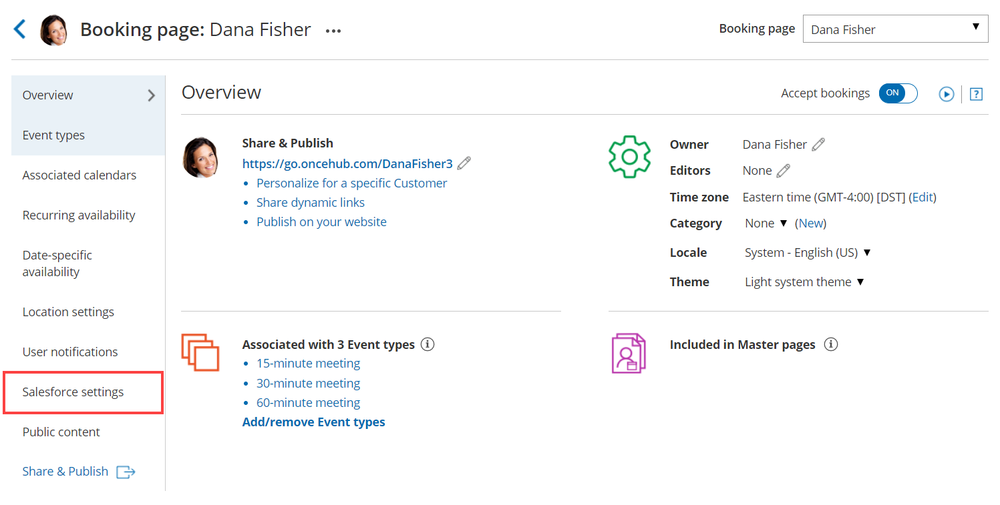
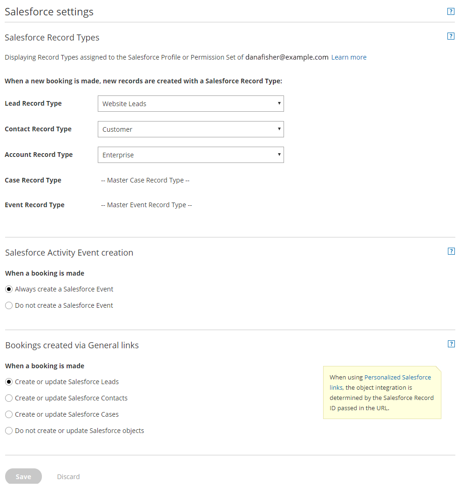

import { Aside } from "@astrojs/starlight/components";

The Salesforce connector settings section of a [Booking page](/scheduleonce/event-types-booking-pages/booking-pages/introduction-to-booking-pages "Introduction to Booking pages") enables you to map the [Salesforce Record Types](/scheduleonce/account-integrations/crm/salesforce/working-with-salesforce-record-types "Working with Salesforce Record types"), configure the Salesforce Activity Event creation, and configure the integration when bookings are created using [General links](/scheduleonce/sharing-publishing/general-one-time-links/using-general-links "Using General links") for your Booking page.

In this article, you'll learn how to configure your personal Salesforce connector settings for your Booking page.

## Requirements

To configure the Salesforce connector settings, you must:

- [Be connected to Salesforce](/scheduleonce/account-integrations/crm/salesforce/connecting-to-salesforce "Connecting to Salesforce").
- Be the [Owner or an Editor of the Booking page](/scheduleonce/event-types-booking-pages/booking-pages/booking-page-access-permissions "Booking page access permissions").

## Configuring the Salesforce connector settings

1. Hover over the lefthand menu and go to the Booking pages icon → Booking pages → your Booking page → **Salesforce settings** (Figure 1). Figure 1: Salesforce settings on a Booking page

2. On the **Salesforce settings** page (Figure 2), you can map the [Record Types](/scheduleonce/account-integrations/crm/salesforce/working-with-salesforce-record-types "Working with Salesforce Record types") for the supported objects, set up the Salesforce Activity Event option, and choose the type of record to be created when using [General links](/scheduleonce/sharing-publishing/general-one-time-links/using-general-links "Using General links"). Figure 2: Salesforce settings

3. In the **Salesforce Record Types** section, select the Record Type that should be assigned to the Lead, Account, Contact, Event, and Case objects. This section displays the [Salesforce Record Types](https://help.salesforce.com/HTViewHelpDoc?id=customize_recordtype.htm) that are assigned to your Salesforce profile or Permission Set. When a booking is made, new records are created with an associated Record Type in your Salesforce organization. [Learn more about working with Record Types](/scheduleonce/account-integrations/crm/salesforce/working-with-salesforce-record-types "Working with Salesforce Record types")

4. In the **Salesforce Activity Event creation** section, select if you want a [Salesforce Activity Event](https://help.salesforce.com/articleView?id=activities.htm&r=https%3A%2F%2Fwww.google.com%2F&type=5) to be created when a booking is made.

   <Aside type="note">

   **Note** If you're using a third-party solution that syncs between your calendar and Salesforce, you should select the option **Do not create a Salesforce Event**. [Learn more about Salesforce Activity Events](/scheduleonce/account-integrations/crm/salesforce/salesforce-activity-event "The Salesforce Activity event")

   </Aside>

5. In the **Bookings created via General links** section, choose the object integration option you want for your [General links](/scheduleonce/sharing-publishing/general-one-time-links/using-general-links "Using General links"). You can decide to integrate your Booking page with the Lead, Contact, or Case object, or you can decide not to integrate the Booking page with Salesforce. When you [use Personalized links (Salesforce ID)](/scheduleonce/account-integrations/crm/salesforce/using-personalized-links-salesforce-id "Using personalized links (Salesforce ID)"), the object integration is determined by the Salesforce Record ID passed in the URL.

   <Aside type="note">

   **Note**When you work with [Salesforce Person Accounts](/scheduleonce/account-integrations/crm/salesforce/working-with-salesforce-person-accounts "Working with Salesforce Person accounts"), you will need to configure your Booking page to work with Contacts. When a booking is made, the Salesforce Person Account is automatically updated and a Salesforce Activity Event is added.

   </Aside>
