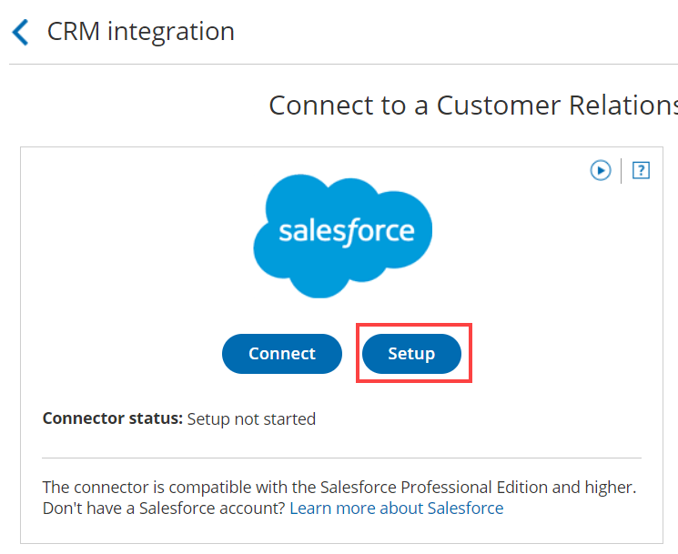
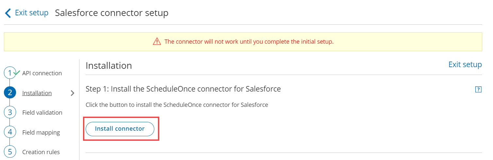
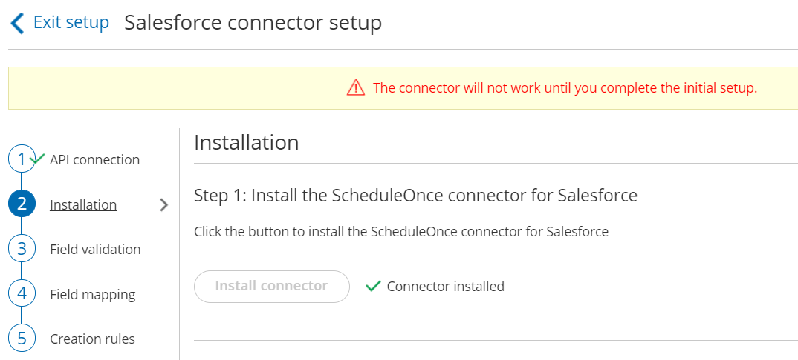

import { Aside } from "@astrojs/starlight/components";

The Salesforce setup process includes 5 phases: [API connection](/scheduleonce/account-integrations/crm/salesforce/connecting-salesforce-api-user "How to connect a Salesforce API User"), Installation, [Field validation](/scheduleonce/account-integrations/crm/salesforce/handling-required-salesforce-fields-in-field-validation-step "Handling required Salesforce fields in the Field validation step"), [Field mapping](/scheduleonce/account-integrations/crm/salesforce/mapping-oncehub-fields-to-non-mandatory-salesforce-fields "Mapping ScheduleOnce fields to non-mandatory Salesforce fields"), and [Creation rules](/scheduleonce/account-integrations/crm/salesforce/salesforce-record-creation-update-and-assignment-rules "Salesforce record creation, update, and assignment rules").

Installation is a three step process. In this article, you will learn about the first step: installing the OnceHub connector package in Salesforce. The OnceHub connector for Salesforce is installed directly from OnceHub.

## Requirements

To install the connector from OnceHub, you must:

- Be a [OnceHub Administrator](/account-administration/user-management/user-roles-overview "Differences between Administrator and Member").
- Be a Salesforce Administrator in your organization.
- Have an[ active connection to your Salesforce API User](/scheduleonce/account-integrations/crm/salesforce/connecting-salesforce-api-user "How to connect a Salesforce API User").

You do not need an assigned product license to install and update Salesforce account settings. [Learn more](/account-administration/user-management/user-management-and-seats)

## Installing the OnceHub connector for Salesforce

1. Click the gear icon located in the top-right corner of the page.
2. Select **Account Integrations** from the dropdown menu.
3. Filter for **CRM**.
4. Click on the **Salesforce (For Booking Pages)** tile.
5. In the **Salesforce** box, click the **Setup** button (Figure 1). Figure 1: Set up API Connection in OnceHub
6. On the **Installation** tab, click the **Install connector** button (Figure 2). Figure 2: Install connector
7. Sign in to Salesforce.
8. On the **Salesforce** Install Package landing page, select **Install for All Users** and then click the **Install** button (Figure 3). Figure 3: Install for All Users
9. Once installation is complete, click the **Done** button.
10. Return to OnceHub and reload the page, then go back to the **Installation** tab. You will see that the connector is now installed (Figure 4). Figure 4: Connector installed

<Aside type="note">

After the connector is installed, it can take up to 10 minutes before **Connector installed** is shown on the **Installation** tab.

</Aside>

That's it! You've completed **Step 1** of the Installation process. Now you can proceed to **Step 2**, which is described in the [How to assign the OnceHub permission set to the Salesforce API User](/scheduleonce/account-integrations/crm/salesforce/assigning-oncehub-permission-set-to-salesforce-api-user "How to assign the ScheduleOnce permission set to the Salesforce API user") article.
