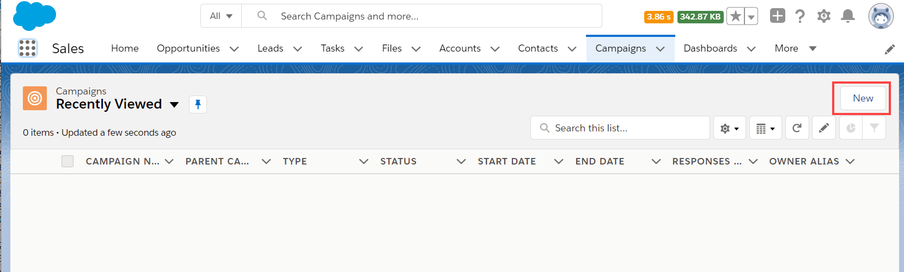
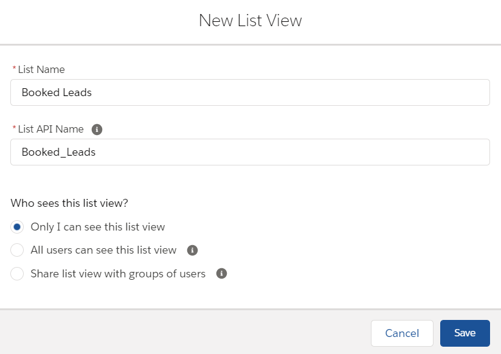
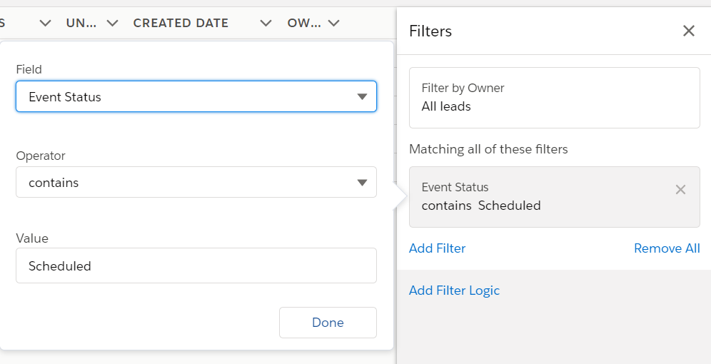
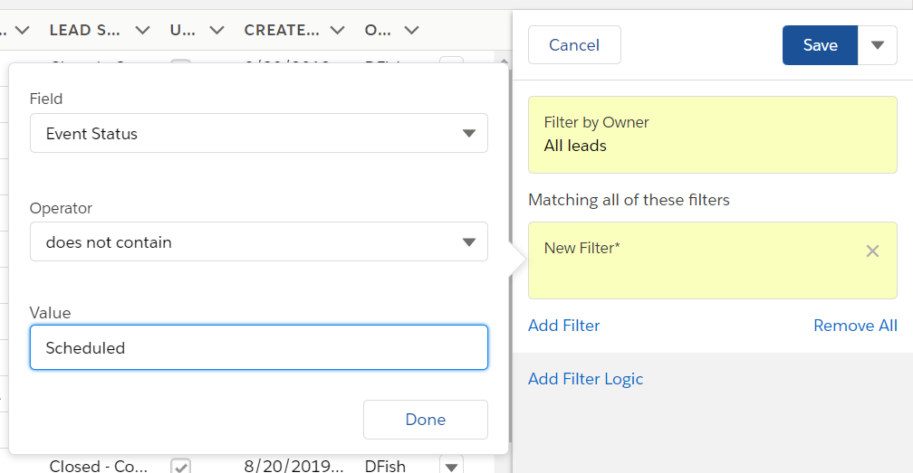
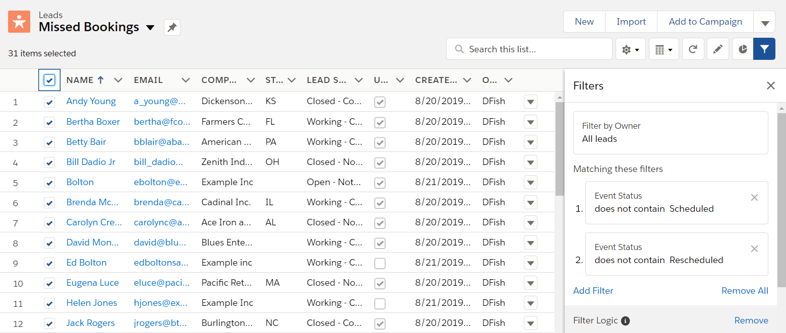

import { Aside } from "@astrojs/starlight/components";

When booking appointments is part of your email marketing campaigns, optimizing your booking rates becomes critical. In this article, you'll learn how to configure [Salesforce Campaigns](https://help.salesforce.com/articleView?id=campaigns_def.htm&type=5) so that you track both bookings made, and more importantly, booking invitations that were missed or ignored. By tracking missed bookings, you'll be able to retarget them and increase the overall booking rates for your campaign.

<Aside type="note">

&#x20;For security and privacy reasons, using CRM record IDs to skip or pre-populate the Booking form is not compatible with [collecting data from an embedded Booking page](https://developers.oncehub.com/docs/client-side-api/collecting-data-from-embedded-booking-page/) or [redirecting booking confirmation data](https://developers.oncehub.com/docs/client-side-api/redirecting-booking-confirmation-data/).

</Aside>

## Requirements

To update Salesforce fields when the Customer schedules or reschedules an event, you must:

- Be a [OnceHub administrator](/account-administration/user-management/user-roles-overview "Differences between Administrator and Member").
- Be a Salesforce Administrator for your organization.
- Have an[ active connection to your Salesforce API User](/scheduleonce/account-integrations/crm/salesforce/connecting-salesforce-api-user "How to connect a Salesforce API User").

Let’s assume that the Lead Status field includes the **Working – Contacted** and the **Open – Not contacted** options. To configure Salesforce Campaigns so that you can track both bookings made and booking invitations that were missed or ignored, you will also need to do the following:

- [Create an Event Status text Custom field for the Lead object and add it to the Lead Page Layout.](/scheduleonce/account-integrations/crm/salesforce/using-salesforce-workflow-rules-to-update-fields-based-on-oncehub-data#creating-an-event-status-text-custom-field "Using Salesforce Workflow Rules to update fields based on ScheduleOnce data")
- [Map the OnceHub Status field to the Lead Event Status field.](/scheduleonce/account-integrations/crm/salesforce/using-salesforce-workflow-rules-to-update-fields-based-on-oncehub-data#mapping-the-oncehub-status-field-to-the-lead-event-status-field)

The **Event Status** Custom field is used as a criteria to manage your campaign’s Lead members.

<Aside type="note">

&#x20;When multiple events are booked for the same Lead, the **Event Status** custom field represents the last event status update.

</Aside>

## Setting up Salesforce Campaigns to retarget missed bookings

**Salesforce Campaigns** enables you to automatically trigger the missed bookings campaign. For this example, let's look at a lead qualification use case, whereby you want to send an email broadcast to a List of unqualified leads, inviting them to book a discovery call.

### Tag leads that DID make a Booking

1. Sign in to Salesforce.
2. Go to the **Sales** app.
3. Click the **Campaign** tab and click **New** (Figure 1). Figure 1: Create a new Campaign
4. Enter "Booked" as the name for the campaign.
5. In the **Type** drop-down menu, select **Email**.
6. Check the **Active** checkbox.
7. Click **Save**.
8. Click the **Leads** tab.
9. Click the gear icon and select **New** from the **List View Controls** drop-down menu (Figure 2). Figure 2: List View Controls
10. In the **New List View** pop-up, give the list a name and select who can view this list (Figure 3). Figure 3: New List View pop-up
11. In the **Filters** sidebar, click **Add Filter** (Figure 4). Figure 4: Add Filter
12. From the **Field** drop-down menu, select **Event Status**.
13. From the **Operator** drop-down menu, select **Contains**.
14. In the **Value** field, add **"Scheduled"** (Figure 5). Click **Done**. Figure 5: Event Status contains Scheduled
15. Add another filter and select **contains** from the **Operator** drop-down menu. This time, in the **Value** field add **"Rescheduled"** and click **Done**.
16. Click **Add Filter Logic**.
17. Change the Filter Logic to **1 OR 2** (Figure 6). Figure 6: Edit Filter Logic
18. Click **Save**. You will now see a list of any Leads that match the criteria.
19. Click the checkbox at the top of the list to select all of the Members in this Filter View (Figure 7). Click the **Add to Campaign** button. Figure 7: Select Members
20. In the **Add to Campaign** pop-up, select the campaign you created (Figure 8). Figure 7: Add to Campaign pop-up
21. Click **Submit**.

### Retarget leads that DID NOT make a Booking

1. Go to the **Sales** app.
2. Click the **Campaign** tab and click **New**.
3. Enter "Retarget Missed Bookings" as the name for the campaign. This campaign will target those who did not make a booking from the first campaign.
4. Check the **Active** checkbox.
5. In the **Type** drop-down menu, select **Email**.
6. Set the **Start Date** to start automatically several days after the initial marketing campaign was run.
7. Click **Save**.
8. Click the **Leads** tab. We will create a list of the members that do NOT belong to the **Booked Leads** group. This group will contain all those who have received the initial email and didn’t open, click or made a booking.
9. Click the gear icon and select **New** from the **List View Controls** drop-down menu.
10. In the **New List View** pop-up, give the list a name and select who can view this list (Figure 8). Figure 8: New List View pop-up
11. In the **Filters** sidebar, click **Add Filter**.
12. From the **Field** drop-down menu, select **Event Status**.
13. From the **Operator** drop-down menu, select **does not contain**.
14. In the **Value** field, add **"Scheduled"** (Figure 9). Click **Done**. Figure 9: Event Status does not contain Scheduled
15. Add another filter and select **Does not contain** from the **Operator** drop-down menu. This time, in the **Value** field add **"Rescheduled"** and click **Done**.
16. Click **Add Filter Logic**.
17. Change the Filter Logic to **1 OR 2**.
18. Click **Save**. You will now see a list of any Leads that match the criteria.
19. Click the checkbox at the top of the list to select all of the Members in this Filter View (Figure 10). Click the **Add to Campaign** button. Figure 10: Select Members
20. In the **Add to Campaign** pop-up, select the campaign you created (Figure 11). Figure 11: Add to Campaign pop-up
21. Click **Submit**.
22. Run your initial marketing campaign and make sure to monitor your **Retarget Missed Bookings** campaign.

<Aside type="note">

You should retarget leads that didn't make a booking multiple times to continuously maximize your booking rates.

</Aside>
