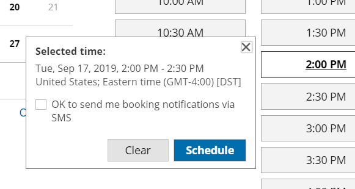

import { Aside } from "@astrojs/starlight/components";

When you schedule with existing Salesforce records, you can decide to prepopulate the Booking form step with Salesforce record data, or completely skip the Booking form step.

Recognizing the Customer by the Salesforce Record ID provides two key benefits:

- On the User side, it allows you to update the correct record, eliminating any chances of updating the wrong record.
- On the Customer side, it eliminates the need to ask Customers for information you already have, improving conversion rates and moving leads through the funnel more efficiently.

## Recognizing the Salesforce Record ID

You can recognize the Salesforce Record ID in the following cases:

- You can use the Salesforce Record ID in our [Personalized links (Salesforce ID)](/scheduleonce/account-integrations/crm/salesforce/using-personalized-links-salesforce-id "Using personalized links (Salesforce ID)") to identify your Customers in your [Salesforce email templates](https://help.salesforce.com/articleView?id=email_create_a_template.htm&type=5) or [Salesforce emails](https://help.salesforce.com/articleView?id=send_email_directly_from_crm_record.htm&type=5).
- You can use the Salesforce Record ID with [Salesforce scheduling buttons](/scheduleonce/account-integrations/crm/salesforce/introduction-to-salesforce-scheduling-buttons "Introduction to Salesforce scheduling buttons").
- You can use the Salesforce Record ID to personalize scheduling in landing pages used in your email marketing campaigns. [Learn more about using Salesforce Record ID to personalize scheduling in landing pages](/scheduleonce/account-integrations/crm/salesforce/personalizing-scheduling-on-landing-pages-with-salesforce-ids "Using the Salesforce Record ID to personalize scheduling in landing pages")

## Prepopulating the Booking form

In this case, Customers will be presented with a Booking form that works in [private mode](/scheduleonce/event-types-booking-pages/booking-forms-redirect/prepopulated-booking-forms "Prepopulated Booking forms"). When the Booking form uses data stored in your Salesforce CRM, the prepopulated data used in the Booking form is indicated as a checklist and the Customer can provide additional information if required. [Learn more about prepopulated Booking forms](/scheduleonce/event-types-booking-pages/booking-forms-redirect/prepopulated-booking-forms "Prepopulated Booking forms") The [Booking form](/scheduleonce/customization-branding/booking-forms-editor/introduction-to-booking-forms-editor "Introduction to the Booking Forms Editor") fields are mapped to Salesforce fields based on the [Field validation](/scheduleonce/account-integrations/crm/salesforce/handling-required-salesforce-fields-in-field-validation-step "Handling required Salesforce fields in the Field validation step") and the [Field mapping](/scheduleonce/account-integrations/crm/salesforce/mapping-oncehub-fields-to-non-mandatory-salesforce-fields "Mapping ScheduleOnce fields to non-mandatory Salesforce fields") steps of the Salesforce connector setup process.

## Skipping the Booking form

In this case, Customers will not be presented with a [Booking form](/scheduleonce/customization-branding/booking-forms-editor/introduction-to-booking-forms-editor "Introduction to the Booking Forms Editor"). This step of the booking process will be skipped, resulting in a faster booking process. When hiding the Booking form, the Customer making the booking cannot provide a meeting subject. For this reason, the [meeting subject should be defined by the Owner](/scheduleonce/event-types-booking-pages/booking-forms-redirect/introduction-to-booking-form-and-redirect "Introduction to the Booking form and redirect section"). If you skip the Booking form and still set the subject to be defined by the Customer, OnceHub will automatically generate a meeting subject, such as _Meeting with John Smith_.

<Aside type="caution">

Since the Customer name and Customer email are mandatory fields in OnceHub, the Booking form will not be skipped if these fields are empty in the Salesforce record. In this case, OnceHub will show a prepopulated Booking form instead of hiding the form, so the Customer will have the opportunity to fill out these fields.

</Aside>

When you add the Mobile phone field to a skipped Booking form with the [enable SMS notifications](/scheduleonce/customization-branding/booking-forms-editor/editing-system-fields "Editing System Fields") option turned on, the SMS notification opt-in/opt-out will be displayed when the Customer chooses a time for the booking (Figure 1). Booking form skipping can be used with [Personalized links](/scheduleonce/account-integrations/crm/salesforce/using-personalized-links-salesforce-id "Using personalized links (Salesforce ID)"), [web form integration](/scheduleonce/sharing-publishing/web-form-integration/integrating-web-forms-with-salesforce-and-oncehub "Integrating Web forms with Salesforce and ScheduleOnce") and [login integration](/scheduleonce/sharing-publishing/publishing-on-websites/login-integration-for-customer-onboarding "Login Integration").

Figure 1: SMS notification opt-in

<Aside type="note">

&#x20;For security and privacy reasons, using CRM record IDs to skip or prepopulate the Booking form is not compatible with [collecting data from an embedded Booking page](https://developers.oncehub.com/docs/client-side-api/collecting-data-from-embedded-booking-page/) or [redirecting booking confirmation data](https://developers.oncehub.com/docs/client-side-api/redirecting-booking-confirmation-data/).

</Aside>
