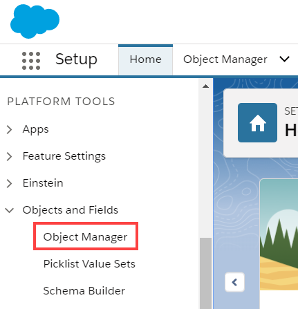
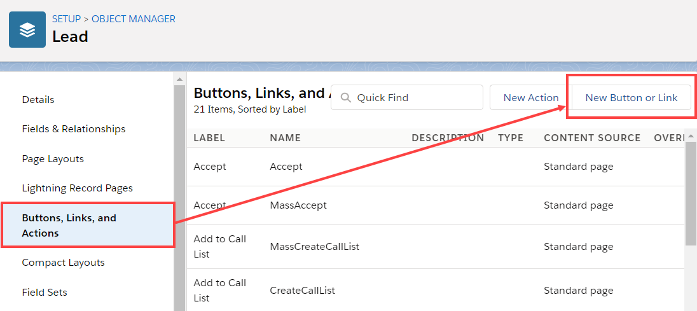
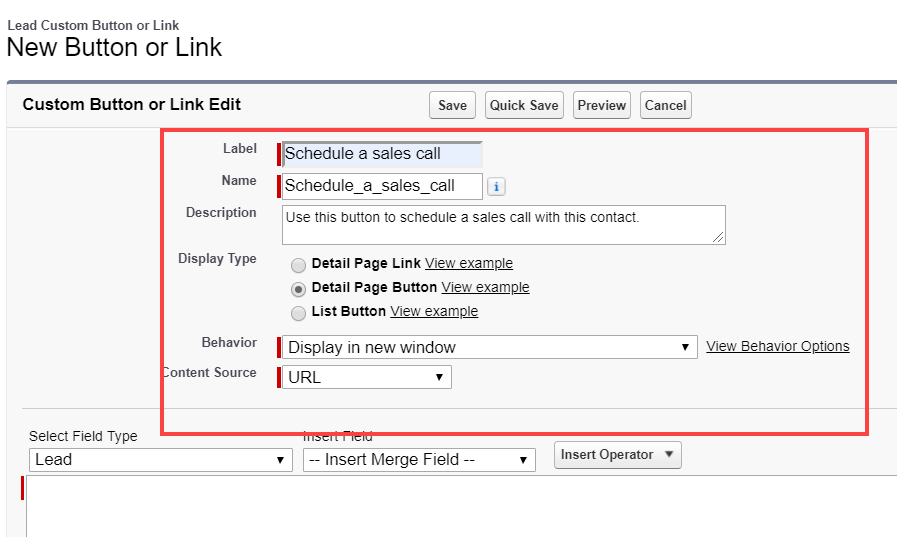
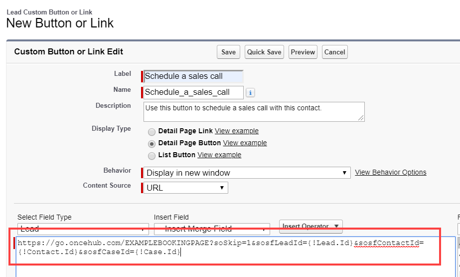
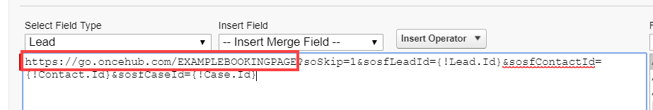
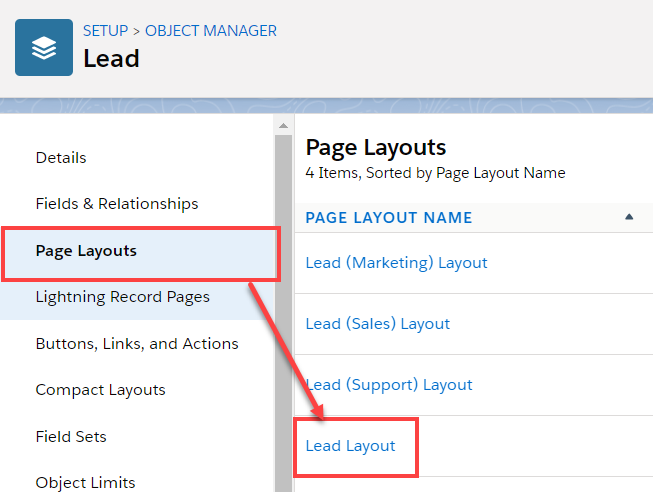
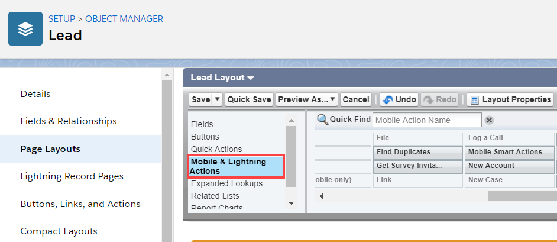
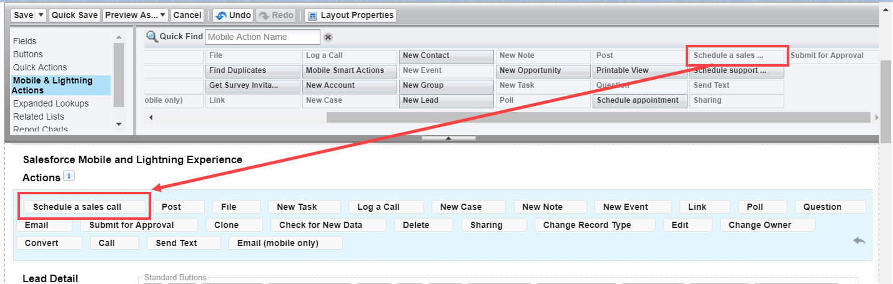

import { Aside } from "@astrojs/starlight/components";

[Salesforce scheduling buttons](/scheduleonce/account-integrations/crm/salesforce/introduction-to-salesforce-scheduling-buttons "Salesforce scheduling buttons") provide a quick method to schedule on behalf of a Customer. Bookings made via these buttons are automatically added to the Salesforce record that the booking is scheduled from.

Salesforce scheduling buttons can be configured to [prepopulate the booking form, or skip it altogether](/scheduleonce/account-integrations/crm/salesforce/prepopulate-or-skip-booking-form-step-in-salesforce-integration "Prepopulating or skipping the Booking form step in Salesforce integration"). This is enabled by the [optional mapping step in the Salesforce setup wizard](/scheduleonce/account-integrations/crm/salesforce/mapping-oncehub-fields-to-non-mandatory-salesforce-fields "Mapping ScheduleOnce fields to non-mandatory Salesforce fields"), where you can define the mapping between Salesforce record fields and OnceHub Booking form fields.

Figure 1: Salesforce scheduling buttons

In this article, you'll learn how to create a Salesforce schedule button and add it to the **Lead**, **Contact** or **Case** Page Layouts in Salesforce.

## Requirements

To add a button to the **Lead**, **Contact**, or **Case** Page Layouts in Salesforce, you will need the following:

- A Salesforce Administrator for your organization.
- [A completed Salesforce connector setup in OnceHub](/scheduleonce/account-integrations/crm/salesforce/connecting-salesforce-api-user "How to connect a Salesforce API User").
- [A OnceHub User connected to Salesforce](/scheduleonce/account-integrations/crm/salesforce/connecting-to-salesforce "Connecting to Salesforce").

## Creating a button in Salesforce

1. Sign in to Salesforce as your [API User](/scheduleonce/account-integrations/crm/salesforce/connecting-salesforce-api-user "How to connect a Salesforce API User").

2. Go to the **Setup** page.

3. In the **Platform Tools** section, go to **Objects and Fields → Object Manager** (Figure 2). Figure 2: Object Manager in the Objects and Fields menu

4. In the **Object Manager** list, select the **Lead**, **Contact**, or **Case** object depending on which one you want to create a button for (Figure 3). Figure 3: Lead in the Object Manager list

5. Select **Buttons, Links, and Actions → New Button or Link** (Figure 4). Figure 4: New Button or Link

6. In the **New Button or Link** pane, enter the following information (Figure 5):

   - **Label:** This is the text that will be displayed on the button.
   - **Name:** Enter a unique name for the button.
   - **Description:** Enter a description for the button.
   - **Display Type:** Select **Detail Page Button**.
   - **Behavior:** Select **Display in new window**.
   - **Content Source:** Select **URL**. Figure 5: New Button or Link pane

7. Copy the following link and paste it in the large text box (Figure 6).

   ```
   https://go.oncehub.com/EXAMPLEBOOKINGPAGE?soSkip=1&sosfLeadId={!Lead.Id}&sosfContactId={!Contact.Id}&sosfCaseId={!Case.Id}
   ```

   Figure 6: Paste link in the large text box

8. Replace the placeholder URL (Figure 7) with the [Public link](/scheduleonce/sharing-publishing/general-one-time-links/using-general-links "Using General links") of the Booking page or Master page that you want to use for the new button. You can find the Public link in the [Booking page Overview section](/scheduleonce/event-types-booking-pages/booking-pages/booking-pages-overview "Booking page: Overview section") or [Master page Overview section](/scheduleonce/master-pages-resource-pools/master-pages/master-pages-overview "Master page: Overview section"). Figure 7: Placeholder URL text For example, if you want to create a button for a Booking page with the Public link *https://go.oncehub.com/danafisher*, your finished link would be: *https://go.oncehub.com/danafisher?soSkip=1&sosfLeadId=`{!Lead.Id}`\&sosfContactId=`{!Contact.Id}`\&sosfCaseId=`{!Case.Id}`*

9. Click **Save.**

## Adding a button to Salesforce Page Layouts

The next step is to add the new button you created to the relevant [Salesforce Page Layout](https://help.salesforce.com/articleView?id=customize_layout.htm&type=5).

<Aside type="note">

&#x20;Page Layouts control which buttons are visible. If you want to display your custom buttons only to specific Salesforce Users, you can assign your Page Layouts to specific Users. [Learn more about assigning Page Layouts to Profiles](https://help.salesforce.com/HTViewHelpDoc?id=customize_layoutassign.htm&language=en_US)

</Aside>

1. In the **Lead**, **Contact**, or **Case** page, click **Page Layouts** and then select the Layout you want to add a button to (Figure 8). Figure 8: Page Layouts
2. In the Lead Layout editor, select **Mobile & Lightning Actions** (Figure 9). Figure 9: Mobile and Lightning Actions
3. Click and drag the button that you want to add to the **Salesforce Mobile and Lightning Experience Actions** section (Figure 10). Figure 10: Add button to Salesforce Mobile and Lightning Experience Actions section
4. Click **Save**.

You're all set! Your button is now ready to use on your **Lead**, **Contact**, or **Case** pages.
