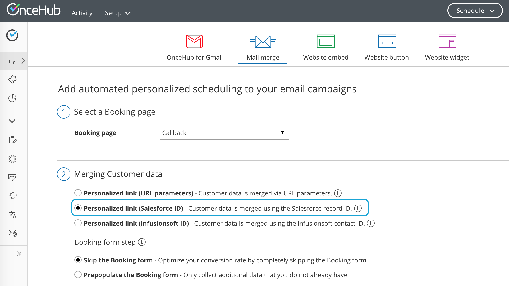

import { Aside } from "@astrojs/starlight/components";

When you schedule with existing Salesforce Leads, Contacts, Person Accounts, or Case records, you can use our **Personalized links (Salesforce ID)** in your [Salesforce email templates](https://help.salesforce.com/articleView?id=email_create_a_template.htm&type=5) and [Salesforce emails](https://help.salesforce.com/articleView?id=send_email_directly_from_crm_record.htm&type=5). Your Customers will be automatically recognized based on their Salesforce Record ID.

In this article, you'll learn about using Personalized links (Salesforce ID).

## Key benefits of using Personalized links (Salesforce ID)

Recognizing a Customer by their Record ID provides two key benefits:

- On the User side, it allows you to update the correct record, eliminating any chance of updating the wrong record.
- On the Customer side, it allows you to [prepopulate the Booking form step with Salesforce record data or completely skip the Booking form step](/scheduleonce/account-integrations/crm/salesforce/prepopulate-or-skip-booking-form-step-in-salesforce-integration "How to prepopulate or skip the Booking form step in Salesforce integration"). This eliminates the need to ask Customers for information you already have, improving conversion rates and moving leads through the funnel faster.

**Personalized links (Salesforce ID)** are available for [Booking pages](/scheduleonce/event-types-booking-pages/booking-pages/introduction-to-booking-pages "Introduction to Booking pages") and [Master pages](/scheduleonce/master-pages-resource-pools/master-pages/introduction-to-master-pages "Introduction to Master pages").

- When you work with Booking pages, **Personalized links (Salesforce ID)** will be available only for Booking pages owned by [Users connected to Salesforce](/scheduleonce/account-integrations/crm/salesforce/connecting-salesforce-api-user "How to connect a Salesforce API User").
- When you work with Master pages, **Personalized links (Salesforce ID)** will always be available to you. However, Booking pages owned by Users who are not connected to Salesforce will work as [General links](/scheduleonce/sharing-publishing/general-one-time-links/using-general-links "Using General links").

<Aside type="note">

For security and privacy reasons, using CRM record IDs to skip or prepopulate the Booking form is not compatible with [collecting data from an embedded Booking page](https://developers.oncehub.com/v1.0.0/docs/collecting-data-from-an-embedded-booking-page) or [redirecting booking confirmation data](https://developers.oncehub.com/v1.0.0/docs/redirecting-booking-confirmation-data).

</Aside>

## Creating a Personalized link (Salesforce ID)

<Aside type="note">

To use data from a database in a prepopulated Booking form, you must be [connected to Salesforce](/scheduleonce/account-integrations/crm/salesforce/salesforce-integration "The ScheduleOnce connector for Salesforce").

</Aside>

1. Log into OnceHub, hover over the lefthand menu. and go to the Booking pages icon → hover over the lefthand sidebar → **Share & Publish**, where you can access the **Mail merge** tab.

2. Select the relevant Booking page or Master page.

3. Under **Merging customer data**, select the **Personalized links (Salesforce ID)** (Figure 1). 

4. In the **Booking form** step, you can select one of the two options below:

   - **Skip the Booking form:** Skipping the OnceHub Booking form helps you maximize your booking conversions and provides your Customers with a quicker booking process.
   - **Prepopulate the Booking form:** The Booking form works in private mode. In this mode, prepopulated data can’t be viewed or edited by the Customer before submission. The prepopulated data used in the Booking is indicated as a checklist and the Customer can provide additional information if required. [Learn more about prepopulated Booking forms](/scheduleonce/event-types-booking-pages/booking-forms-redirect/prepopulated-booking-forms "Prepopulated Booking forms")

5. Click **Copy link** to copy the Personalized link to your clipboard (Figure 3). You can now paste the link into your [Salesforce email templates](https://help.salesforce.com/articleView?id=email_create_a_template.htm&type=5) and [Salesforce emails](https://help.salesforce.com/articleView?id=send_email_directly_from_crm_record.htm&type=5).
