import { Aside } from "@astrojs/starlight/components";

The OnceHub connector for Salesforce allows you to map any OnceHub System field or Custom field to Salesforce fields. If you want to add an additional layer of Salesforce fields update logic, you can [create Salesforce Workflow Rules](https://help.salesforce.com/articleView?id=workflow_rules_new.htm&type=5).

In this article, you'll learn how to create Workflow Rules based on OnceHub data. We'll use a sample scenario in which you update the **Lead: Event Booked** **checkbox** and the **Lead: Lead Status picklist** when a Customer makes a booking or reschedules a booking.

## Requirements

To update Salesforce fields when the Customer schedules or reschedules an event, you will need:

- A [OnceHub Administrator](/account-administration/user-management/user-roles-overview "Differences between Administrator and Member").
- A Salesforce Administrator for your organization.
- [An active connection to your Salesforce API User](/scheduleonce/account-integrations/crm/salesforce/connecting-salesforce-api-user "How to connect a Salesforce API User").

Let’s assume that the Lead Status field includes the **Working – Contacted** and the **Open – Not contacted** options. To create the Salesforce Workflow Rules, you'll need to follow these steps:

- Create an **Event Status** text Custom field for the Lead object and add it to the Lead Page Layout.
- Create an **Event Booked** checkbox Custom field (unchecked as default) for the Lead object and add it to the Lead Page Layout.
- Map the OnceHub **Status** field to the Lead: Event Status field.
- Create the Workflow Rules.

## Creating an Event Status text Custom field

1. Sign in to Salesforce as [your API user](/scheduleonce/account-integrations/crm/salesforce/connecting-salesforce-api-user "How to connect a Salesforce API User").

2. Go to the **Setup** page.

3. In the **Platform Tools** section, go to **Objects and Fields → Object Manager** (Figure 1). Figure 1: Object Manager in the Objects and Fields menu

4. In the **Object Manager** list, select **Lead** (Figure 2). 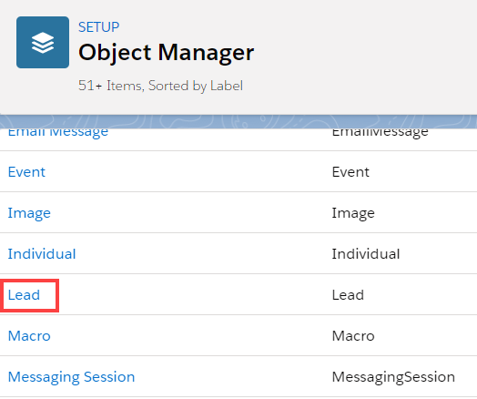Figure 2: Lead in the Object Manager list

5. Select **Field & Relationships → New** (Figure 3). 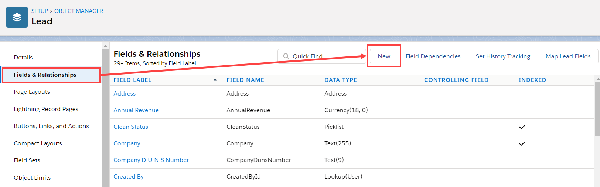Figure 3: Fields & Relationships

6. In the **New** **Custom Field** pane, select **Text** and click **Next** (Figure 4). 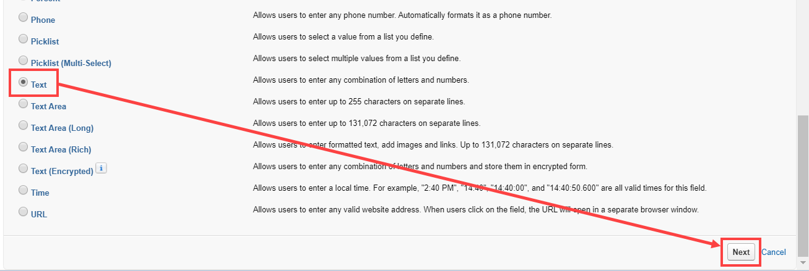Figure 4: Text field

7. In **Step 2: Enter the details**, enter the following information (Figure 5). Add a description if required, then click **Next**.

   - **Field label:** Event Status
   - **Length:** 40
   - **Field Name:** Event_Status **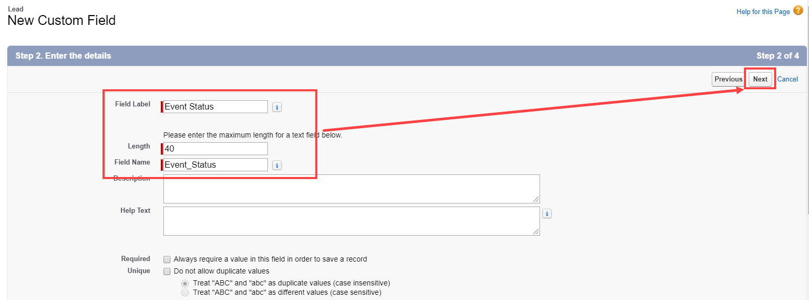Figure 5: Step 2 Enter the details**

8. In Step 3, click **Next**.

9. In Step 4, click **Save**.

Your **Event Status** text Custom field is now created and is added to the Lead Page Layout.

## Creating an Event Booked checkbox Custom field

1. Follow steps 1–5 from Creating an Event Status text Custom field above.

2. In the New Custom field pane, select **Checkbox** and click **Next** (Figure 6). 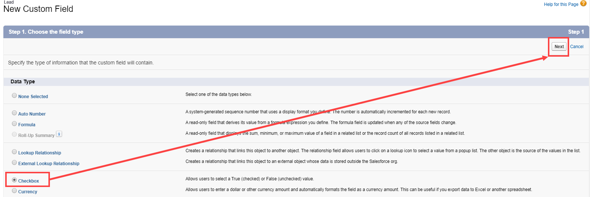Figure 6: Checkbox

3. In **Step 2: Enter the details**, enter the following information (Figure 5). Add a description if required, then click **Next**.

   - **Field label:** Event Booked
   - **Default value:** Unchecked
   - **Field Name:** Event_Booked 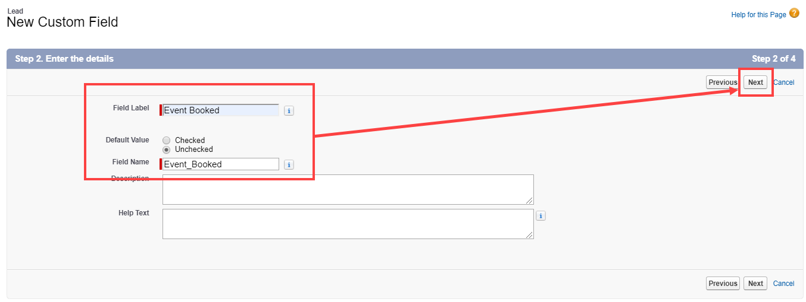Figure 7: Step 2 Enter the details

4. In Step 3, click **Next**.

5. In Step 4, click **Save**.

Your **Event Booked** checkbox Custom field is now created and is added to the Lead Page Layout.

## Mapping the OnceHub Status field to the Lead Event Status field

1. Select your profile picture or initials in the top right-hand corner → **Profile settings** → **CRM**.

2. In the Salesforce box, click **Setup**.

3. In the **Salesforce connector** **setup**, go to the **Field mapping** tab.

4. At the bottom left of the table, click **Add OnceHub fields** (Figure 8). The OnceHub field list includes System fields and Custom fields organized by categories.

5. The **Add OnceHub fields** pop-up will open

6. Use the **Filter by** drop-down menu to filter by **Booking data**.

7. Check the **Status** checkbox.

8. Click **Add fields**.

   <Aside type="note">

   **Note**If you want to make the Workflow Rule specific to a [Booking page](/scheduleonce/event-types-booking-pages/booking-pages/introduction-to-booking-pages "Introduction to Booking pages") or [Event type](/scheduleonce/event-types-booking-pages/event-types/introduction-to-event-types "Introduction to Event types"), you can also map the OnceHub Booking page label or Event type name to specific Lead Custom fields. The Booking page label or Event type name can be used to refine the Salesforce Workflow rule that is triggered when a booking is made.

   </Aside>

9. For the newly added **Status** field, select **Lead** from the first drop-down menu and select **Event Status (Event_Status\_\_c)** from the second drop-down menu (Figure 8). 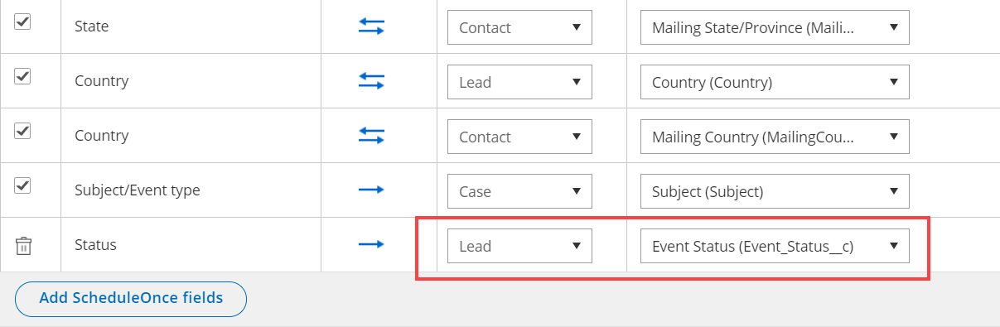Figure 8: Map the Status field

10. Click the **Save** button or **Save and Continue** if you have completed mapping all fields.

## Creating Workflow Rules in Salesforce

You can automate the update of many field records using workflow rules. We will create two workflow rules:

- **Workflow rule 1** checks the **Event Booked checkbox** and sets the Lead Status to **Working - Contacted** when the event is scheduled or rescheduled by Customer
- **Workflow rule 2** unchecks the **Event Booked checkbox** and sets the Lead Status to **Open – Not Contacted** when the event is not scheduled or rescheduled by Customer

To create Workflow rules, follow the steps below:

1. Sign in to Salesforce.
2. In your Salesforce **Setup** page, go to **Platform tools → Process Automation**.
3. Select **Workflow Rules** (Figure 10). 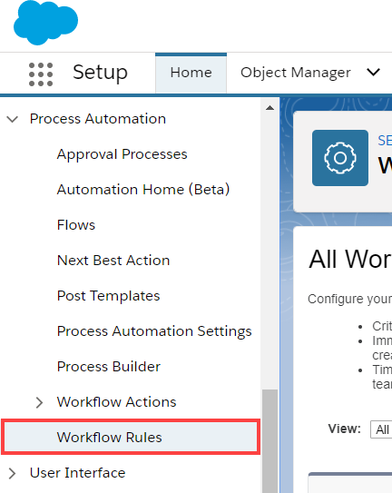Figure 9: Workflow Rules
4. Click **New Rule**.
5. From the **Object** drop-down, select the object to which the rule will apply. In our example, select **Lead**.

### Creating Workflow Rule 1

1. On the **New Workflow Rule page** in Salesforce, fill out the following information and click **Save & Next** (Figure 11).

   - **Rule Name**: Update Lead fields when event is scheduled or rescheduled by Customer

   - **Rule description**: The Rule checks the **Event Booked** checkbox and sets the Lead Status to **Working - Contacted** when the event is scheduled or rescheduled by Customer.

   - **Evaluate the rule when a record is**: created, and every time it’s edited

   - **Rule Criteria:** Run this rule if the criteria are met:

     - **Lead: Event status** equals **Scheduled**
     - **Lead: Event status e**quals **Rescheduled by Customer**
     - **Advance filter logic:** 1 OR 2 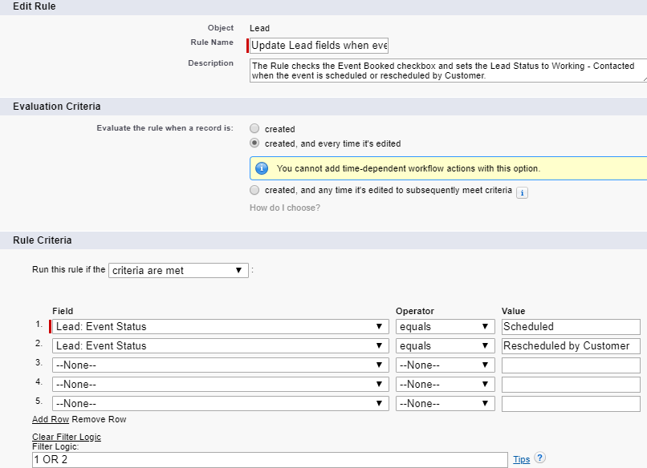Figure 10: Update Lead fields when event is scheduled or rescheduled by Customer

2. On **Step 3: Specify Workflow Actions**, click **Add Workflow Action**.

3. Select **New Field Update** and add the following information (Figure 12):

   - **Name**: Check the **Event Booked** checkbox automatically
   - **Unique name:** Check_checkbox
   - **Field to update**: Event Booked
   - **Re-evaluate Workflow Rules after Field Change:** Checked
   - **Checkbox Options:** True 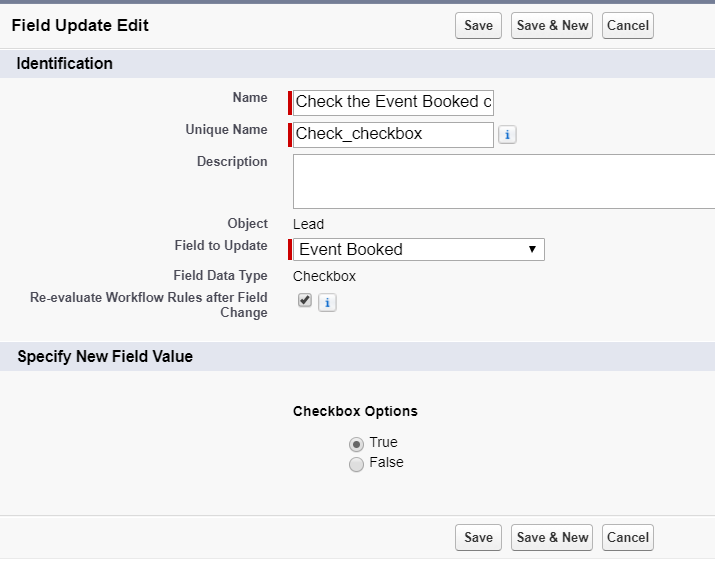Figure 11: Automatically check the Event _Booked_ checkbox

4. Click **Save & New**.

5. Add the following information (Figure 13):

   - **Name**: Update the Lead Status picklist to Working - Contacted
   - **Unique name**: Update_the_Lead_Status_picklist
   - **Field to update**: Lead Status
   - **Re-evaluate Workflow Rules after Field Change:** Checked
   - **Picklist Option > A specific value:** Working – Contacted 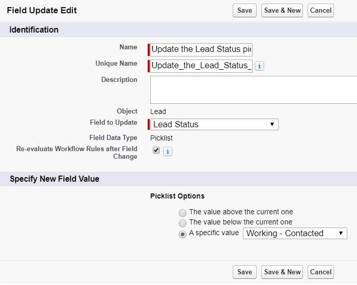Figure 12: Update the Lead Status picklist to Working - Contacted

6. Click **Save**.

7. Click **Done**.

8. On the **Workflow Rules** page, click **Activate** to activate the rule.

### Creating Workflow Rule 2

1. On the **New Workflow Rule page** in Salesforce, fill out the following information and click **Save & Next**.

   - **Rule Name**: Uncheck the **Event Booked** checkbox automatically when a booking is not scheduled or rescheduled by Customer.

   - **Rule description**: The **Event Booked** checkbox will be automatically unchecked on the Lead Page Layout when an event is not scheduled or rescheduled by the Customer for that record.

   - **Evaluate the rule when a record is**: created, and every time it’s edited

   - **Rule Criteria: Run this rule if the following criteria are met:**

     - **Lead: Event status** not equal to **Scheduled**
     - **Lead: Event status** not equal to **Rescheduled by Customer**
     - **Advance filter logic:** 1 OR 2

2. On **Step 3: Specify Workflow Actions** , click **Add Workflow Action**.

3. Select **New Field Update**, add the following information:

   - **Name**: Uncheck the **Event Booked** checkbox automatically when a booking is made.
   - **Unique name:** Uncheck_the_Event_Booked_checkbox
   - **Field to update**: Event Booked
   - **Re-evaluate Workflow Rules after Field Change:** Checked
   - **Checkbox Options:** False

4. Click **Save & New**.

5. Add the following information:

   - **Name**: Change the Lead Status picklist to Open - Not Contacted
   - **Unique name**: Change_the_Lead_Status_picklist
   - **Field to update**: Lead Status
   - **Re-evaluate Workflow Rules after Field Change:** Checked
   - **Picklist Option > A specific value:** Open - Not contacted

6. Click **Save**.

7. Click **Done**.

8. On the **Workflow Rules** page, click **Activate** to activate the rule.

You’re all set! You can now create a test booking in OnceHub to view how the Workflow Rules update your records when a booking is made.
