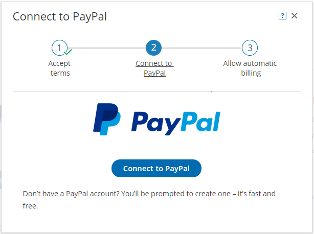
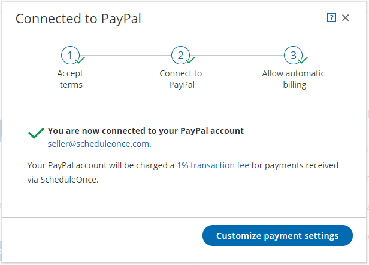

import { Aside } from "@astrojs/starlight/components";

<Aside type="note">

This article only applies if you use our [PayPal integration to collect payments from your Customers](/scheduleonce/account-integrations/payment-collection/paypal/payment-integration-throughout-booking-lifecycle "Payment integration throughout the booking lifecycle (collecting payments from Customers)"). If you have any questions on how we bill you as a OnceHub Customer, go to the [Account billing article](/scheduleonce/insights-operations/billing-subscription-management/introduction-to-billing "Introduction to Billing").

</Aside>

[The OnceHub connector for PayPal](/scheduleonce/account-integrations/payment-collection/paypal/oncehub-connector-for-paypal "The ScheduleOnce connector for PayPal") allows you to collect payments and issue refunds as an integral part of your booking process. This allows you to automatically refund customers when they are canceling, or charge them a reschedule fee when they are rescheduling. You only need to connect your PayPal account, configure your Payment settings, and OnceHub takes care of all payment activities in an automated and secure manner. Connecting OnceHub to your PayPal account is a three-step process: Accept Terms, Connect to Paypal, and [Allow automatic billing](/scheduleonce/account-integrations/payment-collection/paypal/allowing-automatic-billing "Allowing automatic billing").

<Aside type="note">

&#x20;You can reduce administrative overheads and align invoices with your branding requirements by customizing the invoice sent to Customers when payment is collected or refunds are processed via OnceHub. [Learn more about customizing the Invoice settings](/scheduleonce/account-integrations/payment-collection/paypal/customizing-refund-settings "Customizing refund settings")

</Aside>

In this article, you will learn how to connect OnceHub to your PayPal account.

## Requirements

To connect to PayPal, you will need:

- A OnceHub Administrator
- A PayPal Administrator for your account

The OnceHub connector for PayPal is compatible with any PayPal account. If you don't have a PayPal account, [create one now](http://www.paypal.com/).

### Connect to PayPal

<Aside type="note">

You can only connect OnceHub to one PayPal account at a time. If you're already connected to a PayPal account, [you will need to disconnect first](/scheduleonce/account-integrations/payment-collection/paypal/disconnecting-oncehub-from-paypal "Disconnecting ScheduleOnce (collecting payments from Customers)") before you can connect a different PayPal account ").

</Aside>

1. Hover over the lefthand menu and go to the Booking pages icon → open the lefthand sidebar → **Integrations → Payment**.

2. Click the **Get started** button (Figure 1). Figure 1: Paypal integration

3. The **Connect to PayPal** wizard pop-up appears. Read the terms and click the **Accept and continue** button (Figure 2). OnceHub will charge a [1% transaction fee](/scheduleonce/account-integrations/payment-collection/paypal/oncehub-transaction-fee "ScheduleOnce transaction fee") for payments made via OnceHub.

   Figure 2: Accept terms

4. In the **Connect to PayPal** step, click the **Connect to PayPal** button. Note that if you do not have a PayPal account, you will be prompted to create one - it takes only a couple of minutes. (See Figure 3) This will allow OnceHub to access your PayPal account via the PayPal API. [Learn more about granting permissions to OnceHub](/scheduleonce/account-integrations/payment-collection/paypal/granting-permissions-to-oncehub "Granting permissions to ScheduleOnce")

   Figure 3: Connect to PayPal

   <Aside type="note">

   **Note**If you do not have a PayPal account, you will be prompted to create one. If you have a PayPal Personal account or a Premier account, PayPal will automatically upgrade your account to a free PayPal Business account as part of the connection process.

   </Aside>

5. After connecting to your PayPal account and granting permissions to OnceHub, you are automatically redirected to your OnceHub account to allow automatic billing (Figure 4). Automatic billing authorizes OnceHub to charge a 1% transaction fee for each payment made via OnceHub, in addition to the fees charged by PayPal.

   <Aside type="note">

   **Note** To connect OnceHub to your PayPal, you must use the **_same_** PayPal account when granting permissions to OnceHub and when allowing automatic billing.

   </Aside>

   Figure 4: Allow automatic billing

6. Once you allow automatic billing, your connected PayPal account will display a confirmation message informing you that you have agreed to allow OnceHub to charge your account for future received payments, using the funding sources in your PayPal account (Figure 5).

   Figure 5: Confirmation message

Congratulations! Your OnceHub User app is now connected to your PayPal account. Next you can [customize the payment settings for your account](/scheduleonce/account-integrations/payment-collection/paypal/customizing-payment-settings "Customizing payment settings").
