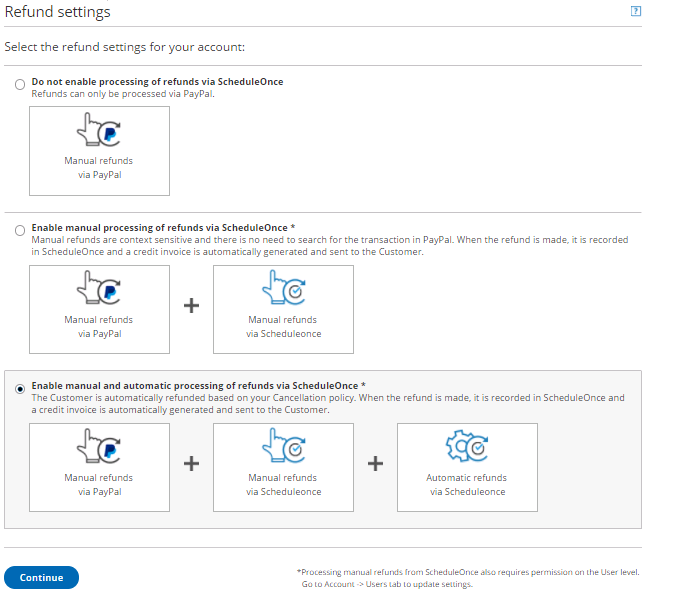

import { Aside } from "@astrojs/starlight/components";

<Aside type="note">

This article only applies if you use our [PayPal integration to collect payments from your Customers](/scheduleonce/account-integrations/payment-collection/paypal/payment-integration-throughout-booking-lifecycle "Payment integration throughout the booking lifecycle (collecting payments from Customers)"). If you have any questions on how we bill you as a OnceHub Customer, go to the [Account billing article](/scheduleonce/insights-operations/billing-subscription-management/introduction-to-billing "Introduction to Billing").

</Aside>

[The OnceHub connector for PayPal](/scheduleonce/account-integrations/payment-collection/paypal/oncehub-connector-for-paypal "The ScheduleOnce connector for PayPal") allows you to process refunds as an integral part of your booking process:

- Customers can automatically receive refunds when they cancel a booking.
- Users can issue refunds directly from the [Activity stream](/scheduleonce/managing-bookings/analytics/activity-stream-viewing-activities "Introduction to the Activity Stream").

In this article, you will learn how to set the refund settings for your account.

## Requirements

To customize the Refund settings, you must be a OnceHub Administrator.

## Selecting the Refund settings for your OnceHub account

1. Hover over the lefthand menu and go to the Booking pages icon → open the lefthand sidebar → **Integrations →** **Payment**.
2. Click the **Customize payment settings** button to reach Payment settings.
3. Select the **Refund settings** option for your account (Figure 1). Figure 1: Refund settings

In the **Refund settings** you will have the following options available for your account:

- **Do not enable processing of refunds via OnceHub**: This option is selected by default. If you decide to use this option, Users will be able to issue refunds only via the connected PayPal account.

- **Enable manual processing of refunds via OnceHub**: When choosing this option, Users can issue refunds directly from the [Activity stream](/scheduleonce/managing-bookings/analytics/activity-stream-viewing-activities "Introduction to the Activity Stream"). [Learn more about manual refunds via OnceHub](/scheduleonce/account-integrations/payment-collection/paypal/manual-refunds-via-oncehub "Manual refund via ScheduleOnce")

  <Aside type="note">

  **Note**In order to issue a refund via OnceHub, you must ensure that the User making the refund has the permission to process manual refunds via OnceHub. [Learn more about controlling User refund permissions](/account-administration/user-management/user-roles-overview "Differences between Administrator and Member")

  </Aside>

- **Enable manual and automatic processing of refunds via OnceHub**: This setting enables all refund options in your OnceHub account and allows you to streamline your refund processes throughout the booking lifecycle. Users can issue refunds directly from the Activity stream, and Customers can be automatically refunded when they cancel a booking on the [Customer Cancel/reschedule page](/scheduleonce/managing-bookings/cancel-reschedule/customer-cancelreschedule-page "The Customer Cancel/Reschedule page"). [Learn more about automatic refunds via OnceHub](/scheduleonce/account-integrations/payment-collection/paypal/automatic-refunds-via-oncehub "Automatic refunds via ScheduleOnce")

  <Aside type="note">

  **Note**In order to issue a refund via OnceHub, you must ensure that the User making the refund has the permission to process manual refunds via OnceHub. [Learn more about controlling User refund permissions](/account-administration/user-management/user-roles-overview "Differences between Administrator and Member")

  </Aside>
