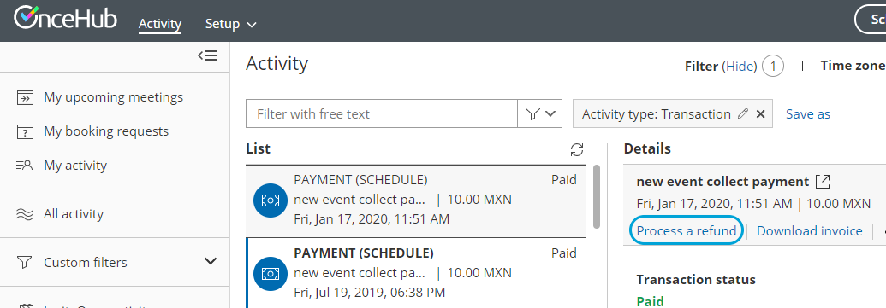

import { Aside } from "@astrojs/starlight/components";

<Aside type="note">

This article only applies if you use our [PayPal integration to collect payments from your Customers](/scheduleonce/account-integrations/payment-collection/paypal/payment-integration-throughout-booking-lifecycle "Payment integration throughout the booking lifecycle (collecting payments from Customers)"). If you have any questions on how we bill you as a OnceHub Customer, go to the [Account billing article](/scheduleonce/insights-operations/billing-subscription-management/introduction-to-billing "Introduction to Billing").

</Aside>

Our [Payment integration](/scheduleonce/account-integrations/payment-collection/paypal/oncehub-connector-for-paypal "The ScheduleOnce connector for PayPal") feature fully handles all payments throughout the booking lifecycle, including manual issuing of refunds.

The ability to refund Customers manually via OnceHub enables you to:

- Handle cancellations and reschedule requests initiated by the User, rather than by the Customer.
- Deal with cancellations initiated by the Customer outside of OnceHub. For example, you might want to issue a refund when your Customer has cancelled a meeting via email.

You can issue manual refunds within OnceHub for any paid transaction directly from the [Activity stream](/scheduleonce/managing-bookings/analytics/activity-stream-viewing-activities "Introduction to the Activity Stream"). Refunds issued via OnceHub are accessible in the Activity stream and in detailed [Revenue reports](/scheduleonce/reporting/revenue-reports "Revenue Reports").

<Aside type="note">

In order to issue a refund via OnceHub, you must enable the [manual processing of refunds via OnceHub](/scheduleonce/account-integrations/payment-collection/paypal/customizing-refund-settings "Customizing refund settings") and ensure that the User making the refund has the permission to refund via OnceHub. A OnceHub administrator can manage the User permissions for their own profile and other Users' in the OnceHub permissions section in the [User profile](/profile-management/managing-your-profile-in-oncehub "Introduction to My Profile").

</Aside>

In this article, you will learn **how to issue a manual refund via OnceHub**.

## Requirements

To issue a refund via OnceHub, you must:

- Be the Owner or the Editor of the activity
- Have the permission to refund via OnceHub
- Enable the [manual processing of refunds via OnceHub](/scheduleonce/account-integrations/payment-collection/paypal/customizing-refund-settings "Customizing refund settings")

## Refunding via OnceHub

To issue a refund via OnceHub:

1. Click on the Transaction from your Activity stream. In the **Details** pane, click **Process a refund** (Figure 1). Figure 1: Issuing a manual refund
2. Enter the amount to refund and click **Refund**.

<Aside type="note">

The User can also issue a refund when initiating a cancellation or requesting reschedule for any Event type. [Learn more about cancelling or requesting reschedule for any Event type](/scheduleonce/managing-bookings/cancel-reschedule/user-action-cancelreschedule-for-booking-pages-with-event-types "User action: Cancel/request to reschedule with event types")

</Aside>

Refunding manually via PayPal

Refunds issued via PayPal are also captured in OnceHub via the PayPal API and are accessible in the [Activity stream](/scheduleonce/managing-bookings/analytics/activity-stream-viewing-activities "Introduction to the Activity Stream") and in detailed [Revenue reports](/scheduleonce/reporting/revenue-reports "Revenue Reports"), giving you full visibility of your refunds activity. We recommend you refund through OnceHub rather than through PayPal, as with OnceHub a credit invoice is automatically issued and sent to your Customers in the default email notifications.
