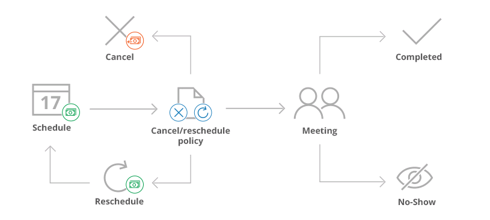

import { Aside } from "@astrojs/starlight/components";

<Aside type="note">

This article only applies if you use our PayPal integration to collect payments from your Customers. If you have any questions on how we bill you as a OnceHub Customer, go to the [Account billing article](/scheduleonce/insights-operations/billing-subscription-management/introduction-to-billing "Introduction to Billing").

</Aside>

OnceHub has partnered with PayPal to offer payment integration through all phases of the booking lifecycle. From the initial booking, through to rescheduling and cancellations, you can increase sales, generate additional revenue streams, and reduce administrative overhead (Figure 1).

## Figure 1: Payment integration throughout the booking lifecycle **Accept secure payments**

[The OnceHub connector for PayPal](/scheduleonce/account-integrations/payment-collection/paypal/oncehub-connector-for-paypal "The ScheduleOnce connector for PayPal") allows you to collect payments as an integral part of your booking process. Customers can pay for your services using a credit/debit card or a PayPal account. Simply [connect your PayPal account](/scheduleonce/account-integrations/payment-collection/paypal/connecting-oncehub-to-paypal "Connecting ScheduleOnce to PayPal"), configure your payment settings, and OnceHub takes care of all payment activities in an automated and secure manner.

You can accept secure payments when:

- **Customers make a booking**: You can collect payment for your services in any currency you have in your PayPal account.
- **Customers reschedule a booking**: The Reschedule policy can stipulate that Customers will be charged a reschedule fee based on the remaining time before the scheduled meeting. Charging for rescheduling actions generates an additional revenue stream and reduces unnecessary rescheduling.

## **Automatic refunds**

[Automatic refunds](/scheduleonce/account-integrations/payment-collection/paypal/automatic-refunds-via-oncehub "Automatic refund via ScheduleOnce") allow you to build trust and increase Customer satisfaction when sessions are canceled. Partial or full refunds are instantly credited back to Customers based on the [cancellation policies](/scheduleonce/account-integrations/payment-collection/paypal/automatic-refunds-via-oncehub "Automatic refunds via ScheduleOnce") you define.

## **Manual refunds**

OnceHub allows you to [issue refunds](/scheduleonce/account-integrations/payment-collection/paypal/manual-refunds-via-oncehub "Manual refund via ScheduleOnce") directly from the [Activity stream](/scheduleonce/managing-bookings/analytics/activity-stream-viewing-activities "Introduction to the Activity Stream"). [When enabled in the Payment settings](/scheduleonce/account-integrations/payment-collection/paypal/customizing-refund-settings "Customizing refund settings"), Users can refund Customers when they initiate a booking cancellation or send a request to reschedule.

## **Integrated transaction data**

Transaction data and payment actions are integrated into User workflows. Payment data appears in context with scheduling activities in the Payment details tab of the [Activity stream](/scheduleonce/managing-bookings/analytics/activity-stream-viewing-activities "Introduction to the Activity Stream"). You can also access detailed [Revenue reports](/scheduleonce/reporting/revenue-reports "Revenue Reports") that provide full visibility into transactions throughout the booking lifecycle. Scheduling activities are presented side by side with correlating payment and credit transactions in one central location.
