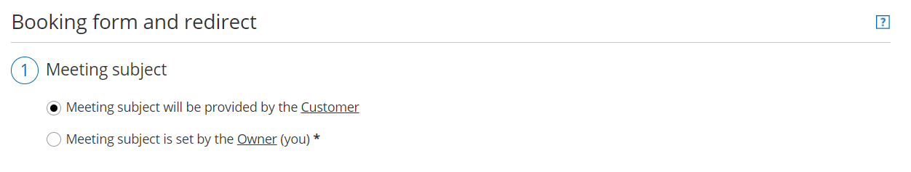
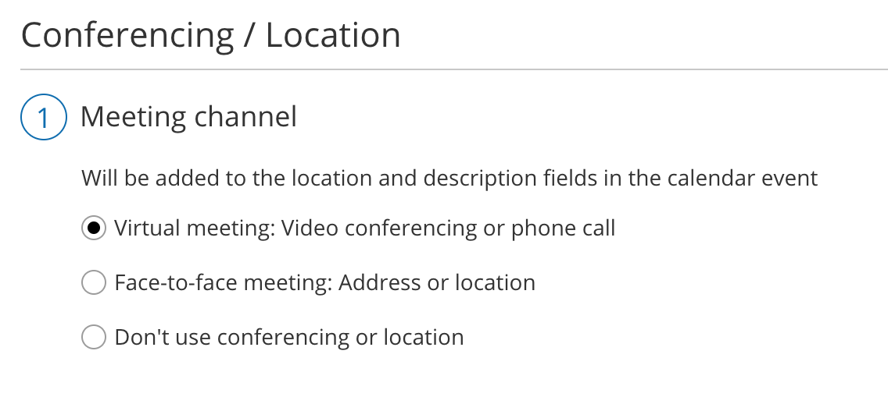

import { Aside } from "@astrojs/starlight/components";

Conditional fields are fields that can be included in your Booking form which are only visible if the Customer is requested to provide this information. Whether a Customer is requested to provide this information is based on settings on your [Booking page](/scheduleonce/event-types-booking-pages/booking-pages/introduction-to-booking-pages "Introduction to Booking pages") or [Event type](/scheduleonce/event-types-booking-pages/event-types/introduction-to-event-types "Introduction to Event types").

The [Booking form](/scheduleonce/customization-branding/booking-forms-editor/introduction-to-booking-forms-editor "Introduction to the Booking forms editor") includes two Conditional fields: **Meeting subject** and **Location**.

## Meeting subject

If you are using [Booking pages without Event types](/scheduleonce/master-pages-resource-pools/master-pages/booking-pages-only-without-event-types "Booking pages only (without Event types)"), you can choose if you want the **Meeting subject** to be set by the Owner (you) or the Customer. If you choose for the Customer to provide the meeting subject, the Customer will be required to provide a meeting subject in order to complete the booking process.

<Aside type="note">

If your [Booking page is linked to an Event type](/scheduleonce/event-types-booking-pages/booking-pages/adding-event-types-to-booking-pages "Adding Event types to Booking pages"), the **Meeting subject** is set by default to the [Event type](/scheduleonce/event-types-booking-pages/event-types/introduction-to-event-types "Introduction to Event types") name and cannot be changed.

</Aside>

To allow the Customer to provide the meeting subject, go to **Booking pages** in the bar on the left → select the relevant Booking page **→** [Booking form and redirect ](/scheduleonce/event-types-booking-pages/booking-forms-redirect/introduction-to-booking-form-and-redirect "Introduction to the Booking form and redirect section")section. Then, select **Meeting subject will be provided by the Customer** (Figure 1), and click **Save**.

Figure 1: Meeting subject will be provided by the Customer

## Location

You can customize the location of your meeting in the [**Conferencing / Location**](/scheduleonce/event-types-booking-pages/booking-pages/booking-pages-location-settings "Booking page: Conferencing / Location section") section of your Booking page (Figure 2).

Figure 2: Booking page Conferencing / Location section First, select the type of location: virtual meeting or face-to-face. If you choose a virtual meeting or face-to-face location, you can either provide the location yourself or specify that the Customer will provide a location when making a booking.

- If you choose for the Customer to provide the location information, the Customer will be required to provide the location information to complete the booking process.
- If you choose to not use a meeting channel or to provide one yourself, the **Location** field will not be visible to the Customer in the Booking form.
