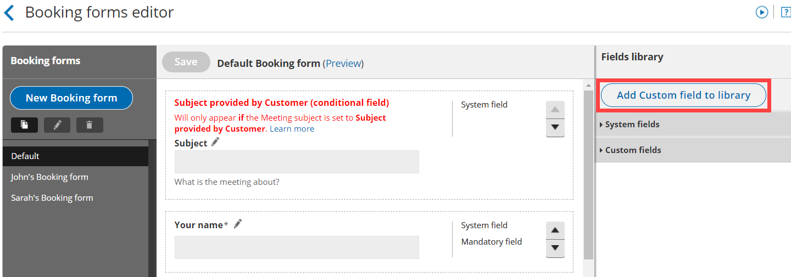
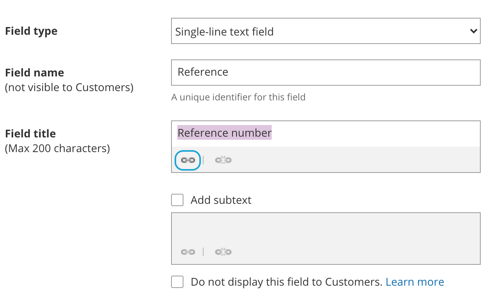

import { Aside } from "@astrojs/starlight/components";

Booking forms allow you to collect information from your Customers when they make a booking. If you want to ask for information in your [Booking form](/scheduleonce/event-types-booking-pages/booking-forms-redirect/introduction-to-booking-form-and-redirect "Introduction to the Booking form and redirect section") that you don’t see represented in the [System fields](/scheduleonce/customization-branding/booking-forms-editor/editing-system-fields "Editing System fields"), you can create your own Custom field.

In this article, you'll learn about creating and editing Custom fields.

## Creating a Custom field

1. Click **Booking pages** in the bar on the left.

2. On the left, select **Booking forms editor**.

3. In the **Fields library** section on the right side of the page, click the **Add Custom field to library** button (Figure 1). Figure 1: Add Custom field to library button

4. The **Add Custom field to library** pop-up will open (Figure 2). Figure 2: Adding a Custom field

5. Select a **Field type**. The following field types are available:

   - **Single-line text:** A single input text box. The maximum character limit is 250.
   - **Multi-line text:** An input text box used to ask Customers for additional information. The maximum character limit is 5000.
   - **Dropdown:** Enables Customers to make a choice among a list of mutually exclusive options. Customers can choose only one option. A minimum of two options is required to use a **Dropdown** list.
   - **Checkbox:** Enables your Customers to choose any number of options from a list. A minimum of one option is required to use the **Checkbox** Field type.
   - **Attachment:** Enables you to request one attachment from your Customers. The file size limit is 5 MB and executable files are not allowed. You can also set the attachment to be secure with permission-based access. [Learn more about Secure attachments](/scheduleonce/customization-branding/booking-forms-editor/secure-attachments "Secure attachments")

6. Enter the **Field name**. Field names are unique identifiers that OnceHub uses to track Custom fields. This allows you to use information collected from Custom fields in other areas of OnceHub, such as Reports and Custom templates. The length of the Field name input text is limited to 20 characters. [Learn more about viewing information collected from your Booking form](/scheduleonce/reporting/viewing-collected-information-from-your-booking-form "Viewing collected information from your Booking form")

7. Enter the **Field title**. This title is displayed to your Customers when they make a booking. The length of the Field title is limited to 200 characters.

8. Check the **Add subtext** box if you want to add subtext to your Custom field. Subtext can provide more detailed information about the Custom field to your Customers. For example, if you are asking for a phone number, you can use this space to explain how you are going to use the phone number.

9. Highlight the relevant text and click the **Link** icon (Figure 3) to link the **Field title**, subtext, or **Checkbox** option to a URL of your choice. With the link option, you can provide external information to your Customers when they make a booking online. Figure 3: Link icon

10. Click **Save**.

Your new Custom field will be saved to the [Fields library](/scheduleonce/customization-branding/booking-forms-editor/fields-library "The Fields library") and can be added to your Booking form. [Learn more about editing a Booking form](/scheduleonce/customization-branding/booking-forms-editor/creating-and-editing-booking-form "Creating and editing a Booking form")

<Aside type="note">

&#x20;The following source tracking field names are reserved for source tracking, and cannot be used as Custom field names:

- utm_source: Used for identifying the traffic source.
- utm_medium: Used for identifying the delivery method.
- utm_campaign: Used for keeping track of different campaigns.
- utm_term: Used for identifying keywords.
- utm_content: Used for split testing or separating two ads that go to the same URL.

</Aside>

## System Custom fields

System Custom fields are fields which are included in the Fields library but are not automatically included in the Booking form. These fields include data you may wish to ask for, without having to input it yourself. The System Custom fields provided include:

- **Your phone:** A single-line text field requesting their phone number Note: The similar **Your mobile phone** system field is included in the Booking form by default
- **Your company:** A single-line text field requesting their company
- **Your state:** A drop-down menu of all 50 states in the United States and Washington, DC.
- **Your country:** A drop-down menu of every country in the world.
- **Your location:** A drop-down menu of every US state, Canadian province and every country in the world.
- **Terms of service:** A checkbox to agree to terms of service.
- **Attachment:** Attachment field.

<Aside type="caution">

It is not recommended to ask Customers to upload attachments that contain sensitive information. Attachments are not encrypted and are not password protected. [Learn more about Secure attachments](/scheduleonce/customization-branding/booking-forms-editor/secure-attachments "Secure attachments")

</Aside>

## Editing Custom fields

Once you've created and saved a Custom field, you can edit it at any time. Custom fields are edited on an account level. This means that any change made to a Custom field will change the settings for that field in every Booking form that the field is included in.

To edit a Custom field that you've created, select the **Edit** icon next to the field in the Fields library (Figure 4).

Figure 4: Edit icon next to your Custom field

In Edit mode, you have the option to:

- **Edit the Field title:** The title of the field as it will appear to Customers on the Booking form. This can be different from the **Field name**, which cannot be changed once the field is created.
- **Add subtext:** This is where you can write a description of the field, or explain why you're asking for the information.
- **Change field data you entered:** For example, let's say you created a **Checkbox** field for your Customer to select options from. You can edit, remove, or add more options as needed.

<Aside type="note">

In a drop-down field, you cannot edit the text of an option directly. You must first delete the option and then create a new one.

</Aside>
