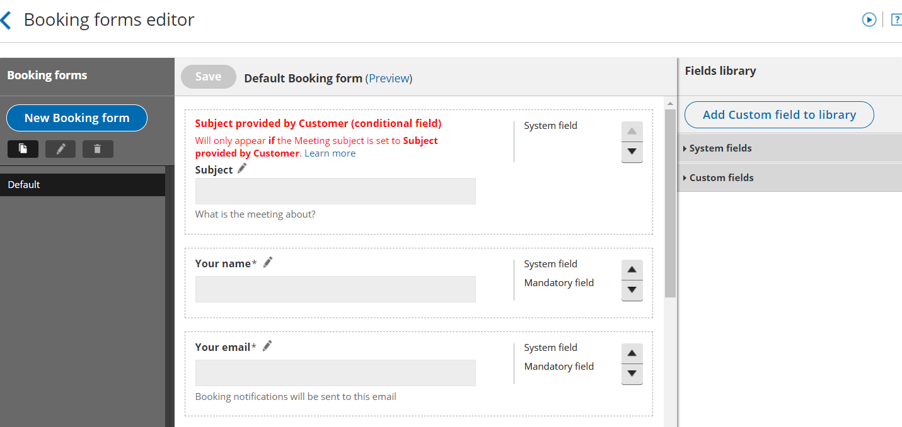

import { Aside } from "@astrojs/starlight/components";

[Booking forms](/scheduleonce/event-types-booking-pages/booking-forms-redirect/introduction-to-booking-form-and-redirect "Introduction to the Booking form and redirect section") allow you to collect information from your Customers when they make a booking. You can use the Booking forms editor to customize the information that you want to collect from your Customers during the booking process.

The Booking forms editor is an advanced WYSIWYG (What You See Is What You Get) editor. You can choose the questions on the Booking form and the order that they're presented in, giving you complete control over your Customer’s booking experience.

## Creating and editing Booking forms

All [OnceHub Administrators](/account-administration/user-management/user-roles-overview "Differences between Administrator and Member") can access the Booking forms editor. On the **Booking page** on the left, select the **Booking forms editor** on the left.

You can edit the Default Booking form (Figure 1), create a new Booking form, or copy and edit an existing Booking form. When you [create a Booking form](/scheduleonce/customization-branding/booking-forms-editor/creating-and-editing-booking-form "Creating and editing a Booking form"), you can edit, add, and remove the content in the middle editing pane.

Figure 1: The Booking forms editor

[Learn more about creating and editing a Booking form](/scheduleonce/customization-branding/booking-forms-editor/creating-and-editing-booking-form "Creating a Booking form")

## The Fields library

[The Fields library](/scheduleonce/customization-branding/booking-forms-editor/fields-library "The Fields library") pane contains all of the fields available to be used on the Booking form. This is where you add fields to your Booking form and create your own [Custom fields](/scheduleonce/customization-branding/booking-forms-editor/creating-and-editing-custom-fields "Creating and editing Custom fields").

- **System fields:** System fields include seven standardized fields that are included on every new Booking form by default. [Learn more about System fields](/scheduleonce/customization-branding/booking-forms-editor/editing-system-fields "Editing System fields")
- **Custom fields:** If you want to collect information that isn't covered in the System fields, you can use one of OnceHub's out-of-the-box Custom fields, or create your own Custom field. [Learn more about Custom fields](/scheduleonce/customization-branding/booking-forms-editor/creating-and-editing-custom-fields "Creating and editing Custom fields")

## Using information collected on your Booking form

The information you collect on the Booking form can be used in the following ways.

### Personalize email and SMS notifications to Users and Customers

When a Customer makes a booking, an email is sent to you with the Customer’s name, their email address, and any other information from other fields that you chose to include on the Booking form.

The Customer will receive a personalized confirmation email with the details of the appointment they've just made. You can use data collected on the Booking form to create custom notifications.

[Learn more about creating custom email or SMS templates](/scheduleonce/customization-branding/notification-templates-editor/how-to-create-custom-email-or-sms-template "How to create a Custom email or SMS template")

### Customize reports

All data collected via the Booking form is available in your [reports](/report-types "Reports"). You can select the fields you want to display in any Detail report in the **Reports** section of the left.

### Updating your CRM by mapping specific System or Custom fields to your CRM's fields

If you use our [Salesforce](/scheduleonce/account-integrations/crm/salesforce/salesforce-integration "The ScheduleOnce connector for Salesforce") or [Infusionsoft](/scheduleonce/account-integrations/crm/infusionsoft/infusionsoft-integration "The ScheduleOnce connector for Infusionsoft") integration, you can map System and Custom fields to the corresponding fields in your CRM.

[Learn more about viewing collected information from your Booking form](/scheduleonce/reporting/viewing-collected-information-from-your-booking-form "Viewing collected information from your Booking form")
