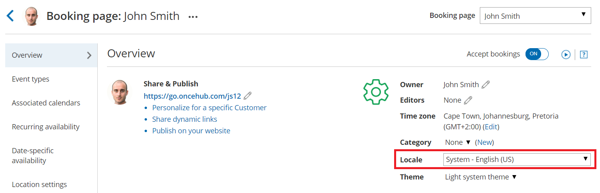
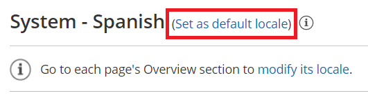

import { Aside } from "@astrojs/starlight/components";

Locales are configured in the [Localization editor](/scheduleonce/customization-branding/localization-customer-text/localization-editor "The Localization editor") on the account level and applied to each [Booking page](/scheduleonce/event-types-booking-pages/booking-pages/introduction-to-booking-pages "Introduction to Booking pages") and [Master page](/scheduleonce/master-pages-resource-pools/master-pages/introduction-to-master-pages "Introduction to Master pages") individually. When a locale is applied to a page, any subsequent changes made to that locale are visible to the Customer. The applied locale determines the language of the page and the date/time formats used.

In this article, you'll learn about applying a locale to a Booking page or Master page and to Customer notifications.

## Applying a locale to a Booking page or Master page

1. Go to **Booking pages** in the bar on the left.
2. Select the [Booking page](/scheduleonce/event-types-booking-pages/booking-pages/booking-pages-overview "Booking page: Overview section") or [Master page](/scheduleonce/master-pages-resource-pools/master-pages/master-pages-overview "Master Page: Overview section") that you want to localize.
3. In the page's **Overview** section, use the **Locale** drop-down menu to select the locale you want to apply to that page (Figure 1). The change is automatically saved. Figure 1: Booking page Overview section

<Aside type="note">

Applying a locale to a Master page always overrides the locales applied to any Booking pages included in that Master page.

</Aside>

## Applying a locale to Customer notifications

The locale of the Booking page or Master page determines the date/time formats and the language of the [Dynamic fields](/scheduleonce/customization-branding/notification-templates-editor/dynamic-fields "Dynamic fields") in [Customer notifications](/scheduleonce/event-types-booking-pages/customer-notifications/customer-notification-scenarios "Customer notification scenarios") including outgoing emails, [SMS messages](/scheduleonce/event-types-booking-pages/sms-notifications/sending-sms-notifications-to-users "Sending SMS notifications to Users"), and the calendar event. The text in these notifications is automatically translated.

- Dynamic fields in notifications are only translated for Customer notifications based on Custom templates. Dynamic fields in User notifications and Default templates always remain in English.
- Static text is not automatically translated. To translate the static text of these notifications, you'll need to use [Custom notification templates](/scheduleonce/customization-branding/booking-forms-editor/creating-and-editing-custom-fields "Creating and editing Custom fields").

## Localization of Default notification templates vs. Custom notification templates

|                                                                | **Default templates**                                                                                                                                                                                                         | **Custom templates**                                                                                                                                                                                                                                                             |
| -------------------------------------------------------------- | ----------------------------------------------------------------------------------------------------------------------------------------------------------------------------------------------------------------------------- | -------------------------------------------------------------------------------------------------------------------------------------------------------------------------------------------------------------------------------------------------------------------------------- |
| User notifications by email and SMS                            | OnceHub Dynamic fields are shown in English. Date/time format follows [User profile settings](/profile-management/managing-your-profile-in-oncehub#customizing-your-date-and-time-settings "Profile: Date and time section"). | OnceHub Dynamic fields are shown in English. Date/time format follows [User profile settings](/profile-management/managing-your-profile-in-oncehub#customizing-your-date-and-time-settings "Profile: Date and time section").                                                    |
| Customer notifications by email and SMS and the calendar event | OnceHub Dynamic fields are shown in English. Date/time format follows [User profile settings](/profile-management/managing-your-profile-in-oncehub#customizing-your-date-and-time-settings "Profile: Date and time section"). | OnceHub dynamic fields such as time zone, country, and location are shown in the locale selected on the Booking page. Date/time format follows [locale settings](/scheduleonce/customization-branding/localization-customer-text/localization-editor "The Localization editor"). |

## Setting a default locale

The account’s default locale is set under the [Localization editor](/scheduleonce/customization-branding/localization-customer-text/localization-editor "The Localization editor"). To set a locale as your default locale, select the desired locale from the locale list and then click **Set as default locale** at the top of the page (Figure 2).

Figure 2: Set your default locale

The default locale will be automatically applied to any newly created page, but existing pages will not be affected.
