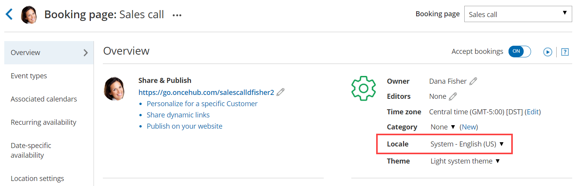

import { Aside } from "@astrojs/starlight/components";

You can localize your scheduling process from start to finish, including the first page your Customer sees, the Confirmation page, [cancel/reschedule](/scheduleonce/managing-bookings/cancel-reschedule/customer-cancelreschedule-page "The Customer Cancel/reschedule page") process, and the [notifications](/scheduleonce/customization-branding/notification-templates-editor/notification-scenarios "Notification scenarios") they will receive. This provides your Customers with a fully localized experience.

In this article, you'll learn how to localize the Customer scheduling experience.

## Requirements

To edit locales and modify [Notification templates](/scheduleonce/customization-branding/notification-templates-editor/introduction-to-notification-templates-editor "Introduction to the Notification templates editor"), you must be a [OnceHub Administrator](/account-administration/user-management/user-roles-overview "Differences between Administrator and Member").

All account Users, including [Members](/account-administration/user-management/user-roles-overview "Differences between Administrator and Member"), can localize the pages that they own using existing locales, [Booking forms](/scheduleonce/customization-branding/booking-forms-editor/introduction-to-booking-forms-editor "Introduction to the Booking forms editor"), and Notification templates.

## Step-by-step localization

To localize the Customer scheduling experience from start to finish, follow the steps below.

<Aside type="note">

The information in this article is only relevant if you are have added [added Event types to Booking pages](/scheduleonce/event-types-booking-pages/booking-pages/adding-event-types-to-booking-pages "Adding Event types to Booking pages"). If you are using Booking pages only, the Booking form section and Cancel/reschedule policy section are located on your Booking page.

[Learn more about the location of the Booking form section](/scheduleonce/event-types-booking-pages/event-types/booking-form-and-customer-notifications "Location of the Booking form and the Customer notifications sections")

</Aside>

### Localizing Event types and Booking pages

1. Go to **Booking pages** in the bar on the left.

2. Select **Localization editor** on the left.

3. Select a [System locale](/scheduleonce/customization-branding/localization-customer-text/system-and-custom-locales "System and Custom locales") to edit or [create a Custom locale](/scheduleonce/customization-branding/localization-customer-text/editing-customer-interface-text "Editing Customer interface text").

4. **Booking pages** in the bar on the left → select the **Booking page** that you want to edit.

5. In the [Booking page Overview section](/scheduleonce/event-types-booking-pages/booking-pages/booking-pages-overview "Booking page: Overview section"), select your edited System locale or your Custom locale (Figure 3). Figure 1: Selecting a Locale in the Booking page Overview section

6. In the [Public content section](/scheduleonce/event-types-booking-pages/booking-pages/booking-pages-public-content "Booking page: Public content section"), add Customer-facing text in the appropriate language.

7. Go to **Booking pages** in the bar on the left. Select [Booking forms editor](/scheduleonce/customization-branding/booking-forms-editor/introduction-to-booking-forms-editor "Introduction to the Booking forms editor") on the left.

8. Edit the text of each field so that it appears in the appropriate language.

   <Aside type="note">

   **Note**Dynamic values such as **Country** will be shown in English in the editor, and will be translated automatically when viewed by your Customers.

   </Aside>

9. Go to **Booking pages** in the bar on the left. Select the Event type that you want to edit.

10. In the [Booking form section](/scheduleonce/event-types-booking-pages/booking-forms-redirect/introduction-to-booking-form-and-redirect "Introduction to the Booking form and redirect section"), select the booking [Booking form](/scheduleonce/event-types-booking-pages/booking-forms-redirect/collecting-customer-data-with-booking-forms "Introduction to Booking forms") that you previously edited (Figure 2) .Figure 2: Selecting the edited Booking form

11. In the [Payment and cancel/reschedule policy section](/scheduleonce/event-types-booking-pages/event-types/payment-and-rescheduling "Event type: Payment and cancel/reschedule policy section"), select the **Custom text** option and enter your policy in the appropriate language (Figure 3).Figure 3: Entering Custom text for the Payment and cancel/reschedule policy

12. In the [Public content section](/scheduleonce/event-types-booking-pages/event-types/public-content "Event type: Public content section"), add Customer-facing text in the appropriate language.

<Aside type="tip">

If you use [Categories](/scheduleonce/event-types-booking-pages/categories/introduction-to-categories "Introduction to Categories") or [Tags](/scheduleonce/master-pages-resource-pools/master-pages/using-booking-page-tags-in-master-pages "Using Booking page tags in Master Pages") for Event types or Booking pages, you should ensure that their labels and titles are written in the appropriate language.

</Aside>

### Localizing Master pages

1. In the [Master page Overview section](/scheduleonce/master-pages-resource-pools/master-pages/master-pages-overview "Master Page: Overview section"), select your Custom locale or select the same System locale you selected in the Localization editor (Figure 4).Figure 4: Selecting a Locale in the Master page Overview section

   <Aside type="note">

   **Note**The locale selected for the Master page will override the locale selected on any of the included Booking pages.

   </Aside>

2. In the [Labels and instructions section](/scheduleonce/master-pages-resource-pools/master-pages/master-pages-event-types-and-assignment "Master Page: Assignment section"), add labels and instructions in the appropriate language.

3. In the [Public content section](/scheduleonce/master-pages-resource-pools/master-pages/master-pages-public-content "Master Page: Public Content section"), add Customer-facing text in the appropriate language.

Your localized Booking page or Master page is now ready to be [shared with Customers](/scheduleonce/sharing-publishing/personalized-links/sharing-your-booking-links-in-emails-and-other-apps "How to share links in emails and other apps") or [published on your website](/scheduleonce/sharing-publishing/publishing-on-websites/website-embed "How to publish Booking pages on websites").

<Aside type="tip">

If you have Customers in different countries, or Customers who speak a variety of languages, you can use a Booking page or Master page for each Customer segment. Repeat the same process for each page based on the target culture, language, country, or geographic location.

To ensure that each of your Customer segments experiences their localized scheduling process, you must share or publish the correct link or page with the corresponding audience.

</Aside>

### Localizing Customer notifications

1. Go to **Booking pages** in the bar on the left.
2. On the left, select the [Notification templates editor](/scheduleonce/customization-branding/notification-templates-editor/introduction-to-notification-templates-editor "Introduction to the Notification templates editor").
3. [Create a Custom notification template](/scheduleonce/customization-branding/notification-templates-editor/how-to-create-custom-email-or-sms-template "How to create a Custom email or SMS template") and translate it into the appropriate language.
4. Go to **Booking pages** in the bar on the left and select the Event type that you want to edit.
5. In the [Customer notifications section](/scheduleonce/event-types-booking-pages/customer-notifications/introduction-to-customer-notifications "The Customer notifications section"), select the Custom template you previously created.

<Aside type="note">

In the Notification templates editor, Dynamic fields are shown in English only in the editor. These fields will be translated into the set locale when Custom notifications are sent to the Customer.

User notifications are always sent in English.

</Aside>
