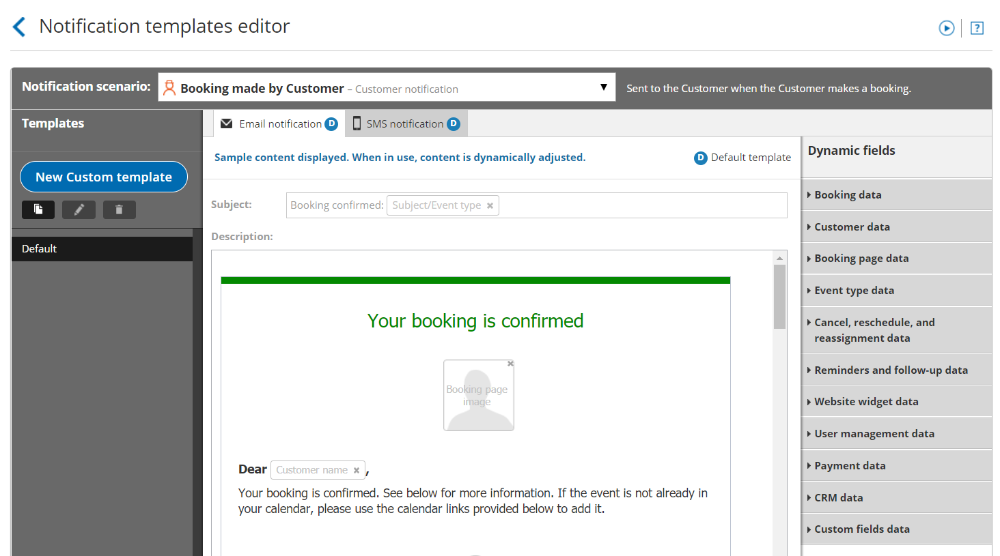
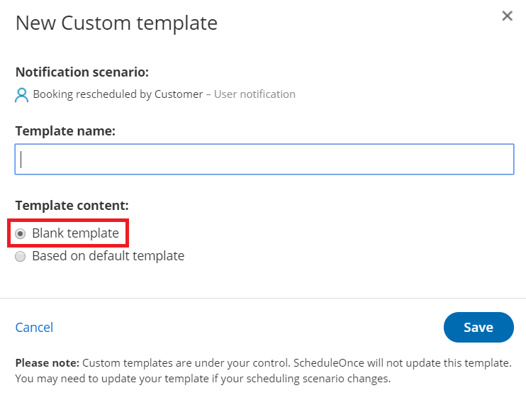
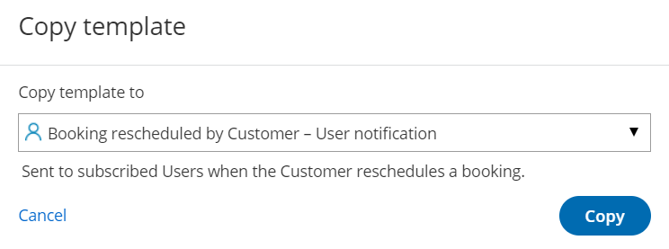

import { Aside } from "@astrojs/starlight/components";
import YouTubeEmbed from "~/components/YouTubeEmbed.astro";

<YouTubeEmbed id="_2uAshy7JJs" title="How to create a Custom email or SMS template" />

You can use the Notification templates editor to customize the email and [SMS notifications](/scheduleonce/insights-operations/profile-management/introduction-to-sms-notifications "Introduction to SMS notifications") that are sent to Customers and Users.

In this article, you'll learn how to create Custom templates for email and [SMS notifications](/scheduleonce/insights-operations/profile-management/introduction-to-sms-notifications "Introduction to SMS notifications").

## Accessing the Notification templates editor

Custom templates are created in the [Notification templates editor](/scheduleonce/customization-branding/notification-templates-editor/introduction-to-notification-templates-editor "Introduction to the Notification Templates Editor"). To access the editor, go to **Booking pages** in the bar on the left. Select the **Notification templates editor** on the left.

Figure 1: Notification templates editor

## Creating a notification template

There are three ways to create a customized notification template. You can create a new template based on the Default template, copy an existing template you previously created, or create a blank template.

### Creating a new template based on the Default template

If you like the Default template and want to make small changes to it, you can create a template based on the Default template and then customize it according to your needs.

1. Select the **Notification scenario** that you want to work on from the drop-down menu (Figure 2). [Learn more about Notification scenarios](/scheduleonce/customization-branding/notification-templates-editor/notification-scenarios "Notification scenarios") 

   Figure 2: Notification scenarios drop-down menu

2. Click the **New Custom template** button in the left pane (Figure 3).

   Figure 3: Click the New Custom template button

3. In the **New Custom template** pop-up, enter a name for your template. This name can be changed later if required.
4. In the **Template content** section, select **Based on default template** (Figure 4). 

   Figure 4: New Custom template pop-up

5. Click **Save**.

### Copying an existing template

If you like a template that you've already created in the Notification templates editor, you can copy it and make changes to it, or use it for a different Notification scenario.

1. Select the template you want to copy from the **Templates** list.
2. Click the **Copy** icon (Figure 5).

   Figure 5: Copy an existing template

3. In the **Copy template** pop-up, use the drop-down menu to select the [Notification scenario](/scheduleonce/customization-branding/notification-templates-editor/notification-scenarios "Notification scenarios") you want to use the template for.

   Figure 3: Copy template pop-up

4. Click **Copy**.

### Creating a Blank template

If you want to create a fully customized notification template, you can create a Blank template.

1. In the **Notification scenario** drop-down menu, select the Notification scenario you want to work on. [Learn more about Notification scenarios](/scheduleonce/customization-branding/notification-templates-editor/notification-scenarios "Notification scenarios")
2. Click the **New Custom template** button.
3. In the **New Custom template** pop-up, enter a name for your template (It can be changed later).
4. In the **Template content** section, select **Blank template**.

   Figure 4: New Custom template pop-up

5. Click **Save**.

## Editing Custom templates

The Notification templates editor has two modes: WYSIWYG (What You See Is What You Get) and HTML. The WYSIWYG mode allows you to edit template content while viewing the content in the format it will appear. The HTML mode allows you to edit the HTML code directly.

[Learn more about the WYSIWG editor](/scheduleonce/customization-branding/notification-templates-editor/wysiwyg-mode-of-notification-templates-editor "The WYSIWYG mode of the Notification templates editor")

### Dynamic fields

You can add Dynamic fields to your Notification templates to dynamically add variable data to your emails and SMS notifications. This allows you to personalize templates for different scenarios for Users or for Customers. For example, emails and SMS can include the Customer’s name and the meeting time and price if you are charging for an Event type. [Learn more about Dynamic fields](/scheduleonce/customization-branding/notification-templates-editor/dynamic-fields "Dynamic fields")

### Adding a Dynamic field

1. Place the cursor in the template editor text box where you want to insert the Dynamic field (Figure 5). 

   Figure 5: Place the cursor in the template editor text box

2. In the **Dynamic Fields** column on the right, click the Dynamic field you want to add (Figure 6). 

   Figure 6: Add a Dynamic field

3. The chosen Dynamic field will appear in the selected location in the template.

To remove a Dynamic field, click on the **X** next to the Dynamic field you want to remove.

<Aside type="note">

&#x20;When you use Dynamic fields, you need to be sure that the data exists in your account. For example, **Event type price** is one of the Dynamic fields available to you. However, if you do not enter an Event type price in the [Payment/cancel and reschedule policy section](/scheduleonce/event-types-booking-pages/event-types/payment-and-rescheduling "Event type: Payment and cancel/reschedule policy section"), no data will be displayed for this field in your emails and SMS notifications. [Learn more about Dynamic fields](/scheduleonce/customization-branding/notification-templates-editor/dynamic-fields "Dynamic fields")

</Aside>

## Where are notification templates used?

Notification templates are used in specific Notification scenarios. You can select which Notification template is used in each scenario from the **Template** drop-down menu in the [Customer notifications section](/scheduleonce/event-types-booking-pages/customer-notifications/introduction-to-customer-notifications "Introduction to the Customer notifications section") and [User notifications section](/scheduleonce/event-types-booking-pages/user-notifications/introduction-to-user-notifications "Introduction to User notifications section") of your Booking pages and Event types.

Figure 6: Template drop-down menu

### Customer notifications templates

Customer notification templates are used in the [Customer notifications section](/scheduleonce/event-types-booking-pages/customer-notifications/introduction-to-customer-notifications "The Customer notifications section"). To choose which notifications Customers receive, go to **Booking pages** in the bar on the left → relevant Event type→&#x20;**&#x20;Customer notifications**.

<Aside type="note">

If your [Booking page is associated with an Event type](/scheduleonce/event-types-booking-pages/booking-pages/adding-event-types-to-booking-pages "Adding Event types to Booking pages"), the Customer notifications section will be on the Event type.

</Aside>

When [Customer notifications based on custom templates](/scheduleonce/customization-branding/localization-customer-text/step-by-step-localization "Step-by-Step Localization") are sent, dynamic fields such as time zone, country, and location are shown in the locale (language) [selected on the Booking page](/scheduleonce/customization-branding/localization-customer-text/applying-locale "Applying a Locale").

### User notifications templates

User notification templates are used in the [User notifications section](/scheduleonce/event-types-booking-pages/user-notifications/introduction-to-user-notifications "Introduction to User notifications section"). To edit which notifications Users receive, go to **Booking pages** in the bar on the left → relevant Booking page **→ User notifications** (Figure 7).

Figure 7: User notifications section

### Calendar event template

You can access the [Calendar event](/scheduleonce/event-types-booking-pages/customer-notifications/customer-calendar-event-options "Customer Calendar Event options") template in the User notifications section. To edit which template is used for the Calendar event, go to → relevant Booking page **→ User notifications**.

### New User sign-up template

[New user sign-up](/getting-started/introduction-oncehub/joining-your-organizations-oncehub-account "Joining your organization's OnceHub account") templates is used in the [Add a new User](/account-administration/user-management/user-management-and-seats "Adding Users") page. To edit which New User sign-up template is used, go to the **Account gear menu → Users → New user button**.
