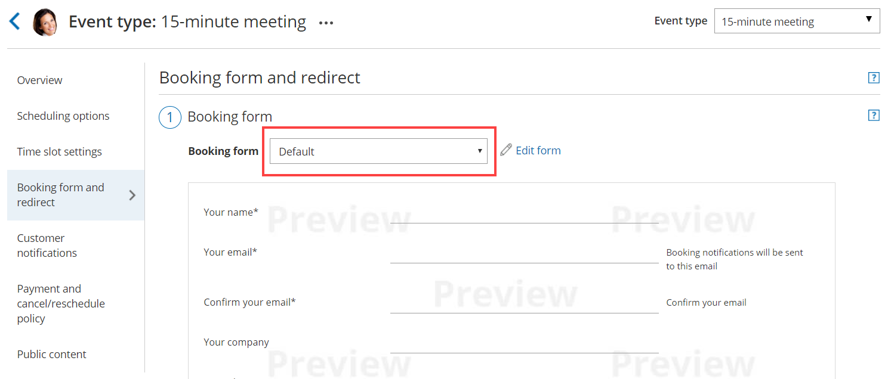

import { Aside } from "@astrojs/starlight/components";

You can test your [Custom templates](/scheduleonce/customization-branding/notification-templates-editor/how-to-create-custom-email-or-sms-template "How to create a Custom email or SMS template") by creating a test booking and filling out a Booking form as if you were a Customer. You can perform several of these test bookings to test every template you have created in every relevant scenario.

In this article, you'll learn how to test a Custom notification template.

## Testing the Custom notification template

1. In the [Booking form section](/scheduleonce/event-types-booking-pages/booking-forms-redirect/introduction-to-booking-form-and-redirect "Introduction to the Booking form and redirect section") of your [Event type](/scheduleonce/event-types-booking-pages/event-types/booking-form-and-customer-notifications "Location of the Booking form and the Customer notifications sections"), use from the **Booking form** drop-down menu to select a Booking form (Figure 1). Figure 1: Selecting a Booking form template

2. In the [Customer notification section](/scheduleonce/event-types-booking-pages/customer-notifications/introduction-to-customer-notifications "The Customer Notifications section") of your Event type, select a template for each [Notification scenario](/scheduleonce/customization-branding/notification-templates-editor/notification-scenarios "Notification scenarios") you want to send notifications for (Figure 2). Figure 2: Choosing a Custom notification template for each Notification scenario

3. In the [User notifications section](/scheduleonce/event-types-booking-pages/user-notifications/introduction-to-user-notifications "Introduction to User notifications section") of your Booking page, select a template for each [Notification scenario](/scheduleonce/customization-branding/notification-templates-editor/notification-scenarios "Notification scenarios") you want to send notifications for (Figure 3). Figure 3: Choosing a Custom notification template for each Notification scenario

   <Aside type="note">

   **Note**If you want to receive [User SMS notifications](/scheduleonce/event-types-booking-pages/sms-notifications/sending-sms-notifications-to-users "Sending SMS notifications to Users"), you'll need to enter a phone number in your [Profile's SMS notifications section](/profile-management/managing-your-profile-in-oncehub#notifications "Profile: Overview section").

   </Aside>

4. In the [Booking page Overview section](/scheduleonce/event-types-booking-pages/booking-pages/booking-pages-overview "Booking page: Overview section") of your Booking page, click on the public link in the **Share & Publish** section. Figure 4: Booking page public link

5. Schedule a meeting and fill out the Booking form that you created as if you were a Customer.

6. Click **Done**.

7. You can now check that you received a confirmation email and SMS. If you're using [Booking with approval mode](/scheduleonce/event-types-booking-pages/scheduling-options/automatic-booking-or-booking-with-approval "Automatic booking or Booking with approval"), you can click **Approve the booking request** in your User email notification. [Learn more about scheduling booking requests](/scheduleonce/managing-bookings/responding-to-booking-requests/responding-to-booking-requests/scheduling-and-responding-to-booking-requests "Scheduling and responding to booking requests") You can also check that the calendar event was added to your calendar. [Learn more about calendar events](/scheduleonce/event-types-booking-pages/customer-notifications/customer-calendar-event-options "Customer Calendar Event options")

8. Finally, you can choose to [cancel or reschedule the booking](/scheduleonce/managing-bookings/cancel-reschedule/introduction-to-canceling-and-rescheduling "Introduction to canceling and rescheduling"), or let the booking run its course and test the reminder and follow-up messages.

## Testing checklist

During the testing, you should check the following:

- The text is written the way you want.
- The correct [Dynamic fields](/scheduleonce/customization-branding/notification-templates-editor/dynamic-fields "Dynamic fields") were chosen.
- The spacing/formatting is correct.
- That you are sending emails and SMS notifications for the required booking notifications.
