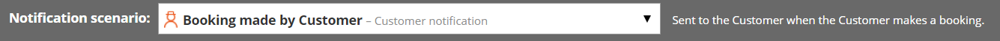

import { Aside } from "@astrojs/starlight/components";

When a Customer makes a booking, both the [Customer](/scheduleonce/event-types-booking-pages/customer-notifications/introduction-to-customer-notifications "The Customer notifications section") and [User](/scheduleonce/event-types-booking-pages/user-notifications/introduction-to-user-notifications "Introduction to User notifications section") receive notifications relevant to that booking. The Notification templates editor allows you to edit notifications so that Customers and Users receive fully customized email notifications and [SMS notifications](/scheduleonce/insights-operations/profile-management/introduction-to-sms-notifications "Introduction to SMS notifications").

The Notification templates editor is an advanced [WYSIWYG](/scheduleonce/customization-branding/notification-templates-editor/wysiwyg-mode-of-notification-templates-editor "The WYSIWYG mode of the Notification templates editor") (What You See Is What You Get) editor that allows you to:

- Review the structure of default templates (when no customization is required).
- Edit the content and look and feel of notifications.
- [Create new Custom templates](/scheduleonce/customization-branding/notification-templates-editor/how-to-create-custom-email-or-sms-template "How to create a Custom email or SMS template").
- Add a logo to your notifications.
- Translate a Custom template to another language as part of [localization](/scheduleonce/customization-branding/localization-customer-text/step-by-step-localization "Step-by-Step Localization").

When your templates are ready, you can use them for Customer and User communications. The templates can be used for:

- [Customer notifications](/scheduleonce/event-types-booking-pages/customer-notifications/customer-notification-scenarios "Customer notification scenarios")
- [User notifications](/scheduleonce/event-types-booking-pages/user-notifications/user-notification-scenarios "User notification scenarios")

## Selecting a notification scenario

When you open the Notification templates editor, you'll be asked to select a notification scenario. Notification scenarios are events that take place during a booking lifecycle which trigger emails and SMS to be sent.

You can also use the **Notification scenario** dropdown menu (Figure 1) to select the notification scenario you want to edit.

Figure 1: Notification scenario dropdown menu

There are different scenarios for Users and Customers, each with their own templates. OnceHub provides out-of-the-box templates for more than 30 different notification scenarios.

[Learn more about notification scenarios](/scheduleonce/customization-branding/notification-templates-editor/notification-scenarios "Notification scenarios")

## Creating or editing a notification template

All OnceHub Administrators can access the Notification templates editor. Go to **Booking pages** in the bar on the left. Select the **Notification templates editor** on the left.

[Learn more about creating custom email and SMS templates](/scheduleonce/customization-branding/notification-templates-editor/how-to-create-custom-email-or-sms-template "How to create a Custom email or SMS template")

You can edit default notifications templates (Figure 1), create a new Custom notification template, or copy and edit an existing notification template. When you create a Custom notification template, you can edit, add, and remove the content in the middle editing pane.

[Learn more about default vs. custom templates](/scheduleonce/customization-branding/notification-templates-editor/should-i-use-default-or-custom-template "Should I use a Default or Custom template?")

<Aside type="note">

Default templates cannot be edited, but they can be copied.

</Aside>

### Email and SMS tabs

Under most scenarios there is an email tab and SMS tab. You can use these to choose which notification type you wish to work on.

- If you see a **blue icon** with a **D**, it means you are viewing the default template.
- If you see a **red icon** with **C**, it means you are viewing a Custom template.

The default template cannot be edited; the Custom templates can be.

Figure 2: Email notification and SMS notification tabs

## Dynamic fields pane

This is where you can find the Dynamic fields to add variable content to your template. Dynamic fields are used in emails and SMS to personalize the message for the User or Customer and to give booking-specific information.

Dynamic fields will be automatically populated with the data generated throughout the booking process and from your booking settings. For example, if you want to include the name of your Customer in the greeting of your Customer emails, insert the Dynamic field “Customer name” and the greeting field will always start with “Dear `<Customer name>`”, inserting your Customer’s actual name.

[Learn more about Dynamic fields](/scheduleonce/customization-branding/notification-templates-editor/dynamic-fields "Dynamic fields")

<Aside type="note">

Dynamic fields such as time zone, country, and location, are shown in English in all notifications except [Customer notifications based on custom templates](/scheduleonce/customization-branding/localization-customer-text/step-by-step-localization "Step-by-Step Localization") - in this case these Dynamic fields are shown in the locale [selected on the Booking page](/scheduleonce/customization-branding/localization-customer-text/applying-locale "Applying a Locale").

</Aside>
