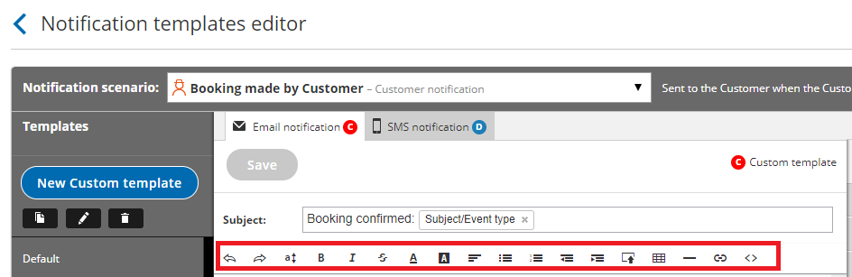

import { Aside } from "@astrojs/starlight/components";

The [Notification templates editor](/scheduleonce/customization-branding/notification-templates-editor/introduction-to-notification-templates-editor "Introduction to the Notification Templates Editor") is used to customize the content and appearance of emails and [SMS notifications](/sms-notifications "SMS notifications") sent to your Customers and Users. The template editor has two modes, WYSIWYG (What You See Is What You Get) and [HTML](/scheduleonce/customization-branding/notification-templates-editor/best-practices-for-creating-html-templates "Best practices for creating HTML templates").

The WYSIWYG mode allows you to edit template content while viewing the content in the format it will appear. The HTML mode allows you to edit the HTML code directly and is only recommended for advanced Users.

<Aside type="note">

OnceHub emails are generated via HTML. When you work with email templates, it is important to be aware of [HTML email best practices](/scheduleonce/customization-branding/notification-templates-editor/best-practices-for-creating-html-templates "Best practices for creating HTML templates"). Following these best practices will help ensure that your emails are delivered to your Users and Customers and will look the way you want them to.

</Aside>

In this article, you'll learn about the WYSIWYG mode of the Notification templates editor.

## Edit functions in the Notification templates editor

Figure 1: Edit functions in the Notification templates editor

The following functions are available in the template editor and are controlled via the buttons at the top. These are the buttons as they appear from left to right:

- **Undo**
- **Redo**
- **Font size:** Allows you to change the size of the text. You can use this setting to create headings.
- **Bold**
- **Italic**
- **Strikethrough:** Allows you display text as crossed out. Click the button again to undo the function.
- **Font color:** Allows you to change the color of text in the template.
- **Background color:** Allows you to change the color of the text background.
- **Alignment:** Align text to the left, center, right, or justify it. By default, all text is aligned to the left.
- **Bulleted list**
- **Numbered list**
- **Decrease indent**
- **Increase indent**
- **Insert image:** Allows you to upload an image from your Computer. The maximum image size supported is 200kb.
- **Insert table:** Allows you insert a table with any number of rows or columns. You can also add and delete rows and columns as well as define header rows.
- **Insert line:** Allows you insert a horizontal line.
- **Insert link**: Insert and remove links from text and images.
- **HTML:** Allows you to edit the [HTML code](/scheduleonce/customization-branding/notification-templates-editor/best-practices-for-creating-html-templates "Best practices for creating HTML templates") of the template directly.
